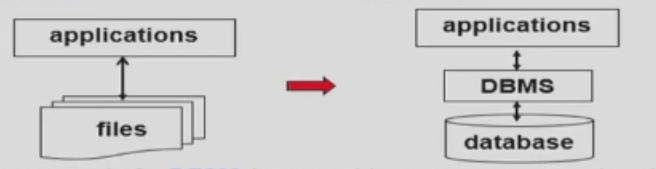
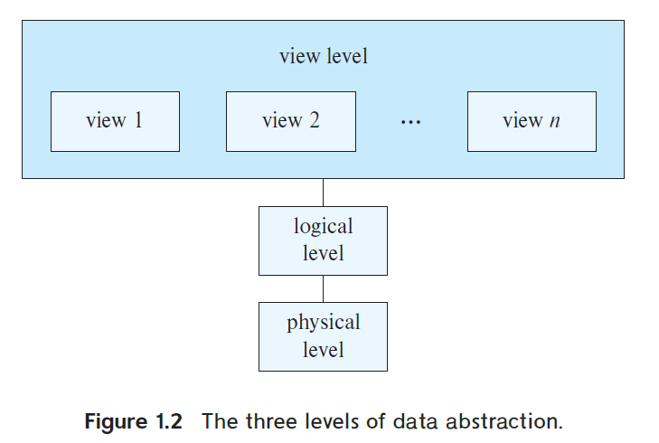
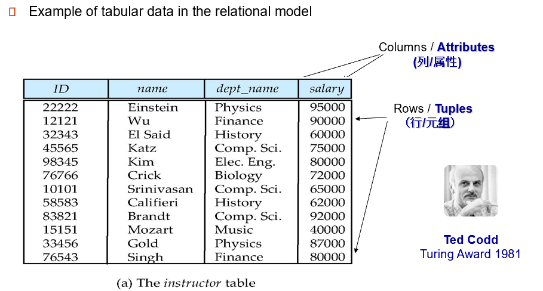

# Chapter 1 引入 Introduction
## 1.1 从文件到数据库
早期的数据库系统直接建立在文件系统(File Processing System)上。

<figure markdown="span">
  {width="500"}
</figure>

### 使用文件系统的弊端
1. 数据冗余(data redundancy)和不一致(inconsistency) ；
2. 数据孤立（多种形式，共享不便）；
3. 存取数据困难（每次新的查询任务都要新的程序来寻找）；
4. 完整性问题（满足约束条件，如余额大于0等，这些都得在程序中编入，一旦改变约束条件，就要重新编写、编译运行（因为文件本身没法限制这些条件））；
5. 原子性问题（如A转账B，A少钱和B多钱是一个整体，要保证都发生）；
6. 并发访问异常（如同时取钱）；
7. 安全性问题（认证、权限、审计）。

### 数据库的特性 Characteristics of Databases
1. 数据持久性 data persistence
2. 数据访问便利性 convenience in accessing data
3. 数据完整性 data integrity
4. 多用户并发控制 concurrency control for multiple user
5. 故障恢复 failure recovery
6. 安全控制 security control

## 1.2 数据库的三层结构

<figure markdown="span">
  {width="500"}
</figure>

## 1.3 关系模型 Relational Model
<figure markdown="span">
  {width="500"}
</figure>