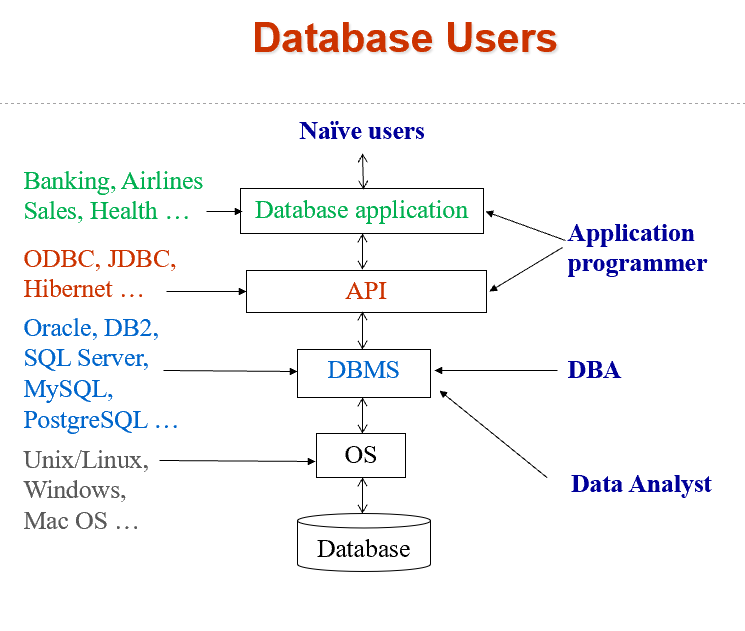

# Chapter 1 引入 Introduction
## 1.1 从文件到数据库
早期的数据库系统直接建立在文件系统(File Processing System)上。

<figure markdown="span">
  {width="500"}
</figure>

### 使用文件系统的弊端
1. 数据冗余(data redundancy)和不一致(inconsistency)；
2. 数据孤立（多种形式，共享不便）；
3. 存取数据困难（每次新的查询任务都要新的程序来寻找）；
4. 完整性问题（满足约束条件，如余额大于0等，这些都得在程序中编入，一旦改变约束条件，就要重新编写、编译运行（因为文件本身没法限制这些条件））；
5. 原子性问题（如A转账B，A少钱和B多钱是一个整体，要保证都发生）；
6. 并发访问异常（如同时取钱）；
7. 安全性问题（认证、权限、审计）。

### 数据库的特性 Characteristics of Databases
1. 数据持久性 data persistence
2. 数据访问便利性 convenience in accessing data
3. 数据完整性 data integrity
4. 多用户并发控制 concurrency control for multiple user
5. 故障恢复 failure recovery
6. 安全控制 security control

## 1.2 数据库的三层结构

<figure markdown="span">
  {width="500"}
</figure>

- 各层有相应的 `instance` 和 `schema` .

## 1.3 关系模型 Relational Model
<figure markdown="span">
  {width="500"}
</figure>

## 1.4 数据库语言 Database Languages

`数据定义语言 DDL(Data Definition Language)`
:   定义数据库，metadata, 关于数据的数据

`数据操作语言 DML(Data Manipulation Language)`
:   分过程式(procedural)和陈述式（非过程式）(declarative)语言。

`数据控制语言 DCL(Data Control Language)`
:   控制权限

## 1.5 数据库设计 Database Design
> 一整个大表虽然看起来清晰，但不是一个好的设计（比如数据有冗余、占用空间大），拆表后会更好。

## 1.6 数据库引擎 Database Engine
1. 存储管理 storage manager
2. 查询处理 query processor
3. 事务管理 transcation management

## 1.7 数据库用户 Database Users
<figure markdown="span">
  {width="500"}
</figure>

- DBA(database administrator): 数据库管理员
- 还有一个database engine developer