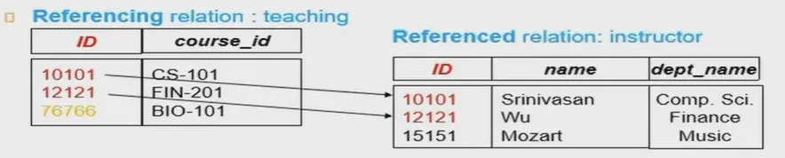
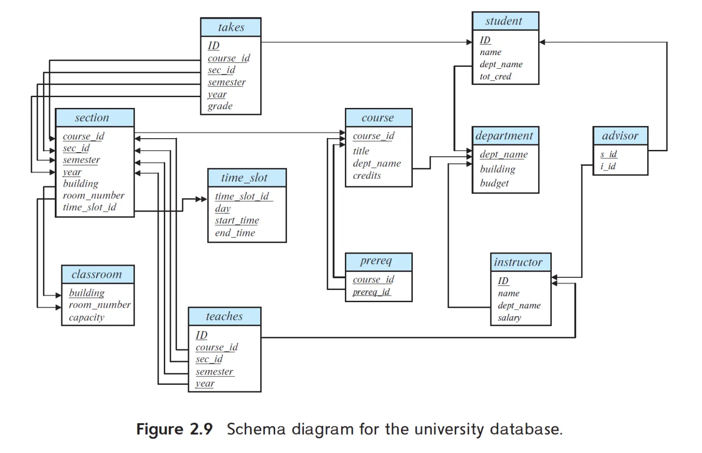
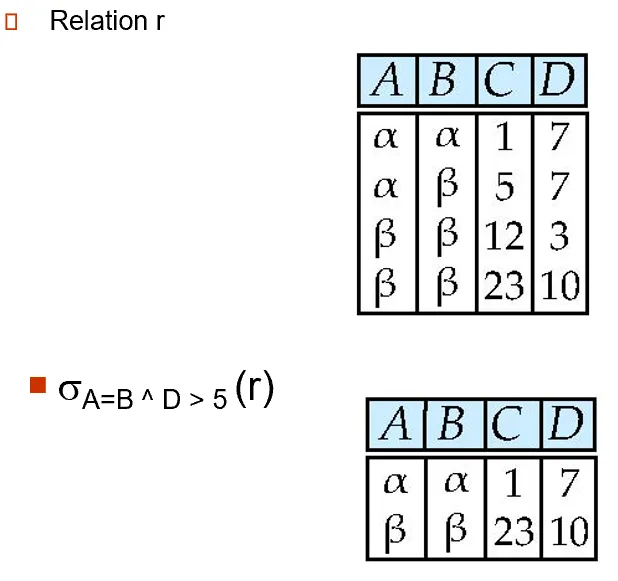
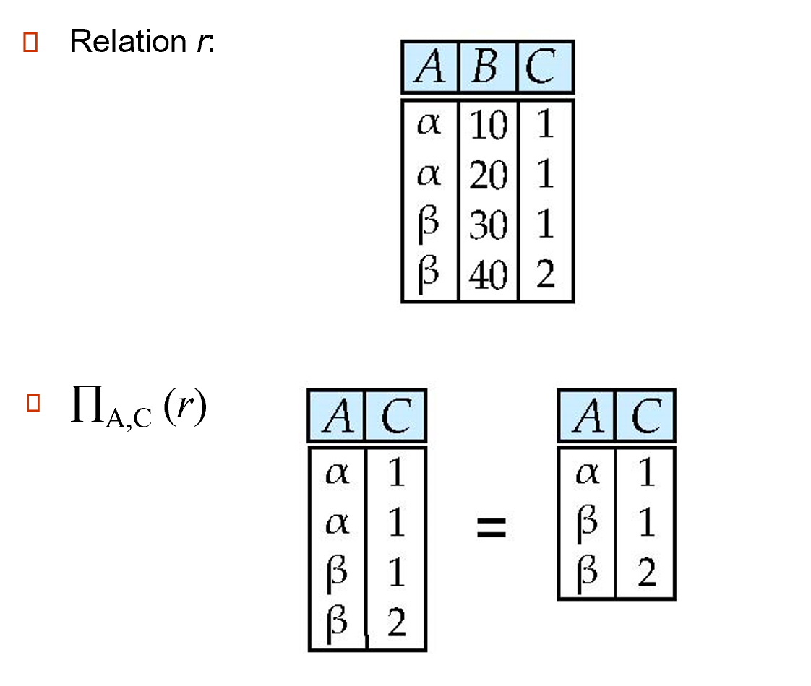
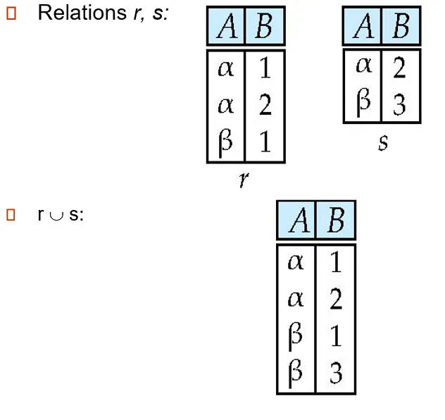
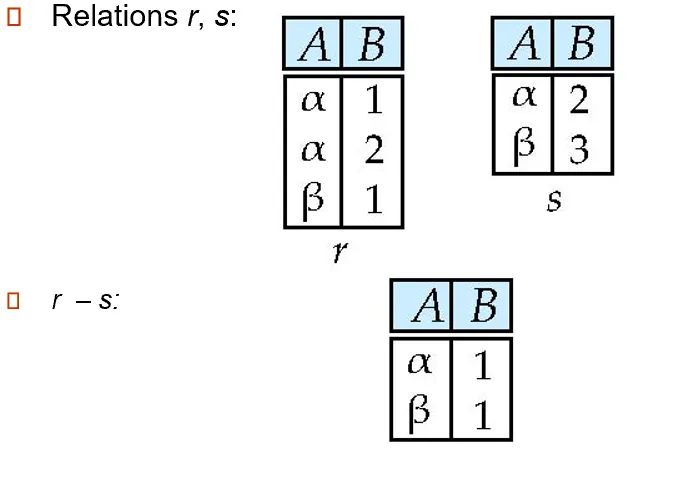
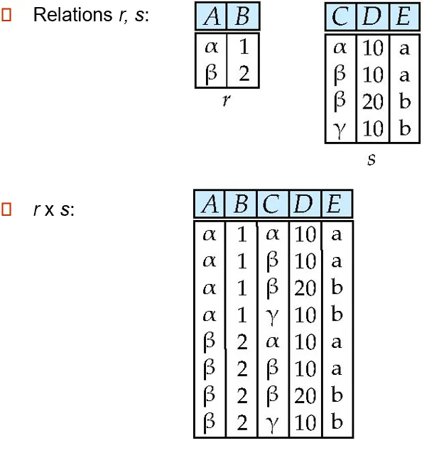
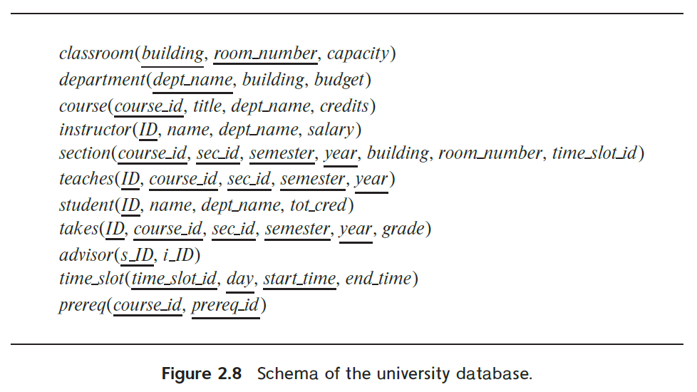

# Chapter 2 关系模型 The Relational Model

!!! tip
    本章包含部分 Chapter 6.1: Relational Algebra 的内容。

---

## 2.1 基础结构 Basic Structure

### 关系 Relation
`关系 relation`
:   一个关系就是一个 **n元组**的**无序**集合 | Formally, given sets $D_1,D_2,...,D_n$ a **relation** $r$ is a **subset** of $D_1\times D_2\times ...\times D_n$(笛卡尔积). Thus, a relation is a **set** of **n-tuples** $(a_1, a_2, ..., a_n)$ where each $a_i\in D_i$.

### 关系模式 Relation Schema 和 关系实例 Relation Instance

`关系模式 relation schema`
:   $R = (A_1, A_2, ..., A_n)$ is a **relation schema**.

    定义了这一类关系的结构，即由哪些属性构成，这些属性来自什么域。
    !!! example

        $Instructor\_schema = (ID, name, dept\_name, salary)$

`属性 attribute`
:   $A_1, A_2, ..., A_n$ are **attributes**.

`关系实例 relation instance`
:   A **relation instance** $r$ defined over schema $R$ is denoted by $r(R)$.
    !!! example

        $instructor(Instructor\_schema) = instructor(ID, name, dept\_name, salary)$

`表 table`
:   一个关系实例就是一张二维表 | The current values(relation instance) of a relation are specified by a **table**.

`元组 tuple`
:   An element $t$ of relation $r$ is called a **tuple** and is represented by a **row** in a table.

!!! note
    数学表达上，笛卡尔积的结果是有序对，并且tuple的定义就是a sequence/list of values. 但我们在讨论关系模型时，一般认为属性在理论概念上依然是无序的，即属性的顺序不影响我们对关系的表达。

- 多个relation schema/relation合在一起，就是database schema/database instance.

### 属性 Attribute
`域 domain`
:   The set of allowed values for each attribute is called the domain of the attribute.

`空值 null`
:   一个特殊值，属于任何域。

#### 关系理论第一范式 1st NF

属性值是**原子性的(atomic)**, 即每一属性的值都不可分割，同一属性中不能有多个值。

### 键 Key
#### 主键 Primary Key
假设$K\in R$.（二者都是属性的集合）

- 如果$K$的值能唯一确定任意关系$r(R)$中的一个元组，则称$K$是一个$R$的**超键(superkey)**.
- 包含元素个数最少的超键$K$称为**候选键(candidate key)**.
- 将候选键之一选为**主键(primary key)**.

!!! example
    - $K_1 = \{ID\}$和$K_2 = \{ID, name\}$都是表$instructor$的超键。
    - $\{ID\}$是表$instructor$的一个候选键。

#### 外键 Foreign Key

从关系$r_1$的属性$A$到关系$r_2$的**主键**$B$的一个**外键约束(foreign key constraint)** 限制了所有$r_1$中的元组的$A$属性值必须也是$r_2$中某元组的$B$属性值。（Attribute set A is called **a foreign key from $r_1$, referencing $r_2$**.）$r_1$称为**参照关系(referencing relation)**, $r_2$称为**被参照关系(referenced relation)**.

<figure markdown="span">
{width="500"}
</figure>

- 其中`76766`是异常值

**参照（引用）完整性约束(referential integrity constraint)** 的定义和外键约束类似，唯一的区别是不要求属性$B$是关系$r_2$的主键。

- 外键约束是参照完整性约束的一种特殊情况。

<figure markdown="span">
{width="500"}
</figure>

---

!!! note
    定义foreign key有助于数据库维护。

### 模式图 Schema Diagram

- 下划线表示主键
- 单箭头表示外键
- 双箭头表示引用完整性

## 2.2 关系查询语言 Relational Query Languages

!!! tip
    本章节我们只讨论其中的**关系代数 (relational algebra)** 部分。

---

### 基本关系代数操作 Fundamental Relational Algebra Operations

> 关系的操作，本质上就是集合的操作。

六个基本操作：

!!! quote ""
    === "select | $\sigma$"
        横向选择若干项，下标为选择条件（表示属性特征的一个表达式）。

        - 使用逻辑运算符$\land$, $\lor$, $\lnot$.

        <figure markdown="span">
        {width="250"}
        </figure>
    
    === "project | $\Pi$"
        投影，纵向选择。

        - 注意去重，因为集合不可重。

        <figure markdown="span">
        {width="250"}
        </figure>

    === "union | $\cup$"
        集合并。

        - 注意参与运算的两个表的属性和对应的值域都要相同。
  
        <figure markdown="span">
        {width="250"}
        </figure>

    === "set difference | $-$"
        集合减。

        - 注意参与运算的两个表的属性和对应的值域都要相同。

        <figure markdown="span">
        {width="250"}
        </figure>

    === "cartesian product | $\times$"
        笛卡尔积。

        - 如果参与运算的两个表有同名属性，则需对其重命名。

        <figure markdown="span">
        {width="250"}
        </figure>

    === "rename | $\rho$"
        重命名。

        $\rho_X(E)$ 将$E$重命名为$X$并返回。

        $\rho_{X(A_1, A_2, ..., A_n)}(E)$ 将$E$及其属性都重命名为$X(A_1, A_2, ..., A_n)$并返回。

???+ example
    参考：

    <figure markdown="span">
        {width="500"}
        </figure>

    ---

    !!! quote ""
        === "example 1"
            **Find the names of all instructors in the Physics department, along with the course_id of all courses they have taught.**

            ---

            - Query 1:
             
            $$\large{\Pi_{instructor.name,\ course\_id}(\sigma_{dept\_name = "Physics"}(\sigma_{instructor.ID = teaches.ID}(instructor\times teaches)))}$$

            - Query 2
      
            $$\large{\Pi_{instructor.name,\ course\_id}(\sigma_{instructor.ID = teaches.ID}(\sigma_{dept\_name = "Physics"}(instructor)\times teaches))}$$

            !!! note
                显然Query 2更快——优化时尽量将select操作往里放。（当然为了方便和清晰，将关系代数表达式写成Query 1这样也没啥问题）

        === "example 2"
            **Find the names of all instructors in the Physics department, along with the course_id and title of all courses they have taught**

            ---

            在example 1的基础上再乘一个$course$表即可。

            $$\large{\Pi_{instructor.name,\ course.course\_id,\ course.title}(\sigma_{dept\_name = "Physics"\ \land\ instructor.ID = teaches.ID \ \land\ teaches.course\_id = course.course\_id}(instructor\times teaches\times course))}$$

        === "example 3"
            **Find the largest salary in the university**

            ---

            

### 附加操作 Additional Relational Algebra Operations

### 扩展操作 Extended Relational Algebra Operations

### 修改操作 Modification of the Database

### 多重集上的关系代数 Multiset Relational Algebra

