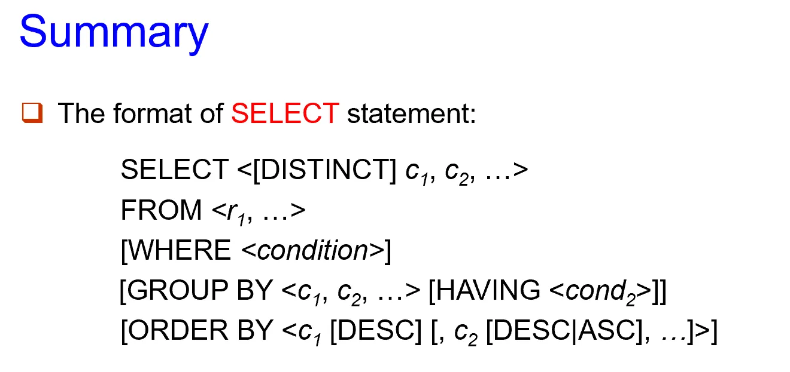
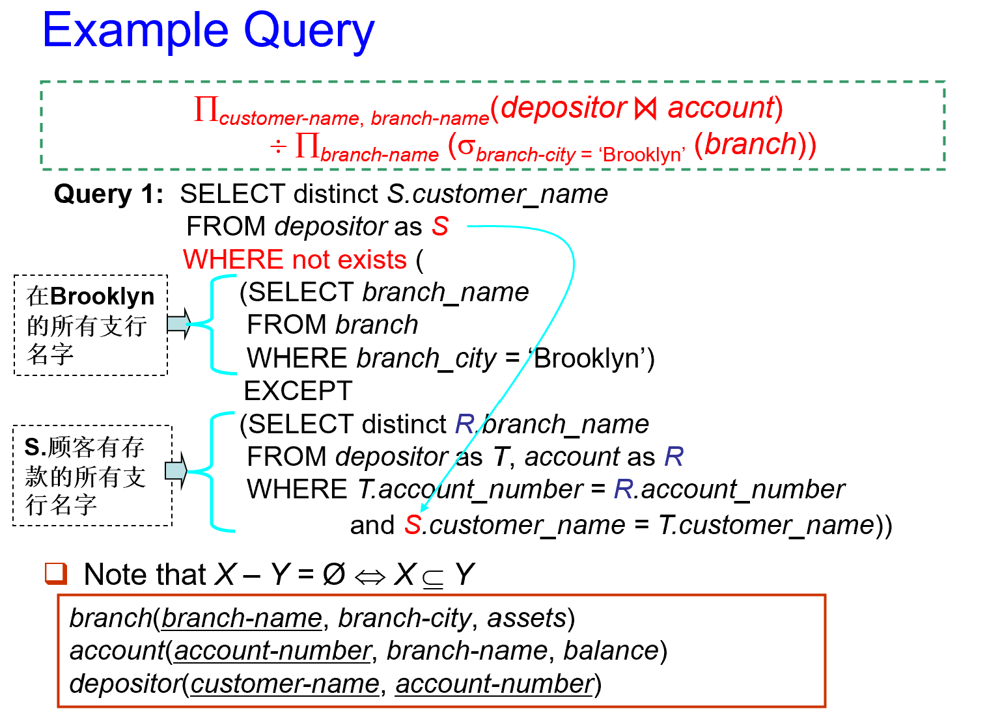
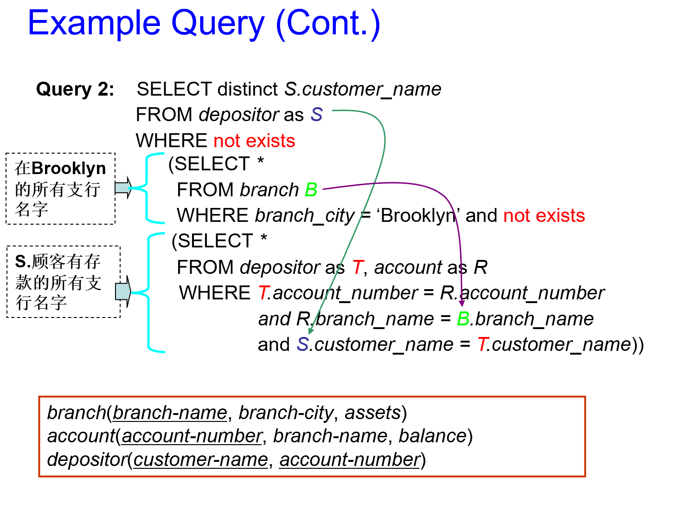

# Chapter 3 SQL介绍 Introduction to SQL

SQL语言包含以下几个部分：

1. 数据定义语言 Data Definition Language(DDL)

    - `create table`, `alter table`, `drop table`
    - `create index`, `drop index`
    - `create view`, `drop view`
    - `create trigger`, `drop trigger`

2. 数据操纵语言 Data Manipulation Language(DML)

    - `select...from`
    - `insert`, `delete`, `update`

3. 数据控制语言 Data Control Language(DCL)

    - `grant`, `revoke`

---

## 3.1 数据定义语言 Data Definition Language(DDL)

### 数据类型 Data Types
#### 域类型 Domain Types

| 类型 | 简介 |
| --- | --- |
| **char(n)** | 固定长度字符串，长度为 $n$.(不足的话用空格补足) |
| **varchar(n)** | 可变长度字符串，最大长度为 $n$. |
| **int** | 整数.(范围取决于机器) |
| **smallint** | 小整数.(范围取决于机器) |
| **numeric(p, d)** | 定点数，共 $p$ 位，小数点后 $d$ 位. |
| **real, double precision** | 浮点数，单精度和双精度.(精度取决于机器) |
| **float(n)** | 浮点数，精度为 $n$ 位. |

#### 内置数据类型 Built-in Data Types

| 类型 | 简介 | 示例 |
| --- | --- | --- |
| **date** | 日期类型，包含年（4位），月，日. | `date '2005-7-27'` |
| **time** | 一天中的时间，包含时，分，秒. | `time '09:00:30'`, `time '09:00:30.75'` |
| **timestamp** | 时间戳类型，包含年，月，日，时，分，秒. | `timestamp '2005-7-27 09:00:30.75'` |
| **interval** | 时间间隔.  | `interval '1' day` |

- date/time/timestamp相减会得到interval类型结果，interval类型也可以加到date/time/timestamp上.

---

- date, time functions:
    - **`current_data()`**, **`current_time()`**
    - **`year()`**, **`month()`**, **`day()`**, **`hour()`**, **`minute()`**, **`second()`**
### 表定义 Table Definition

#### 创建表 Create Table

```sql linenums="0"
create table 表名(
    属性名1 数据类型1 [约束条件1],
    属性名2 数据类型2 [约束条件2],
    ...
    [表级约束条件]
);
```

#### 完整性约束 Integrity Constriants

1. **`not null`**: 保证非空.
2. **`default 0`**: 指定缺省值.
3. **`primary key(A_1, ..., A_n)`**: 主键，不重且非空.（若主键只有一个属性，可以直接写在属性定义后面）
4. **`foreign key(A_1, ..., A_n) references r`**: 外键.

    - 可附加 **`on delete/update cascade/set null/restrict/set default`**，即如果被引用的表中主键的某一个值被删除/更改，则当前表中对该值的做法：1. 也删除/更改 2. 置空 3. 禁止删除/更改（回退） 4. 置为缺省值.

5. **`check(P)`**: 断言，保证属性满足条件 $P$.

!!! example
    !!! quote ""
        === "example 1"
            ```sql
            create table instructor(
                ID        char(5),
                name      varchar(20) not null,
                dept_name varchar(20),
                salary    numeric(8, 2)
            )

            1. insert into instructor values('10211', 'Smith', 'Biology', 66000); // success
            2. insert into instructor values('10211', null, 'Biology', 66000); // fail
            ```

        === "example 2"
            声明 $branch\_name$ 为主键，保证 $assets$ 非负的两种等价定义：

            ```sql
            create table branch(
                branch_name char(20) not null,
                branch_city char(30),
                assets      integer,

                primary key(branch_name),
                check(assets >= 0)
            );
            ```

            ```sql
            create table branch(
                branch_name char(20) primary key,
                branch_city char(30),
                assets      integer,

                check(assets >= 0)
            );
            ```
        
#### 删除和更改表 Drop and Alter Table

```sql linenums="0"
drop table 表名; -- 删除表和其中的内容
delete from 表名; -- 删除表中的内容，但保留表

alter table 表名 add 属性名 数据类型 [约束条件]; -- 添加属性，默认初始值为null
alter table 表名 drop 属性名; -- 删除属性（很多数据库不支持此操作）
alter table 表名 modify 属性名 数据类型 [约束条件]; -- 修改属性类型
```

## 3.2 数据操纵语言 Data Manipulation Language(DML)

### 基础查询结构 Fundamental Query Sturcture
```sql linenums="0"
select A_1, A_2, ..., A_n
from r_1, r_2, ..., r_m
where P;
```

- 对应关系代数表达式 $\Pi_{A_1, A_2, ..., A_n}(\sigma_{P}(r_1 \times r_2 \times ... \times r_m))$.

```sql linenums="0"
select A_1, A_2, sum(A_3)
from r_1, r_2, ..., r_m
where P
group by A_1, A_2
```

- 对应关系代数表达式 $_{A_1,A_2}{\large{g}}{}_{sum(A_3)}(\sigma(r_1\times r_2\times...\times r_m))$.

---

#### 基本子句 Clauses

!!! quote ""
    === "select"
        ```sql linenums="0"
        -- 基本用法
        select dept_name
        from instructor;

        -- select结果默认为多重集，可以用distinct去重，也可用all保留重复元组
        select distinct dept_name
        from instructor;

        select all dept_name
        from instructor;

        -- 可以用*代表所有属性
        select *
        from instructor;

        -- 可以对属性进行算术运算
        select ID, name, salary / 12
        from instructor;
        ```

    === "where"
        ```sql linenums="0"
        /*
        基本用法
        可用逻辑运算符 and, or, not连接，使用不等号比较大小
        */ 
        select name
        from instructor
        where dept_name = 'Comp. Sci.' and salary > 80000;


        -- between...and 用于范围查询
        select name
        from instructor
        where salary between 90000 and 100000;
        
        -- 支持元组比较
        select name, course_id
        from instructor, teaches
        where (instructor.ID, dept_name) = (teaches.ID, 'Biology');
        ```

    === "from"
        ```sql linenums="0"
        /*
        基本用法
        对应关系代数表达式中的笛卡尔积
        */
        select *
        from instructor, teaches;

        -- 使用natural join(以下两条语句等价)
        select name, course_id
        from instructor natural join teaches;

        select name, course_id
        from instructor, teaches
        where instructor.ID = teaches.ID;
        ```

        !!! warning 
            注意from子句中若不同表中有相同属性名，一般用“表明.属性名”加以区分，否则在natural join时要特别注意误合并的情况。

            例如对以下关系模式

            $$\begin{aligned}&course(\underline{course\_id},\ title,\ \underline{dept\_name},\ credits) \\ &teaches(ID,\ \underline{course\_id},\ sec\_id,\ semester,\ year) \\ &instructor(ID,\ name,\ \underline{dept\_name},\ salary)\end{aligned}$$

            我们要列出所有导师的姓名和所教课程的标题。

            ```sql linenums="0"
            /*
            错误，因为直接natural join使得course.dept_name = instructor.dept_name, 
            而老师所属学院和课程开课学院不一定相同
            */
            select name, title
            from instructor natural join course natural join teaches;

            -- 正确，避开dept_name的连接
            select name, title
            from instructor natural join teaches, course
            where teaches.course_id = course.course_id;

            -- 另一种正确写法
            select name, title
            from (instructor natural join teaches) join course using(course_id);
            ```

    === "rename(as)"
        ```sql linenums="0"
        -- 基本用法
        select ID, name, salary / 12 as monthly_salary
        from instructor;

        select distinct T.name
        form instructor as T, instructor as S
        where T.salary > S.salary and S.dept_name = 'Comp. Sci.';
        ```

        - `as`可以省略。
    
    === "group by/aggregate functions"
        1. aggregate functions
            ```sql linenums="0"
            -- 找出CS系教授的平均工资
            select avg(salary)
            from instructor
            where dept_name = 'Comp. Sci.';

            -- 找出在2010春学期上课的教授数量
            select count(distinct ID)
            from teaches
            where semester = 'Spring' and year = 2010;
            ```

        2. `group by`: 分组计算aggregate functions
            ```sql linenums="0"
            -- 计算每个系的教授平均工资
            select dept_name, avg(salary)
            from instructor
            group by dept_name;
            ```
        !!! warning
            select子句中的属性必须是group by子句中的属性或者aggregate functions的参数。

    === "having"
        对组再进行筛选。
        ```sql linenums="0"
        -- 找出系平均工资大于42000的系名和对应的平均工资
        select dept_name, avg(salary)
        from instructor
        group by dept_name
        having avg(salary) > 42000;
        ```

        !!! note
            having子句在分组之后执行，而where子句在分组之前执行。所以**先执行where，再执行having**.


    === "order by"
        ```sql linenums="0"
        -- 基本用法
        select distinct name
        from instructor
        order by name;

        -- desc降序，asc升序（默认）
        select distinct name
        from instructor
        order by name desc;

        -- 可以对多个属性排序
        select dept_name, name
        from instructor
        order by dept_name, name;
        ```

    === "limit"
        ```sql linenums="0"
        -- 基本用法
        select name
        from instructor
        order by salary desc
        limit 3; -- 相当于 limit 0, 3

        -- 可以指定偏移量，格式为limit offset, number
        select name
        from instructor
        order by salary desc
        limit 2, 3
        ```

---

<figure markdown="span">
    {width="500"}
</figure>

- 各子句的执行顺序：from -> where -> group by -> having -> select -> order by -> limit

#### 字符串操作 String Operations
!!! warning
    SQL中用单引号表示字符串。

- 用`like`表示通配，`%`表示任意长度的字符串，`_`表示一个字符。
    ```sql linenums="0"
    -- 找出所有名字中包含子串"dar"的教授
    select name
    from instructor
    where name like '%dar%';

    -- 匹配字符串"100 %"，用escape定义转义符
    like '100 \%' escape '\'
    ```

- 支持用`||`连接字符串
- 支持大小写转换、获取字符串长度、字符串截取等操作

#### 集合操作 Set Operations
使用`union`, `intersect`, `except`进行集合操作。

!!! warning
    集合操作自动（对输入）去重。若要保留重复元组，需在操作符后加`all`，变成`union all`, `intersect all`, `except all`.

#### 空值 Null Values
**`null`**表示一个未知值或不存在的值。

- `null`参与数学运算，返回结果仍为`null`.
- `null`与任何值（包括自己）的比较结果都是`unknown`.
    ```sql linenums="0"
    -- unknown参与逻辑运算的结果：
    unknown or true -- true
    unknown or false -- unknown
    unknown or unknown -- unknown

    unknown and true -- unknown
    unknown and false -- false
    unknown and unknown -- unknown

    not unknown -- unknown
    ```
- `is null`和`is not null`可用于判断某属性值是否为`null`. `is unknown`可用于判断某属性值是否为`unknown`.
    ```sql linenums="0"
    -- 举例
    select name
    from instructor
    where salary is null;
    ```
- 聚合函数 aggregate functions(**除了count(*)**)在计算时直接忽略`null`值，当然如果没有满足条件的元组，返回值为`null`(**count**返回0).
- 在去重和分组时，`null`值的性质和别的属性值相同，即`null`与其他值不同，但两个`null`被认为是相同的。

### 高级查询结构 Advanced Query Structure
#### 嵌套子查询 Nested Subqueries
一个查询的结果（其实也是一张表）可以直接嵌套在另一个查询中。

!!! quote ""
    === "in, not in"
        set membership, 判断包含关系。
        ```sql linenums="0"
        -- 找出所有在2009年秋和2010年春都开设的课程
        select distinct course_id
        from section
        where semester = 'Fall' and year = 2009 and
              course_id in (select course_id
                            from section
                            where semester = 'Spring' and year = 2010);

        -- 找出所有在2009年秋开设，但不在2010年春开设的课程
        select distinct course_id
        from section
        where semester = 'Fall' and year = 2009 and
              course_id not in (select course_id
                                from section
                                where semester = 'Spring' and year = 2010);

        -- 找出上过10101号教授的课的学生数（光用course_id不够，因为一门课可能有多个教授上）
        select count(distinct ID)
        from takes
        where (course_id, sec_id, semester, year) in
            (select course_id, sec_id, semester, year
             from teaches
             where teaches.ID = 10101);
        ```       
    === "some, all"
        set comparison, 集合元素值比较。
        ```sql linenums="0"
        -- 找出工资大于至少一个生物系教授的教授名字
        select name
        from instructor
        where salary > some(select salary
                            from instructor
                            where dept_name = 'Biology');
        
        -- 找出工资大于所有生物系教授的教授名字
        select name
        from instructor
        where salary > all(select salary
                            from instructor
                            where dept_name = 'Biology');
        ```

        - 当子查询只返回一个值（称为scalar subquery）时，可以直接将其当作一个数值进行比较。
            ```sql linenums="0"
            -- 举例
            select name
            from instructor
            where salary * 10 > (select budget
                                 from department
                                 where department.dept_name = instructor.dept_name);
            ```   

    === "exists, not exists"

        判断表是否为空。
        ```sql linenums="0"
        exists r -- 等价于r不为空集
        not exists r -- 等价于r为空集
        ```
        <figure markdown="span">
            {width="500"}
        </figure>
        <figure markdown="span">
            {width="500"}
        </figure>

    === "unique, not unique"
        判断是否有重复元组。（空集也被视为unique）
        ```sql linenums="0"
        -- 找出所有在2009年最多只开过1次的课程
        select T.course_id
        from course as T
        where unique(select R.course_id
                     from section as R
                     where T.course_id = R.course_id and R.year = 2009);
        ```

- 另外，子查询还可以直接写在from子句中，这样的子查询称为[derived relation]().

#### 派生关系 Derived Relations

```sql linenums="0"
-- 找到平均工资大于42000的系的平均工资。
-- 前文中该查询使用having子句实现，这里换一种实现方法。
select dept_name, avg_salary
from (select dept_name, avg(salary) as avg_salary
      from instructor
      group by dept_name)
where avg_salary > 42000;

-- 也可以给子查询的结果表及其属性命名
select dept_name, avg_salary
from (select dept_name, avg(salary)
      from instructor
      group by dept_name)
      as dept_avg(dept_name, avg_salary)
where avg_salary > 42000;
```

> 派生表似乎必须有别名？

#### with子句 With Clause

定义只在当前查询中可用的临时表。
```sql linenums="0"
with dept_total(dept_name, value) as 
    (select dept_name, sum(salary)
     from instructor
     group by dept_name)
     dept_total_avg(value) as
    (select avg(value)
     from dept_toal)
select dept_name
from dept_toal, dept_total_avg
where dept_total.value >= dept_total_avg.value;
```

### 数据库的修改 Modification of the Database
!!! quote ""
    === "删除 Deletion"
        ```sql linenums="0"
        -- 删除所有教授
        delete from instructor;

        -- 删除所有Finance系教授
        delete from instructor
        where dept_name = 'Finance';

        -- 删除所有系建在Watson的学院的教授
        delete from instructor
        where dept_name in (select dept_name
                            from department
                            where building = 'Watson');
        ```
    === "插入 Insertion"
        ```sql linenums="0"
        -- 插入一条新的课程元组
        insert into course
            values('CS-437', 'Database Systems', 'Comp. Sci.', 4);

        -- 可以指定属性名顺序
        insert into course(course_id, title, dept_name, credits)
            values('CS-437', 'Database Systems', 'Comp. Sci.', 4);

        -- 可将子查询结果插入表中，如把所有教授插入学生表中，并将tot_creds属性置为0
        insert into student
            select ID, name, dept_name, 0
            from instructor
        ```
    === "更新 Update"
        ```sql linenums="0"
        -- 所有工资大于100000的教授增加3%工资，其他教授增加5%(注意顺序很重要)
        update instructor
            set salary = salary * 1.03
            where salary > 100000;
        update instructor
            set salary = salary * 1.05
            where salary <= 100000;

        -- 可用case语句
        update instructor
            set salary = case
                            when salary <= 100000 then salary * 1.05
                            else salary * 1.03
                         end;
        ```