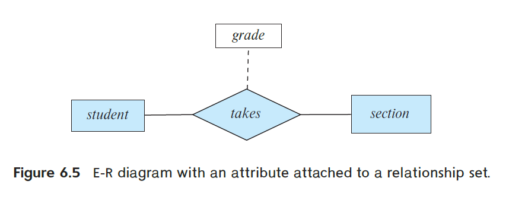
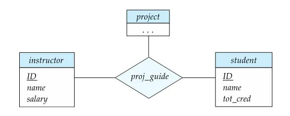

# Chapter 6 ER模型 Entity-Relationship Model
## 6.0 数据库设计流程 Database Design Process
1. 需求分析 requirement analysis
2. 概念设计 Conceptual design
3. 逻辑设计 logical design
4. 物理设计 physical design

---

本章介绍的ER模型即为2. 概念设计的工具之一。

## 6.1 ER图概述 Overview of ER Diagram
<figure markdown="span">
    {width="600"}
</figure>

一些要点：

- 确定各个实体集。
- **花括号**表示多值属性。（如图中 $time\_slot$ 中属性）
- 建立关系，**箭头**表示多（包括零）对（指向）一，**单横线（无箭头）**表示多对多，**双横线**表示全参与（集合中每个元素都参与此联系），**双框**表示弱实体集（不能独立存在，有依赖性，如图中 $section$ 依赖于 $course$）。
- 联系也可以带有属性。（如图中 $grade$ 属性）

## 6.2 ER模型概述 Outline of the ER Model

ER = Entities(实体) + Relationship(联系).

---

### 实体集 Entity Sets

`实体 entity`
:   An **entity** is an object that exists and is digtinguishable from other objects.

`属性 attributes`
:   实体有属性，允许的属性值的集合称为**域(domain)**.
:   - **简单(simple)属性**和**复合(composite)属性**（如名字包含姓和名，地址包含城市和街道等）
    - **单值(single-valued)属性**和**多值(multi-valued)属性**（如一个人有多个电话号码）
    - **派生(derived)属性：**可通过其他属性（也称为**基(base)属性**）的计算得到（如年龄可通过出生日期计算得到）

`实体集 entity set`
:   一个实体集包含多个同类的实体 | An **entity set** is a set of entities of the same type that share **the same properties**.

---

实体集的表示：

1. 矩形代表实体集；
2. 实体的属性列在矩形内；
3. 下划线代表主键中属性。

<figure markdown="span">
    {width="400"}
</figure>

<figure markdown="span">
    {width="400"}
</figure>

- 图中 $age$ 是派生属性。

### 联系集 Relationship Sets

`联系 relationship`
:   联系是**两个或多个不同类**实体之间的关联 | A **relationship** is an association among several entities.

`联系集 relationship set`
:   一个联系集表示**两个或多个**实体集之间的关联，换言之，一个联系集包含多个**同类**联系 | Formally, a **relationship set** is a mathematical relation among $n\geq 2$ entities, each taken from entity sets $\{(e_1, e_2, ..., e_n) | e_1\in E_1, e_2\in E_2, ..., e_n\in E_n\}$ , where $(e_1, e_2, ..., e_n)$ is a relationship, $E_i$ is an entity set.
:   联系集也可以有属性。

<figure markdown="span">
    {width="400"}
</figure>

---

#### 联系集的度 Degree of a Relationship Set

一个**联系集的度**为该参与该联系集的实体集数量。

度为2的联系集称为二元(binary)联系。

!!! Note
    实际应用中，尽量使用二元联系。多元联系最好转化成二元联系。

    !!! Example
        如下图，可以将联系 $proj\_guidie$ 也转为实体集，就全部变为二元联系了。

        <figure markdown="span">
            {width="300"}
        </figure>

