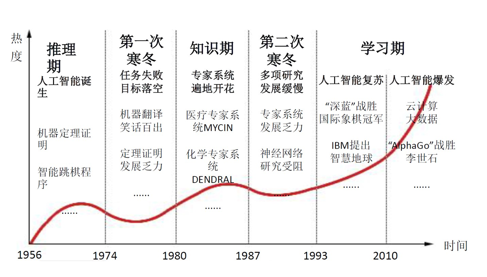
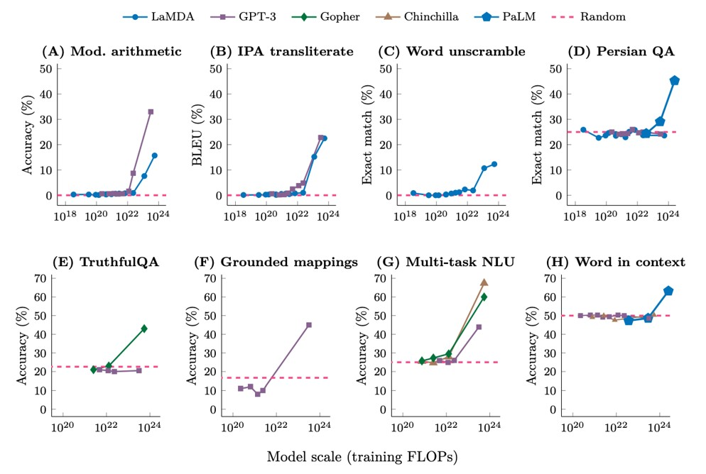

# Chapter 1 引入 Introduction

## 1.1 NLP简介

**自然语言处理（Natural Language Processing, NLP）**是一种通过计算机手段分析文本的方法，属于计算机科学、人工智能和语言学的交叉领域。

???+ question "为什么NLP很难？"
    - 人类语言具有多义性，包括词汇（Lexical Ambiguity）、句法（Syntactic Ambiguity）、语义（Semantic Ambiguity）、回指（Anaphora Ambiguity）等多义性。
    - 在表达、学习和使用语言、情境、世界、视觉等方面的复杂性。（比如我会说“香蕉”，但不会说“黄香蕉”，因为我们默认香蕉大概率是黄的）
    - 人类语言的理解依赖于真实世界、共识和上下文语境信息。（具身智能，身心是一体的，所以AI需要有类似人类的身体感知，才能理解人类语言）

## 1.2 NLP简史 A Brief History of NLP

<figure markdown="span">
    {width="500"}
</figure>

| 时间 | 特点 |
| :--: | :--: |
| late 1940s - late 1960s | 基于**规则**，主要聚焦于机器翻译，比如使用双语词典将俄语单词映射到英语单词 |
| late 1960s - late 1970s | 基于**知识**，出现BASEBALL问答系统，输入输出受限，涉及的语言处理较简单，以及精神分析师聊天机器人ELIZA |
| late 1970s - late 1980s | 基于**编译**，语法理论发展 |
| late 1990s - late 2010s | 基于**学习**，统计学习方法流行，利用带标注的数据构建模型（WordNet数据集） |
| 2013 - now | 基于**深度学习**，词向量、序列到序列模型、注意力机制、预训练模型等技术发展 |

## 1.3 GPT简述

**GPT（Generative Pre-trained Transformer）**是一种基于Transformer的预训练模型，由OpenAI发布，是目前最流行的NLP模型之一。

- 2019年2月OpenAI发布GPT-2，包含了1.5亿参数
- 2020年11月OpenAI发布GPT-3，包含了**1750亿**参数
- “上下文”学习——提示词（"In-context" Learning——Prompting）
    1. SOFTWARE 1.0: 设计算法来解决问题
    2. SOFTWARE 2.0: 设计数据集来解决问题
    3. SOFTWARE 3.0: 设计提示词来解决问题（我们现在所处阶段）
- **能力涌现（Emergent Ability）：**当模型参数、数据规模、计算开销增大到一定规模时，模型的特定能力（例如，举一反三、数学证明、跨域迁移的能力）出现显著增强
    <figure markdown="span">
        {width="500"}
    </figure>
    - 能力是线性增长的，但是评价指标是非线性的？（比如要预测两个五位数相加的结果，如果每次优化多预测对一个数字，那就会在预测对六个数字时，正确率突然从0到100%）
    - 尺度定律（Scaling Law）：大模型的最终性能主要与计算量、模型参数量和训练数据量三者的大小相关，而与模型的具体结构（层数/深度/宽度）基本无关，且存在一种可预测的关系（“只是钱的问题”）。
- GPT-3的局限性：
    - 在阅读理解、自然语言推理等任务上的表现还不如T5等规模更小的模型，复杂推理能力较弱
    - 对于复杂、个性化任务指令（例如，”请帮我找出这段代码中的错误“）的理解准确度较低
    - 训练语料中包含部分存在偏见的文本，GPT-3生成的文章可能存在性别、种族、宗教偏见
- Codex：在GPT-3的基础上，使用从Github收集的159G代码对其进行微调，正确率达到37.7%
- ChatGPT(GPT-3.5)