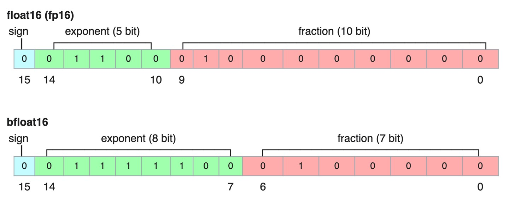
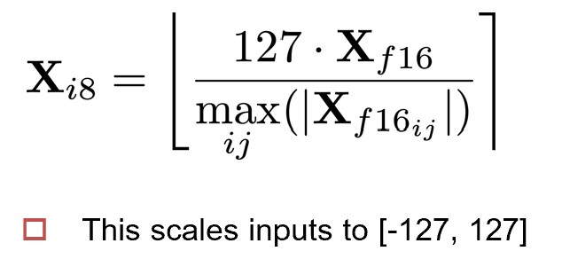

# Chapter 10. 模型压缩与数据高效微调 Model Compression and Data-Efficient Fine-Tuning

## 10.1 模型压缩 Model Compression

模型压缩是指**有损地**通过减少模型的参数量、内存占用和计算复杂度来提高模型的效率和可部署性。

### 量化 Quantization

#### Post-Training Quantization

Post-Training Quantization是指在模型训练完成后，对模型参数进行量化，以减少模型大小和内存占用。

浮点数直接砍半，并调整指数部分以保持更高的精度：

<figure markdown="span">
    {width="500"}
</figure>

甚至可以直接将浮点数转换为整数，如 absmax 量化：

<figure markdown="span">
    {width="300"}
</figure>

但不能一股脑地将所有参数都量化，对一些重要值的量化可能会产生问题。而这些重要值往往分布在低概率密度的区域（异常值），所以可以只对高概率密度区域的值进行量化。这样的方法称为 Model-Aware Quantization.

#### Quantization-Aware Training

Quantization-Aware Training是指在模型训练过程中就采用量化的方法。

### 剪枝 Pruning

剪枝是指在模型训练完成后，去掉一些不重要的参数（置为0），以减少模型大小和内存占用。

### 蒸馏 Distillation