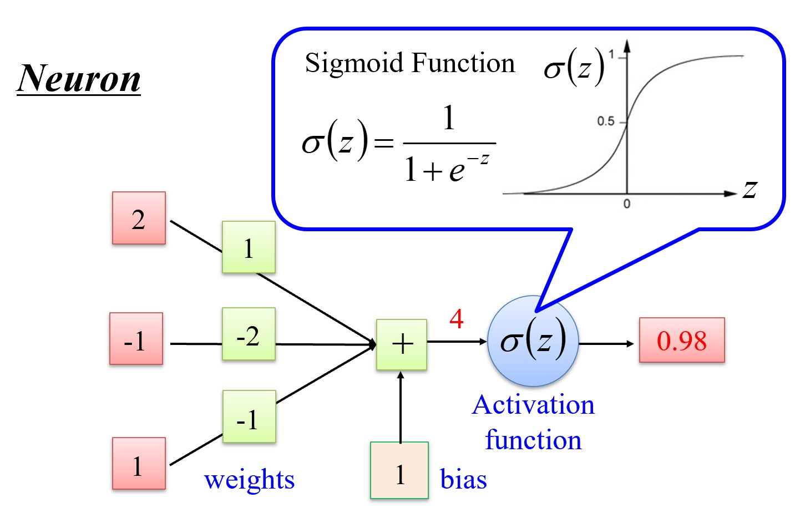
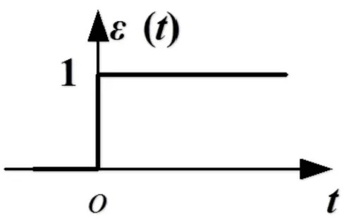
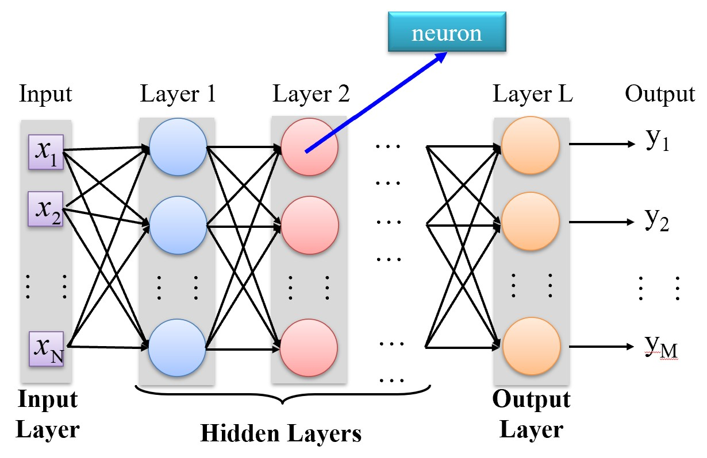
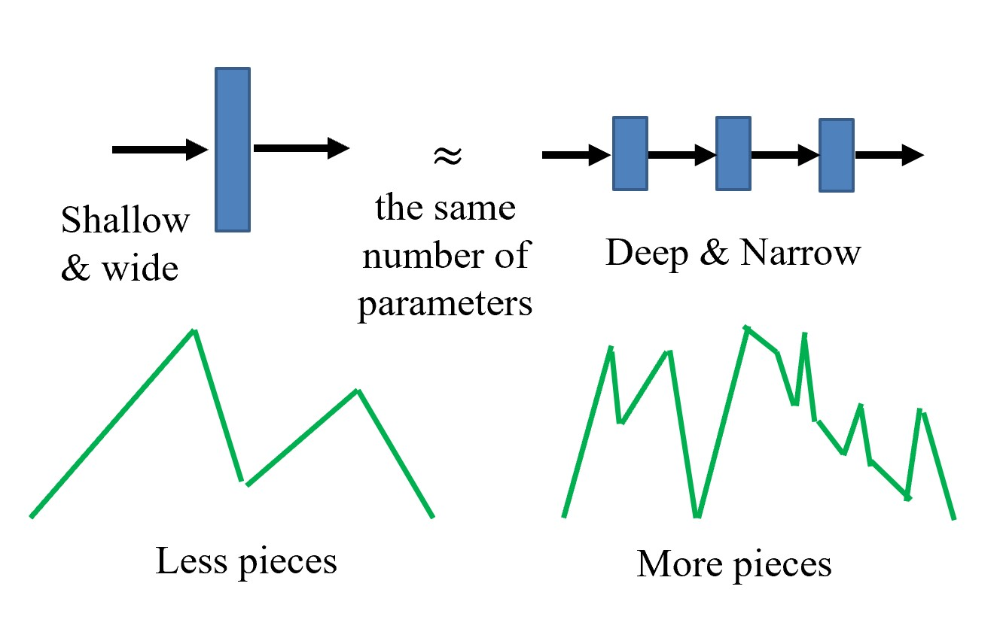
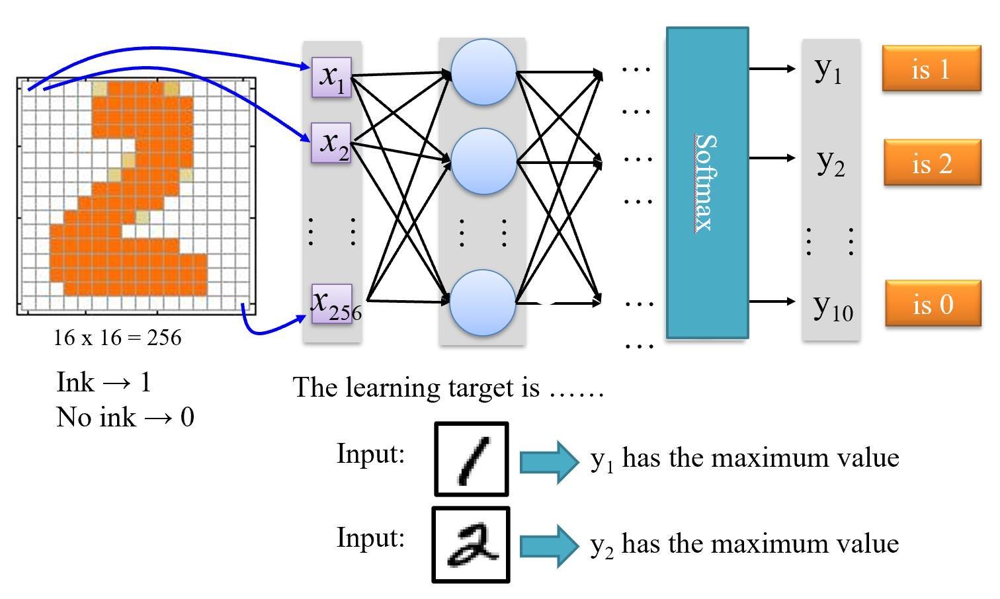
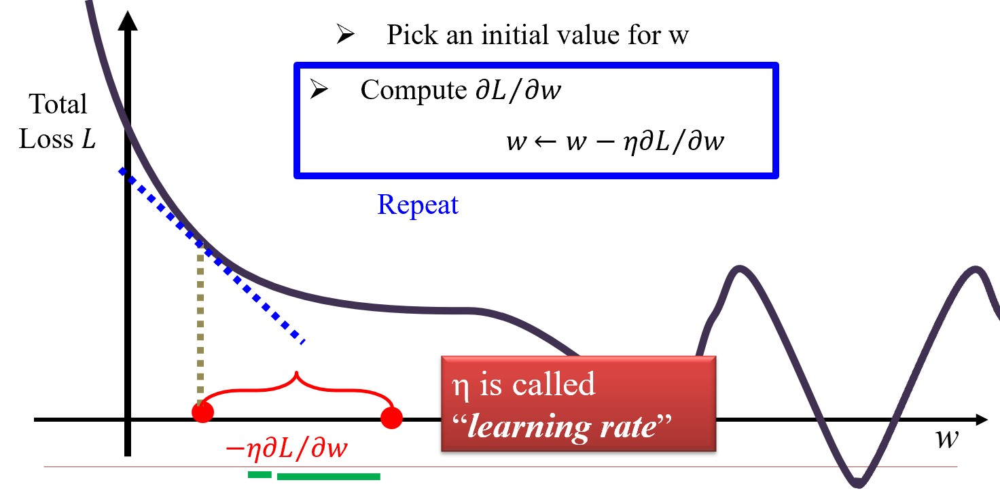

# Chapter 2 深度学习基础 Deep Learning Basics

## 2.1 人工智能的诞生

1955年**达特茅斯会议**提出**人工智能（Artificial Intelligence）**这一术语。四位学者：John McCarthy（时任Dartmouth数学系助理教授，1971年度图灵奖获得者）, Marvin Lee Minsky（时任哈佛大学数学系和神经学系Junior Fellow，1969年度图灵奖获得）, Claude Shannon（Bell Lab, 信息理论之父）, Nathaniel Rochester（IBM, 第一代通用计算机701主设计师）。

报告列举了人工智能面临的七类问题：

1. 自动计算机 Automatic Computers
2. 如何编程计算机使用（自然）语言 How Can a Computer be Programmed to Use a Language
3. 神经元网络 Neuron Nets
    - 如何安排一组（假设的）神经元以形成概念
4. 计算的规模理论 Theory of the Size of a Calculation
5. 自我学习与提高 Self-improvement
6. 抽象 Abstractions
    - 从感官中形成抽象
7. 随机性与创造力 Randomness and Creativity
    - 随机性必须由直觉引导才能有效

## 2.2 深度学习基础 Deep Learning Basics

深度学习的三个步骤：

1. 定义一个函数集合（包括了接下来要介绍的神经网络）
2. 选择测试指标来评估模型
3. 挑出表现最好的模型

---

### 全连接神经网络 Fully Connected Neural Networks

<figure markdown="span">
    {width="500"}
</figure>

???+ question "为什么不用阶跃函数作为激活函数？"
    <figure markdown="span">
        {width="300"}
    </figure>

    如图，阶跃函数图像中出现跳变，两端的梯度为0，导致梯度消失，无法进行反向传播。（它在学习时不知道该往左走还是往右走）

<figure markdown="span">
    {width="500"}
</figure>

???+ question "为什么全连接网络同一层的节点之间没有连接？"
    1. 首先前馈网络必须是无环的，否则会导致循环依赖，无法进行前向传播；
    2. 在1的前提上，每个神经元在当前层的计算都是基于上一层的输入，相互连接只导致信息重复流动，没有带来额外的表达能力。（本质上还是上一层的结果向量乘上一个权重矩阵）

而深度学习的“深度”指的就是网络的深度，即网络中隐藏层（hidden layers）的层数。

???+ question "为什么深一些的网络更好？"
    <figure markdown="span">
        {width="300"}
    </figure>
    
    但神经网络也不是越深越好，太深的网络会导致梯梯度消失等问题。

### 训练数据：评估模型

<figure markdown="span">
    {width="500"}
</figure>

- softmax层（输出层）的效果：大的更大，小的更小；归一化为概率分布
- 得到输出后用损失函数评估

### 梯度下降：挑出最好的函数

目标：找到一组网络参数，使得损失函数最小。

<figure markdown="span">
    {width="500"}
</figure>

## 2.3 深度学习理论最新进展 Recent Advances in DL Theory