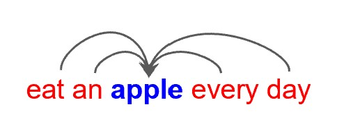
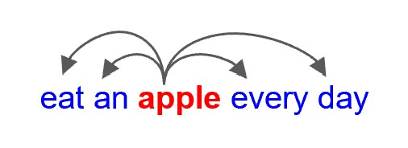
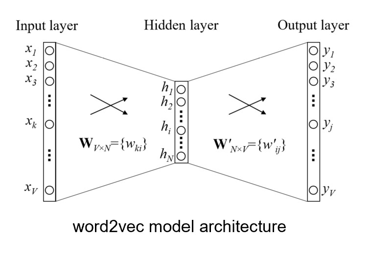
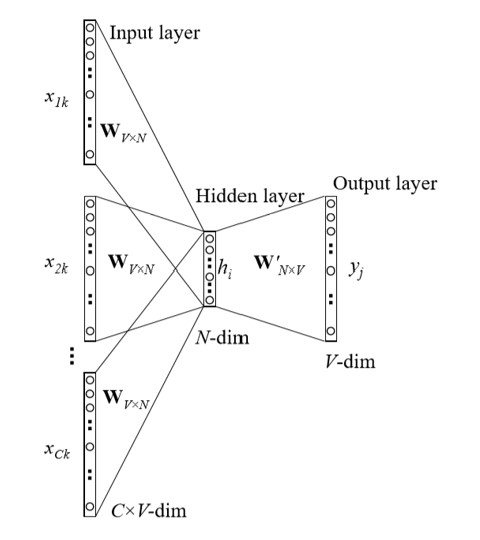
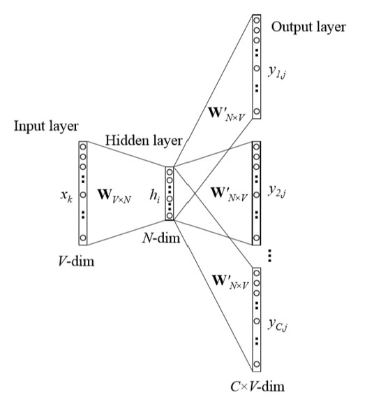
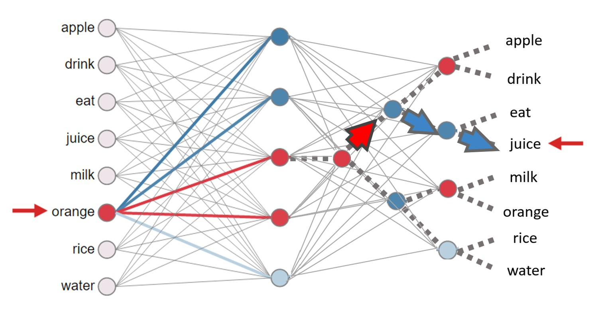

# Chapter 3 词向量 Word Embedding

???+ note 
    词向量本质上是一个降维的过程。

## 3.1 计算机如何表示词义

### 分类词典

构建一个层次式分类的语义词典，描述词语之间的关系（WordNet）

#### 缺点

- 难以描述同义词之间的微妙区别
- 新词无法及时更新
- 主观化
- 依赖人力构建和调整
- 难以准确计算词语相似度

### 独热编码 One-Hot Encoding

常用于离散变量表示。

#### 缺点
  
- 词数过多，维度过高，占用空间大
- 同义词、近义词等关系无法表示（如搜索"Seattle motel"和"Seattle hotel"的结果理应相似，但"motel"和"hotel"的独热编码正交）

### 分布式表示 Distributional Similarity Based Representation

用一个更稠密的向量直接表示一个词。例如词库中总词数为50000，词向量维度为300，则每个词用一个300维的向量表示。

> 如何了解一个人？通过他的朋友了解。如何了解一个词的意思？通过它的**上下文**了解。

- 用MLP进行降维，目标约束是让同义词、近义词的向量距离更近
- 如果多个词可以填在同一个上下文中，那么它们的含义就应该是相似的。

## 3.2 词向量模型

???+ tip
    本节主要介绍 **word2vec**，Google在2013年提出的一个词向量模型，包含 **CBOW(Continuous Bag of Word)** 和 **Skip-gram** 两种方法。

### 两种方法

- CBOW：给定上下文，预测中心词
    <figure markdown="span">
        {width="200"}
    </figure>
- Skip-gram：给定中心词，预测上下文
    <figure markdown="span">
        {width="200"}
    </figure>

### 词向量模型结构

以词库大小为50000，词向量维度为300为例：词向量模型接受的输入为独热编码，即50000维的向量；模型将其变换为词向量，即一个300维的向量；最后再变换为50000维的向量，经过softmax计算每个词的概率分布。

<figure markdown="span">
    {width="500"}
</figure>

| {width="300"} | {width="300"} |
|:----------------------------:|:----------------------------:|
| **CBOW**                     | **Skip-gram**                |

### 论文贡献

#### 层次Softmax Hierarchical Softmax

如果使用传统softmax，相当于在做50000分类，softmax计算量过大。

层次softmax用二叉树来表示词典，叶子节点是词，非叶子节点是**二分类器**，相当于做一个编码，从前往后一位一位预测。

<figure markdown="span">
    {width="500"}
</figure>

- 缺点：不适合gpu并行计算.

#### 负采样 Negative Sampling

每次找若干个负样本（不在上下文中的词）进行训练，给它们打低分。

## 3.3 词向量应用

1. 计算相似度 Word Similarity
2. 机器翻译 Machine Translation
3. 命名实体识别 Part-of-Speech and Named Entity Recognition
4. 关系抽取 Relation Extraction
5. 情感分析 Sentiment Analysis 
6. 指代消歧 Co-reference Resolution 

## 3.4 词向量的局限性

- 无法解决多义词问题
- 难以调试（比如我在实际应用中想把“红色”和“绿色”分开，但难以训练）
- 序列化问题（没考虑上下文词的顺序）