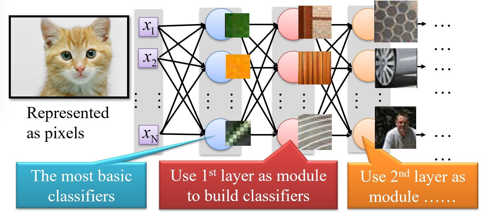
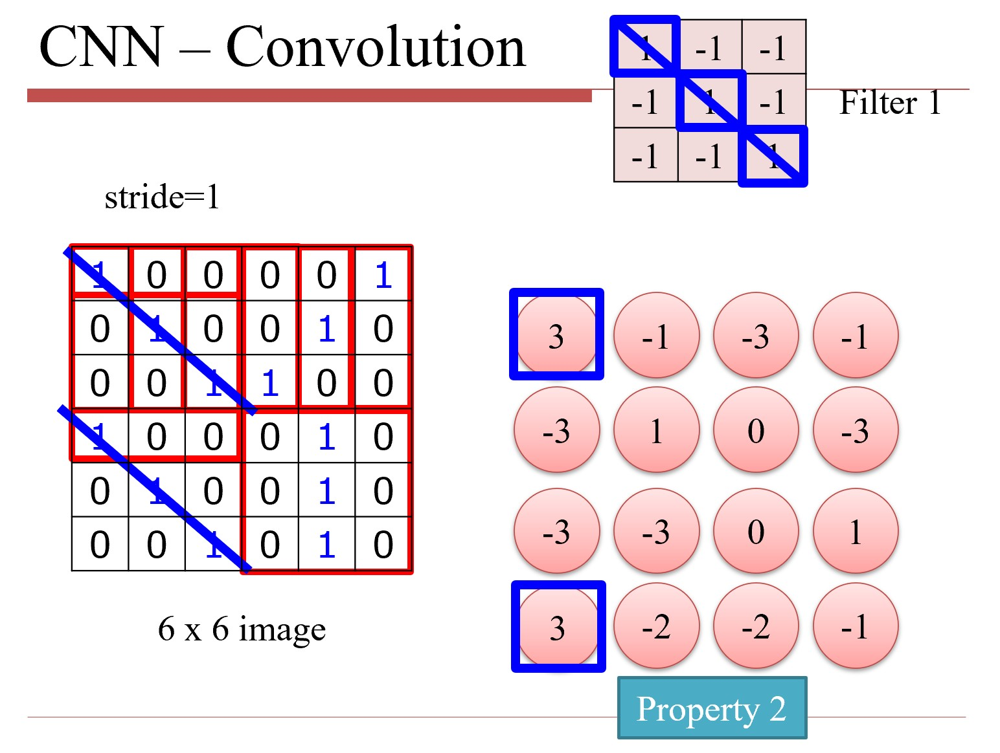
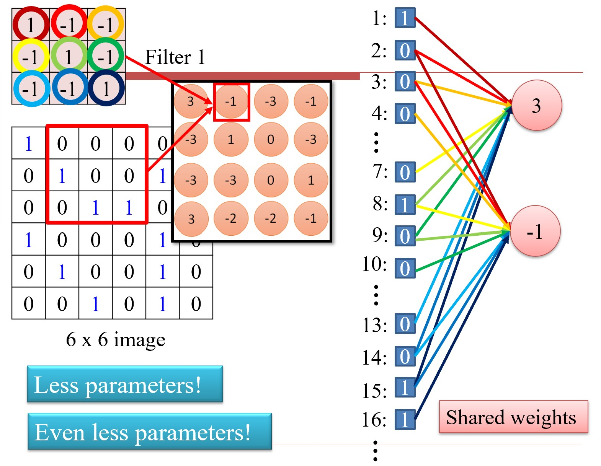
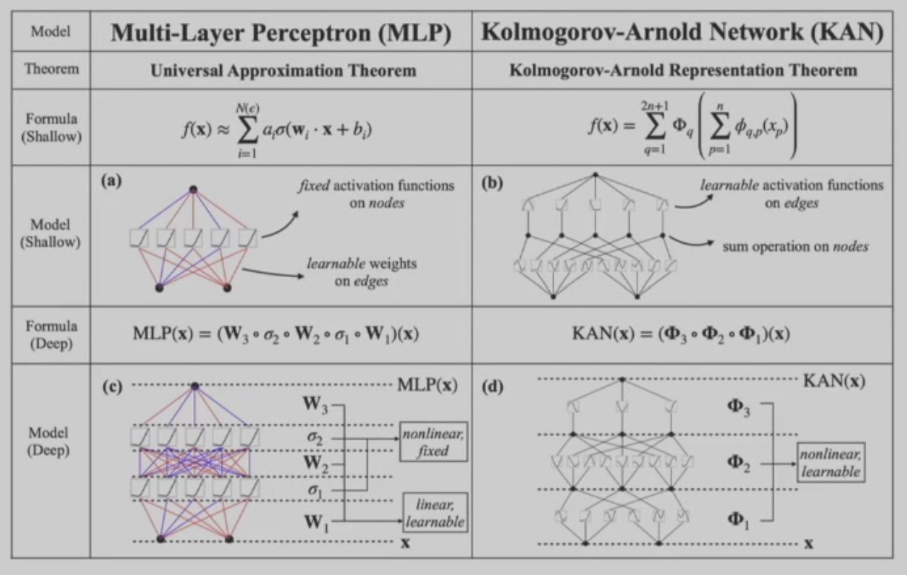
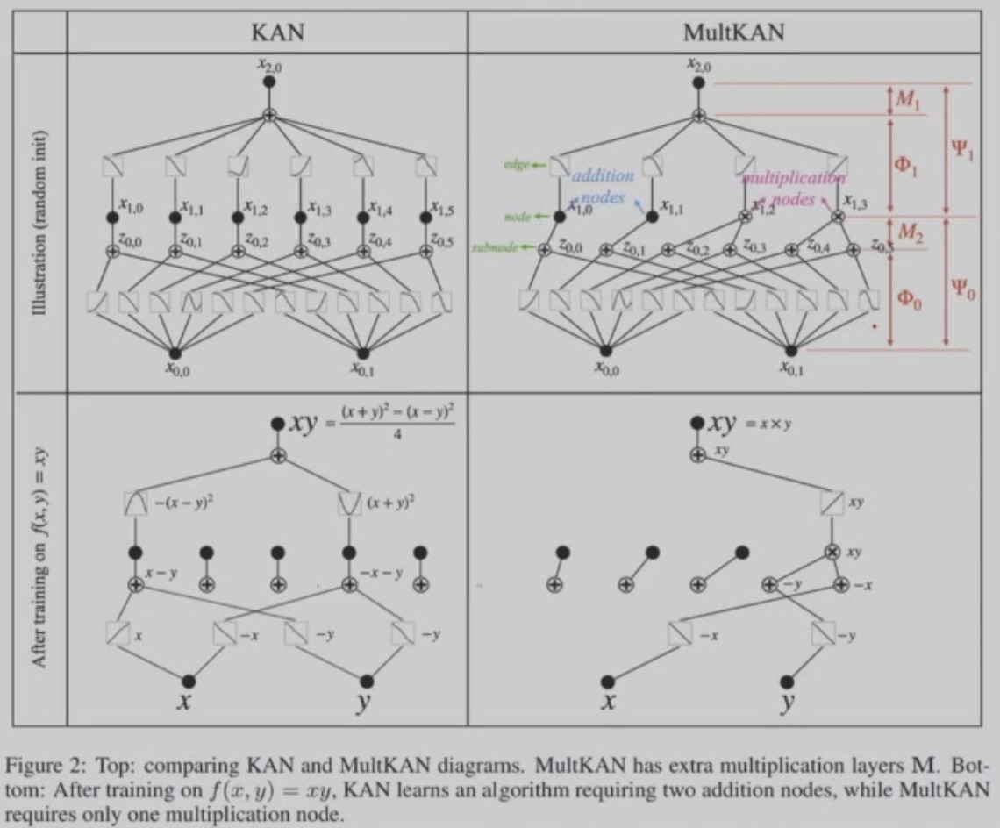
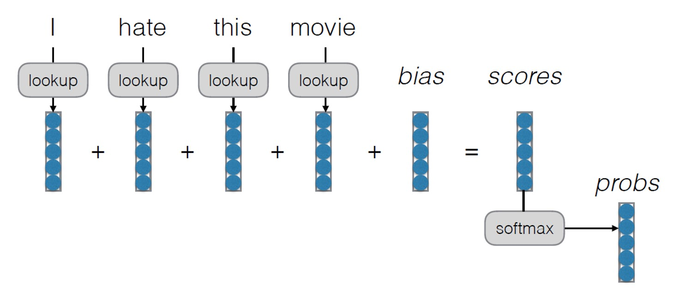
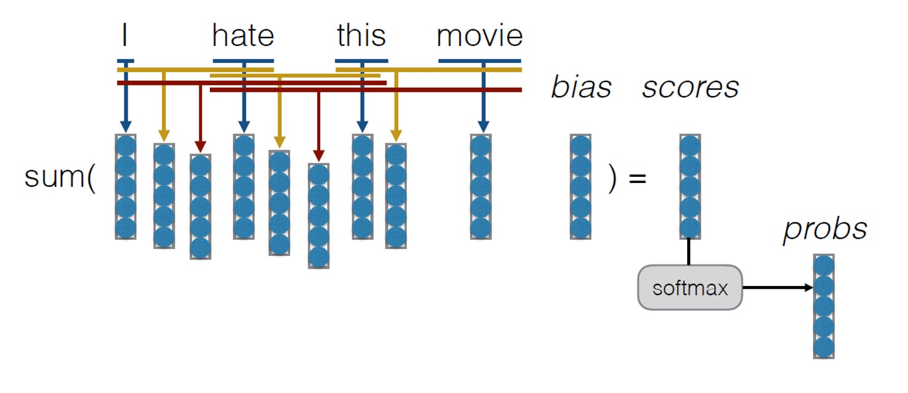
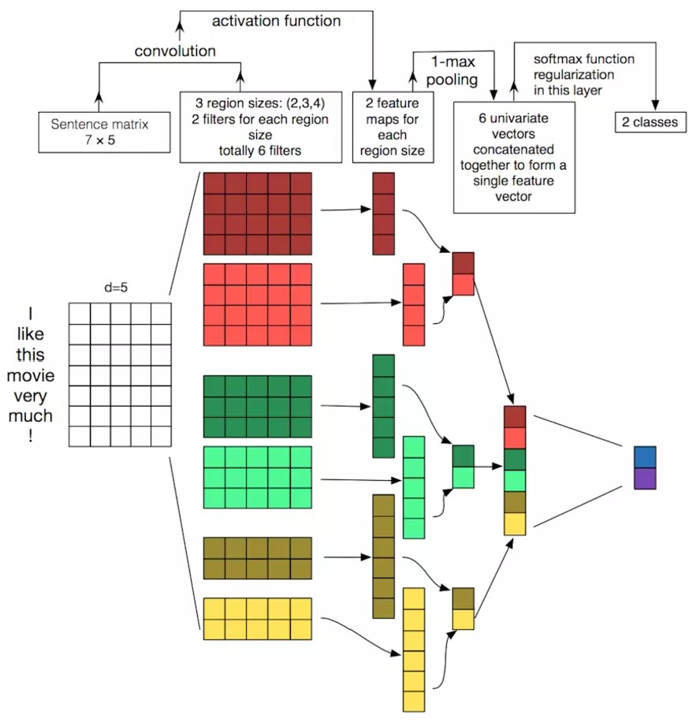
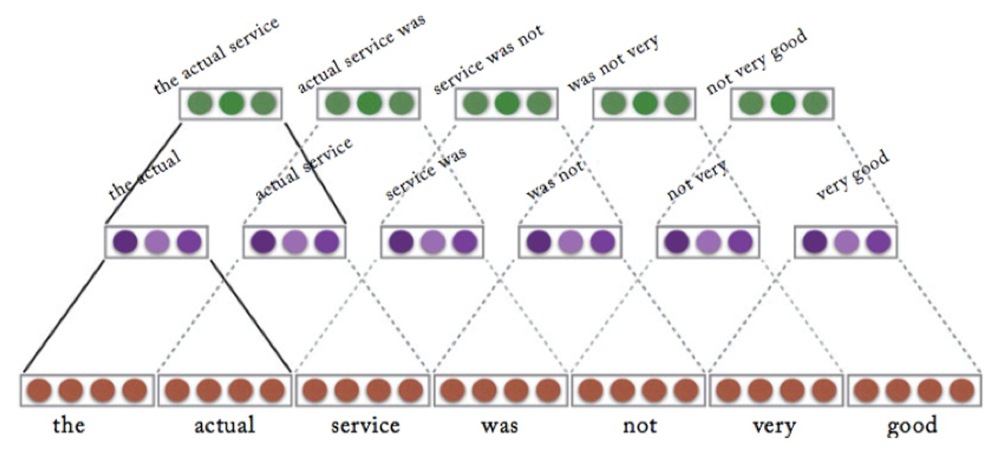
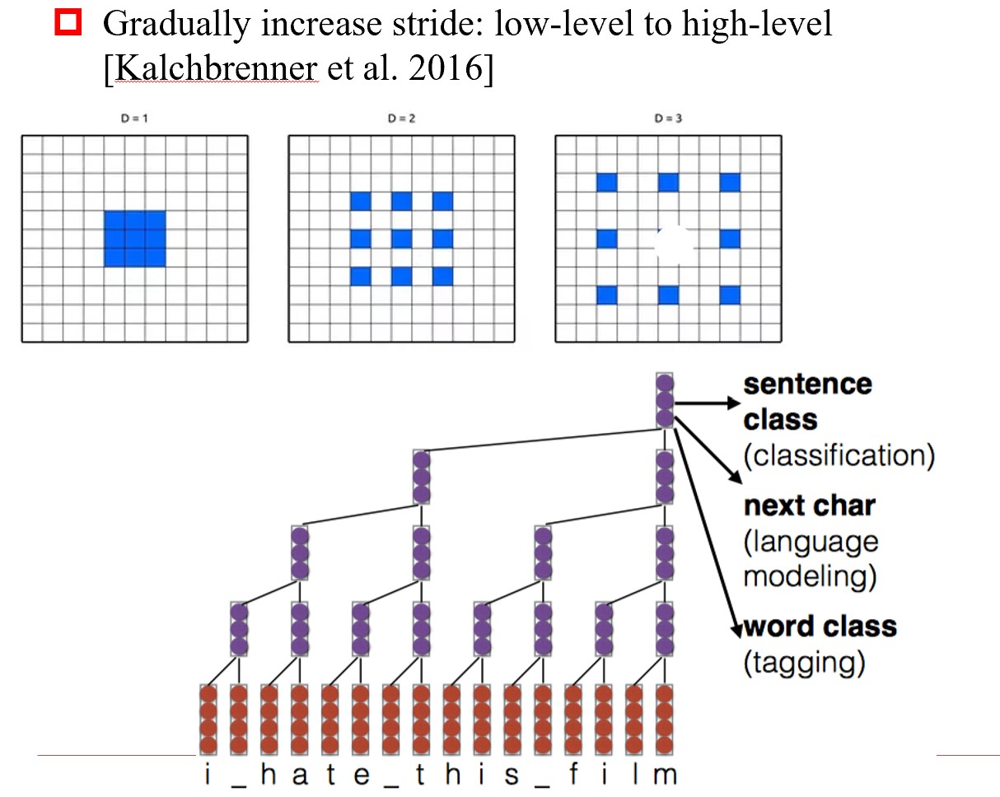

# Chapter 4 卷积神经网络 Convolutional Neural Networks

<figure markdown="span">
    {width="500"}
</figure>

- 使用FCNN处理图像数据时，由前到后的每一层依次识别更复杂的特征。

能否针对图像数据的特点，设计一种更简化的网络结构？

---

## 4.1 图像数据的特点

1. 一些特征具有空间局部性（如鸟嘴并不占据整张鸟的图像），所以某些神经元可以不考虑整张图像的所有像素；
2. 一些同样的特征可能出现在图像的不同位置（平移不变性，如鸟嘴可能在左上角，也可能在中间），所以某些神经元可以共享参数；
3. 图像大小（分辨率）不影响物体识别，所以可对原图像进行下采样以缩小尺寸、减少参数。

以上第1, 2点对应了卷积神经网络的**卷积层**，第3点对应了**池化层**。

## 4.2 卷积神经网络结构

### 卷积层

<figure markdown="span">
    {width="400"}
</figure>

- 卷积操作事实上在寻找图像中与卷积核匹配（模式相似）的区域，得到的结果称为**特征图（Feature Map）**，是一个关于卷积核模式的热力图。

<figure markdown="span">
    {width="400"}
</figure>

- 连接是稀疏的，比FCNN的参数少很多
- 卷积核滑动时，参数重用，参数更少

???+ note
    底层的卷积核只识别简单的特征，所以数量少一些；而高层的卷积核识别复杂的特征（是简单特征的组合），所以数量多一些。

*频域

### 池化层

- 最大池化：关心特征图各区域中信号最强的部分
- 平均池化：检测一个模式的频率

池化层可以减少特征图的大小，降低计算复杂度，所以通常放在卷积层（多个卷积核会增加数据量）后面组合使用。（经过多次这样的组合后，把结果拍扁（Flatten），送入FCNN进行分类即可）

## 4.3 卷积神经网络简史 A Brief History of CNN

???+ note "关于眼睛"
    - 人眼有 $10^8$ 个视觉接收器（如视锥，视杆等），但只有$10^6$ 个视觉神经，可知每一个视觉神经都接收来自多个视觉接受细胞的输入
    - 视觉神经不是简单地感受光线，而是感受光线与黑暗的对比（即形状或边缘）
    - 单个神经元并不会对整个图像做出反应，而是对图像的某个局部区域做出反应

[看这里](../../open_course/eecs498/chap1.md)

## 4.4 卷积神经网络变种 CNN Variants

!!! quote ""
    === "VGGNet [2014]"

        架构不变，增加深度（钞能力产物）

        - 有16层和19层的版本（测试证明深度更深也不会更好，事实上是产生了梯度消失的问题）

    === "GoogLeNet(Inception) [2014]"

        增加宽度

        - 发明 $1\times 1$ 卷积核，对多个特征图进行线性组合

    === "ResNet [2015]"

        为什么一个更深的网络反而比不过一个浅的网络？理论上我们将更深的部分全置为恒等映射，表现至少都是一样的。发现更深的网络并不是表达能力不好，而是训练效果不好。

        但恒等映射是很难训练的，所以改为学习输入和输出之间的差值。

    === "DenseNet [2016]"

        在卷积层之间加入跳链

    === "Capsule Network[2017]"

        Hinton: 池化层是一个错误的设计

        - 池化层丢失了位置信息（把人脸的眼睛和嘴巴交换位置，模型依然认为是一张人脸）
        - 提出了Capsule Network，但不太成功

---

### Kolmogorov-Arnold Network(KAN)

不学习网络权重，而是学习激活函数（样条函数）

<figure markdown="span">
    {width="500"}
</figure>

- KAN的表达能力比MLP更强，可以用更少的参数达到更好的性能
- 可在已经训练好的KAN上继续细化样条函数，更好地拟合，提高正确率
- KAN的训练结果可以直接用函数写出来
  
KAN 2.0:

<figure markdown="span">
    {width="500"}
</figure>

## 4.5 用于NLP的卷积神经网络 CNN for NLP

常见任务：句子分类

### Bag of Words
**不考虑词的顺序**（“词袋”），将句子中每个词的词向量相加，输入给分类器做分类
<figure markdown="span">
    {width="400"}
</figure>
### Bag of n-grams
提取一堆n元组（n个连续的词），每个n元组的词向量相加，输入给分类器做分类

- 缺点：参数爆炸
<figure markdown="span">
    {width="500"}
</figure>

### CNN for NLP

<figure markdown="span">
    {width="500"}
</figure>

- 卷积核的宽度为词向量的维度，长度为n-gram的长度
- 池化层k-Max Pooling：取出k个最大的值（上图中 $k=1$）

#### 堆积卷积 Stacked Convolution

<figure markdown="span">
    {width="500"}
</figure>

#### 膨胀卷积 Dilated Convolution

<figure markdown="span">
    {width="500"}
</figure>