# Chapter 5. 循环神经网络 Recurrent Neural Networks

RNN是一种“有记忆”的神经网络，适合处理序列数据（如文本、语音、视频等）。

## 5.1 循环神经网络结构

### RNN基本结构

<figure markdown="span">
    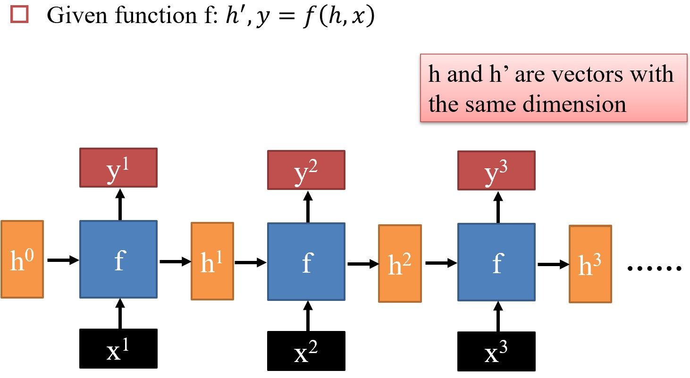{width="500"}
</figure>

- 预测函数 $f$ 保持不变，最早的 $f$ 其实就是一个MLP

???+ note "双向RNN(Bidirectional RNN)"

    RNN的一个变种，思路为收集前后双向的信息。

    <figure markdown="span">
        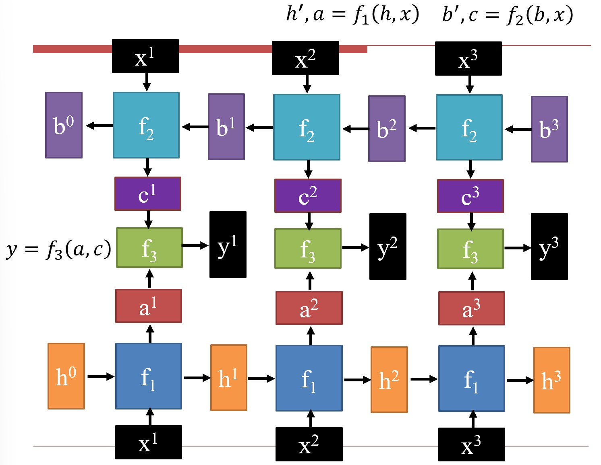{width="400"}
    </figure>

### 预测函数设计

#### Naive RNN

<figure markdown="span">
    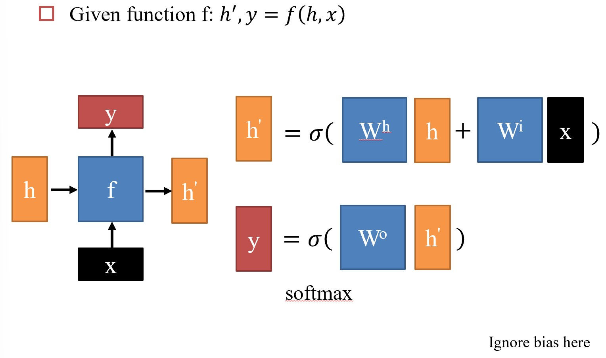{width="500"}
</figure>

**主要问题：**

1. $h$ 的变化非常剧烈，记忆跳跃，表现得很随机
2. 只能串行处理，计算速度慢
3. 梯度消失或爆炸（因为反向传播时，深度大且每一层的参数都相同，损失函数类似幂函数，1附近有跳变）

#### LSTM(Long Short-Term Memory)

为解决RNN记忆变化剧烈的问题，把输入分成长期记忆 $c$ 和短期记忆 $h$ 两部分：

<figure markdown="span">
    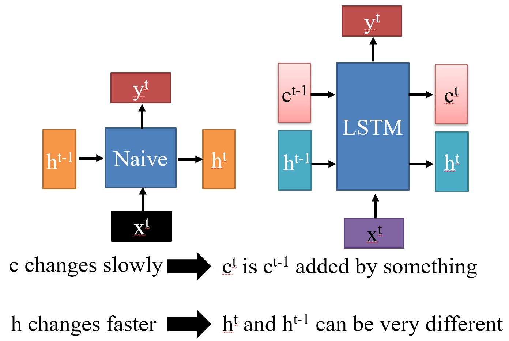{width="500"}
</figure>

计算方法：

- 当前输入和短期记忆拼接，作为输入信息；
- 对输入信息做归一化，取值 $\in (-1, 1)$
- 将输入信息转换成三个阀门，取值 $\in (0, 1)$，分别为：
    - 输入阀门：决定多少当前输入信息进入长期记忆
    - 遗忘阀门：决定保留多少长期记忆
    - 输出阀门：决定多少长期记忆进入短期记忆

<figure markdown="span">
    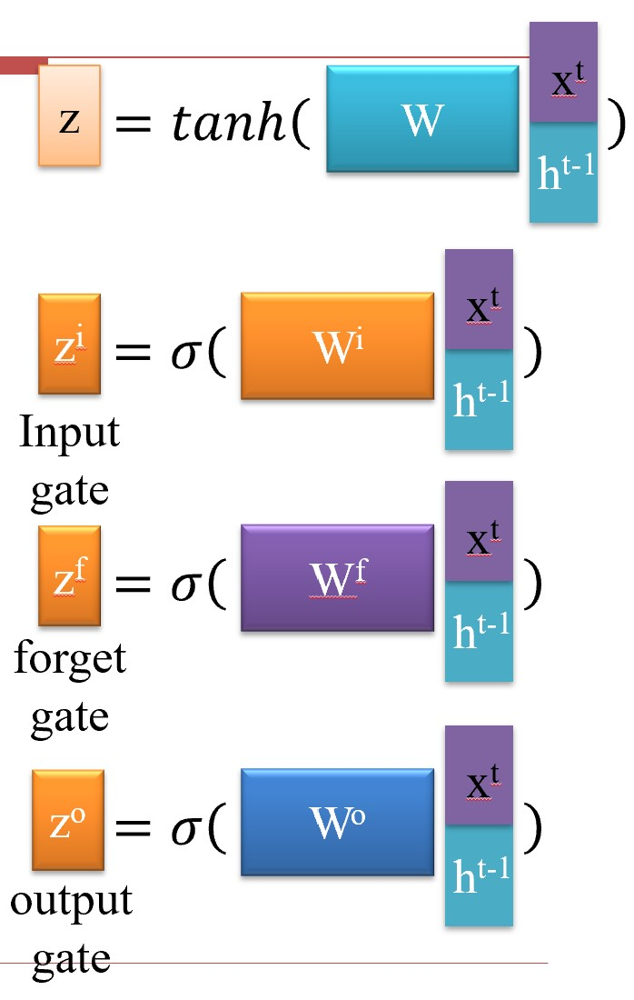{width="250"}
</figure>
<figure markdown="span">
    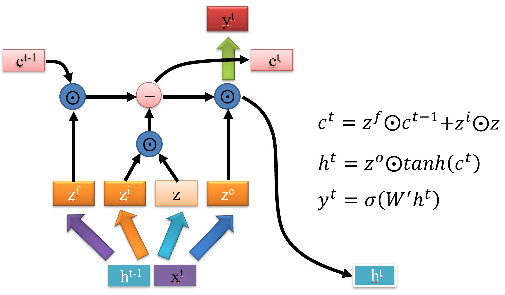{width="500"}
</figure>

??? note "LSTM: A Search Space Odyssey"
    对LSTM做消融实验：
    <figure markdown="span">
        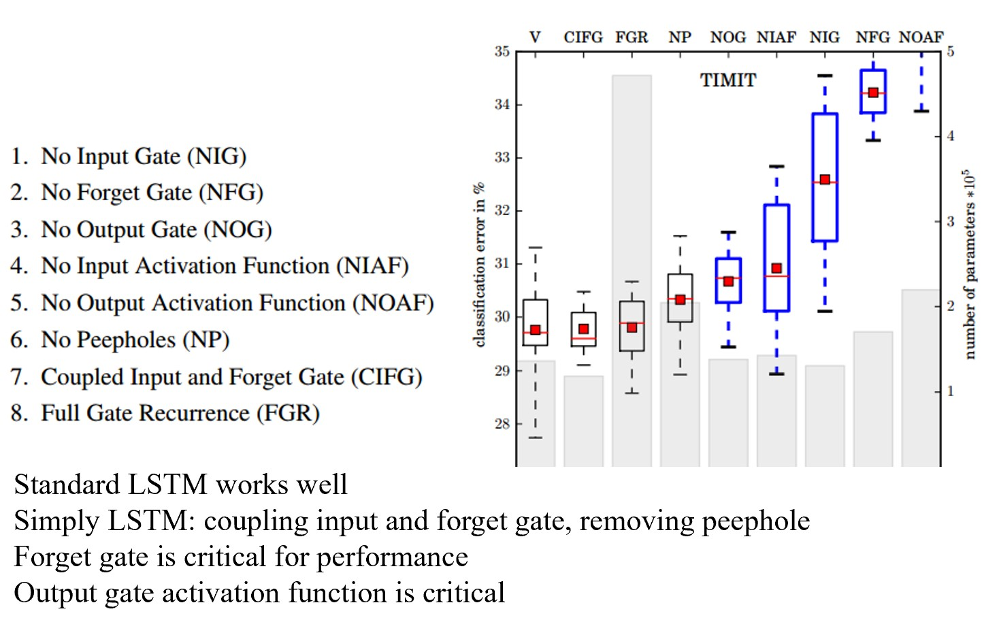{width="500"}
    </figure>

    结论：

    1. 标准的LSTM工作得很好
    2. 遗忘门非常重要
    3. 输出门的激活函数非常重要
    4. 如果要简化LSTM，可以把输入门和遗忘门合并成一个门，且不使用peephole

但LSTM没有解决RNN只能串行计算的问题。

#### GRU(Gated Recurrent Unit)

将LSTM的input gate和forget gate合并成一个reset gate（记住和遗忘的占比相加为1）

GRU性能和LSTM相差不大，但计算速度更快。

<figure markdown="span">
    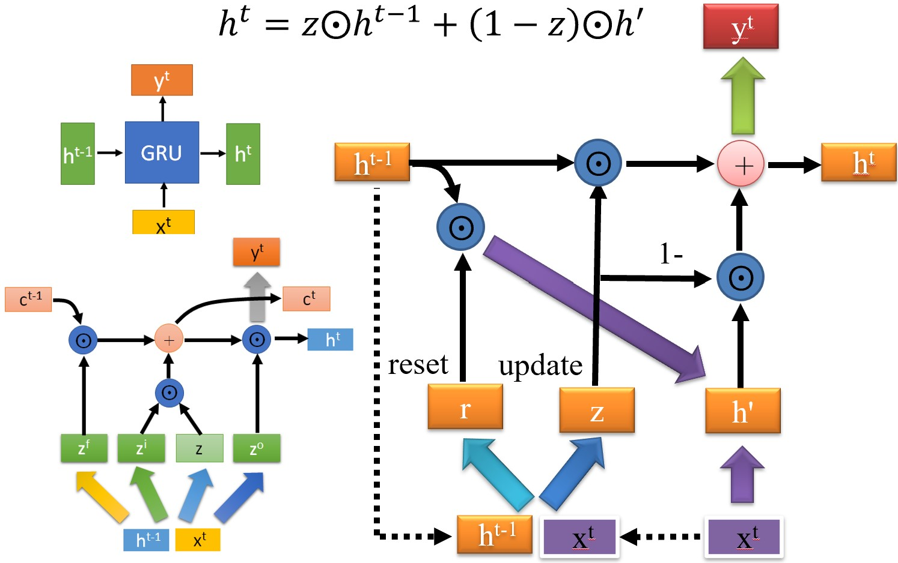{width="500"}
</figure>

## 5.2 用于NLP的循环神经网络 RNN for NLP

### RNN用于NLP的优势

1. 可以捕捉长距离的依赖关系（long-distance dependencies）（而CNN是基于窗口（window-based）的）

    <figure markdown="span">
        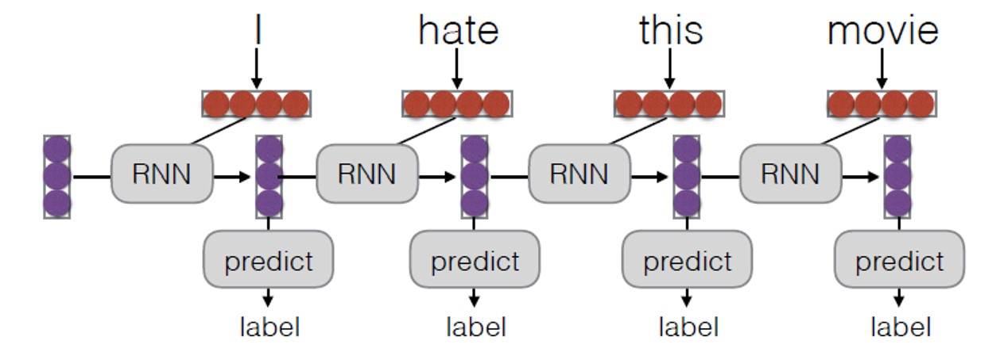{width="500"}
    </figure>

    ???+ example
        **He** does not have very much confidence in **himself**.

        The **reign** has lasted as long as the life of the **queen**.

        指代消解：

        - The **trophy** would not fit in the brown suitcase because it was too **big**.
        - The trophy would not fit in the brown **suitcase** because it was too **small**.
        
2. 既可以做编码器，又可以做解码器（用来生成，但传统CNN做不了）

    <figure markdown="span">
        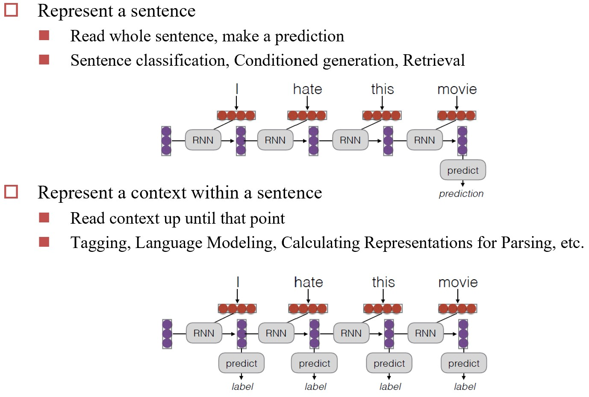{width="500"}
    </figure>

### Encoder-Decoder Models

!!! warning
    应该这么说：

    - Seq2Seq 是 Encoder-Decoder 框架的一种具体实现，强调序列到序列的映射，通常基于RNN.
    - Encoder-Decoder 是一个更广泛的框架，可以使用多种模型（如CNN、Transformer等）来实现。

又称为**Seq2Seq模型**，主要用于机器翻译任务

<figure markdown="span">
    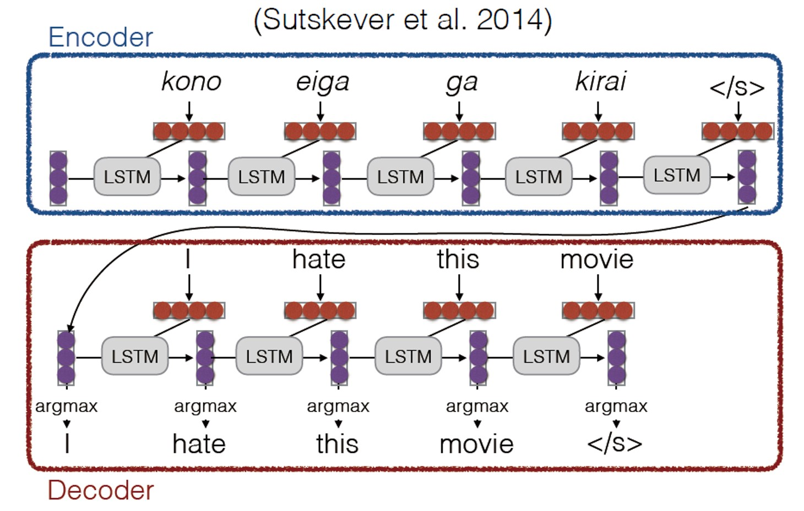{width="500"}
</figure>

- encoder提取语义并编码，decoder解码成目标语言

## 5.3 注意力机制 Attention Mechanism

???+ note "注意力机制的灵感"
    人会选择性地关注感受到的信息

    <figure markdown="span">
        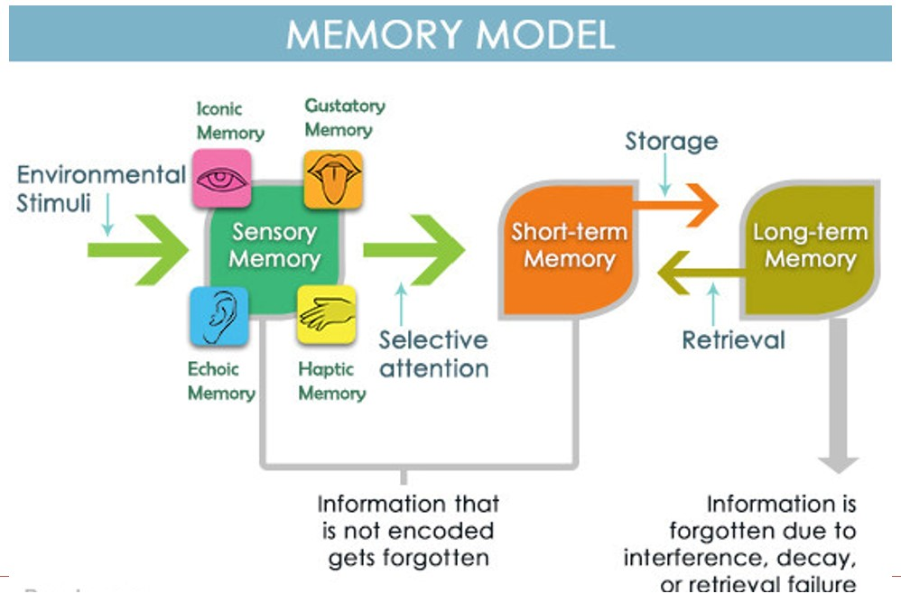{width="500"}
    </figure>

    ???+ example
        用眼动仪定量分析，热力图显示了人们在阅读时的注意力分布（注视时间）。
        <figure markdown="span">
            {width="500"}
        </figure>

以机器翻译为例，使用注意力机制时，相当于对当前解码出的向量，在对应的键值（是编码的结果）空间中查找最相关的向量。实际做法是与每个键值向量点乘得到注意力权重分布，用softmax归一化后，再对每个键值向量对应的值向量加权求和，用得到的向量去预测下一个词。

<figure markdown="span">
    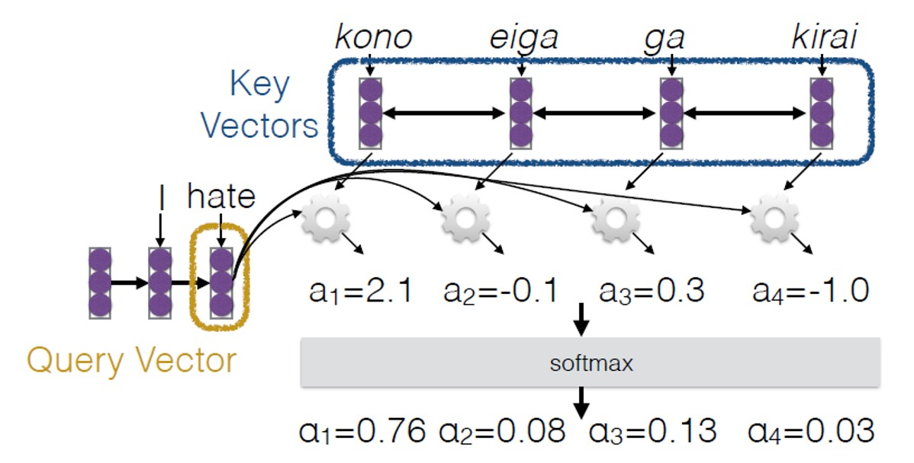{width="500"}
</figure>
<figure markdown="span">
    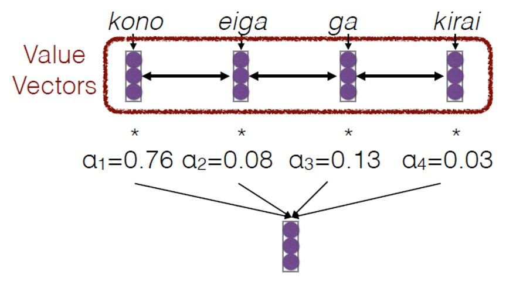{width="400"}
</figure>

???+ question "为什么日翻英时，用的是英语当前最后一个词的Q？"
    仔细想会发现用日语的任何一个词都不行（顺序不匹配），所以最后这样做还是把问题变成一个“预测下一个词”的问题。

注意力权重有多种计算方式：

1. MLP: $a(q, k) = w_2^T tanh(W_1[q:k])$
    - 灵活性高
2. Bilinear: $a(q, k) = q^T W k$
    - 对 $q$ 做投影，再与 $k$ 点乘
3. Dot Product: $a(q, k) = q^T k$
    - 需 $q$ 和 $k$ 维度相同
4. Scaled Dot Product: $a(q, k) = \frac{q^T k}{\sqrt{|k|}}$
    - 真正在用的公式，其中 $|k|$ 为 $k$ 的维度，除以它的平方根是为了避免点乘值过大，导致softmax（指数计算）梯度消失。

### 指针网络 Pointer Network

问题：Seq2Seq模型应用于类似找凸包的问题时，输出序列长度不固定。

解决方法：使用注意力机制，直接在输入序列中进行选择并输出。

<figure markdown="span">
    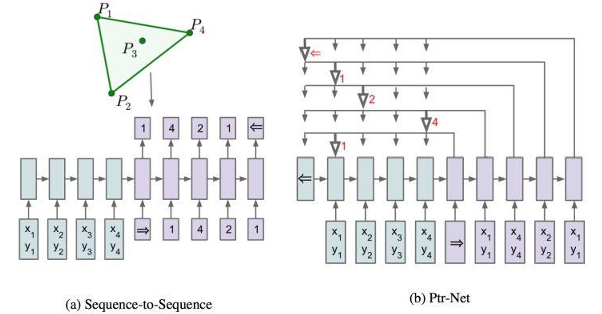{width="500"}
</figure>