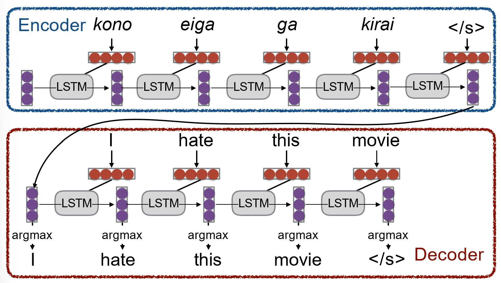
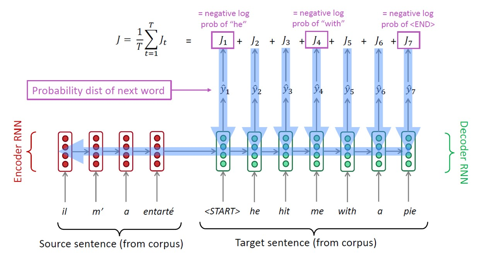
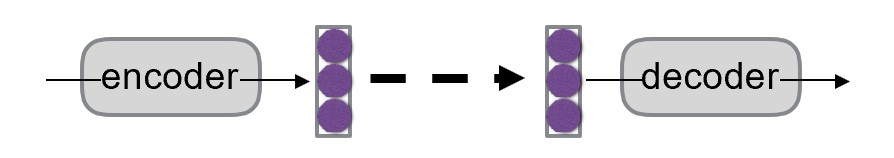
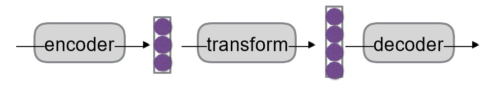
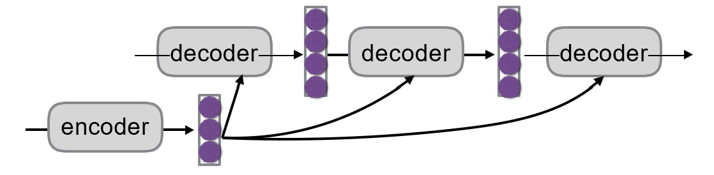
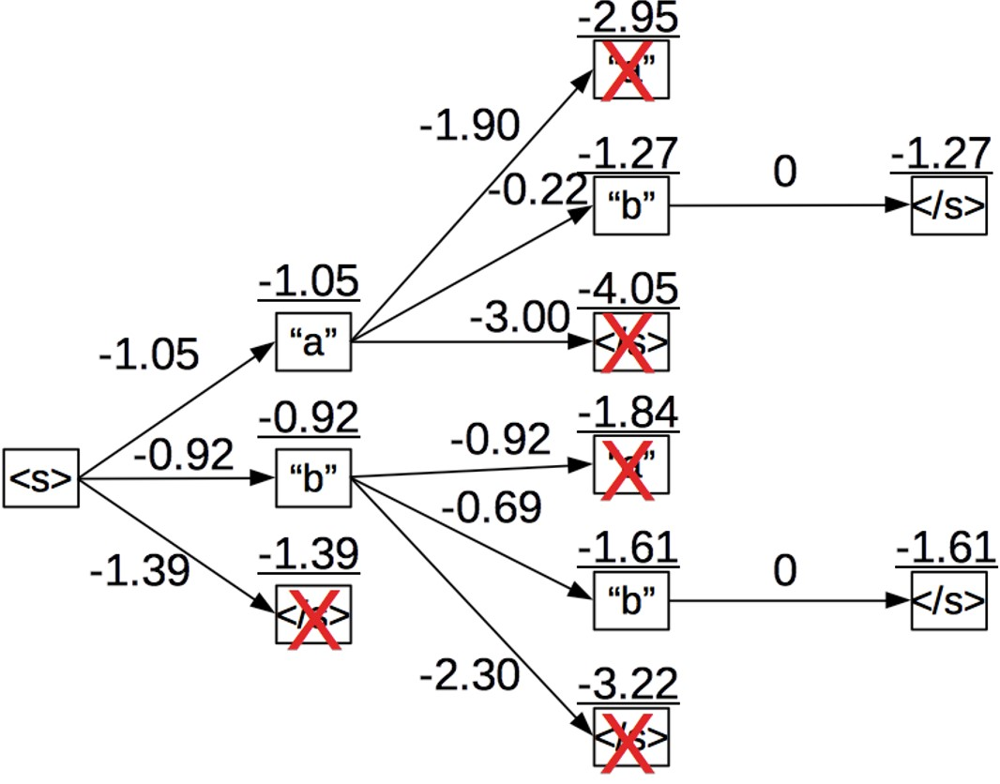
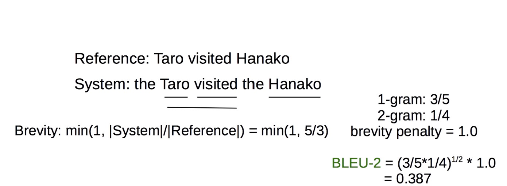

# Chapter 6. 自然语言生成和神经机器翻译 Natural Language Generation and Neural Machine Translation

## 6.1 自然语言生成 Natural Language Generation

`语言建模 Language Modeling`

:   给定一个序列，预测下一个词的概率分布，即 $P(y_t|y_1, ..., y_{t-1})$

`语言模型 Language Model`
:   语言建模的模型。例如下图模型：

    <figure markdown="span">
        {width="400"}
    </figure>

`RNN语言模型 RNN-LM`
:   使用RNN作为语言模型的模型

`条件语言模型 Conditional Language Model`
:   给定一个序列以及一个条件，预测下一个词的概率分布，即 $P(y_t|y_1, ..., y_{t-1}|x)$. 场景例如：

    - 机器翻译中 $x$ 为源语言句子，$y$ 为目标语言句子
    - 做摘要时 $x$ 为原文，$y$ 为摘要文本

    模型例如：

    <figure markdown="span">
        {width="400"}
    </figure>

---

### 条件RNN语言模型的训练

以机器翻译为例：

<figure markdown="span">
    {width="500"}
</figure>

- 其中 $J$ 表示损失函数（通过反向传播，最小化 $J$ 来训练模型）

???+ question "训练过程中，如果目标句子中某一个词预测错误，该把错误的词还是正确的词传下去？"
    **教师强制（Teacher Forcing）：**将正确的词传下去。但总是给予正确的词会导致模型过度依赖于训练数据，无法处理真实数据中的错误。

    **计划采样（Scheduled Sampling）：**在训练过程中，逐渐增加将模型预测的词传下去的比例，减少使用正确的词的比例。这样可以让模型在训练时逐渐适应真实数据中的错误。

### 隐空间传递 Hidden State Passing

解决编码器和解码器之间的信息传递问题：

1. 两者向量维度相同时，可直接传递；

    <figure markdown="span">
        {width="400"}
    </figure>

2. 变换

    <figure markdown="span">
        {width="400"}
    </figure>

3. 每次解码都输入编码器的结果

    <figure markdown="span">
        {width="500"}
    </figure>

### 解码（选词）算法 Decoding Algorithm

得到概率分布 $P(Y|X)$ 后，有若干种选词的方法。

#### 贪心搜索 Greedy Search

即Argmax，直接取概率最大的词

#### 采样 Sampling

从概率分布中采样，可获得更高的多样性与随机性。（常用这个，这也是为什么现在的大语言模型能对相同的输入生成不同的输出）

#### 束搜索 Beam Search

核心思想：解码的每一步都保留 $k$ 个概率最大的词，以控制搜索空间。

<figure markdown="span">
    {width="400"}
</figure>

- 第一步保留概率最大的两个词"a""b"，第二步也保留概率最大的两个词"b""b"，保证每一步只有 $k=2$ 条“光束”

!!! note "k的选择"
    - $k$ 太小，会近似于贪心搜索（每一步都选择最优的，而一个句子生成的概率是其中每个词的条件概率的乘积（相互独立），如果前面一味选概率大的，后面的概率可能很小，总乘积反而更小），可能生成不符合语法的、不自然的句子
    - $k$ 太大，计算量大，且更倾向于选择短句子（因为词的概率都是0到1，句子越长，总概率乘积越小）以及常用词的组合
  
### Softmax中的温度参数 Softmax Temperature

Softmax中的温度参数也是一种控制多样性的方法，但它不属于解码算法。

在 $t$ 时刻，LM根据分数向量 $s\in R^{|V|}$ ，使用softmax函数计算概率分布：

$$P_t(w) = \frac{exp(s_w)}{\sum_{w'\in V}exp(s_{w'})}$$

使用**温度参数**$\tau$来控制分布的平滑程度：

$$P_t(w) = \frac{exp(s_w/\tau)}{\sum_{w'\in V}exp(s_{w'}/\tau)}$$

- $\tau=1$ 时，softmax正常工作
- $\tau>1$ 时，分布更平滑，选择概率小的词的可能性更高（温度高，熵高，更无序）
- $\tau<1$ 时，分布更尖锐，选择概率大的词的可能性更高

???+ note
    - 事实上做Scaled Dot Product时，除以$\sqrt{|k|}$就是在调整温度参数
  

### 评估 Evaluation

#### 人类评估 Human Evaluation

效果好，但速度慢，成本高，且有一定主观性

#### BLEU

BLEU（Bilingual Evaluation Understudy）是一个自动评估指标，主要用于机器翻译的评估。它通过比较机器翻译结果与参考翻译之间的n-gram重叠程度来评估翻译质量。

<figure markdown="span">
    {width="500"}
</figure>

- 1-gram重叠了3次，2-gram重叠了1次
- Brevity Penalty: 惩罚因子，防止生成的句子过短

BLEU只考虑了n-gram的重叠程度，忽略了语法、语义等其他因素，缺点显而易见。

#### METEOR

在BLEU的基础上，增加了对词形变化、同义词、顺序等的考虑。

缺点是对一些新语言/绝种语言的支持不够好。

#### 困惑度 Perplexity

$$PPL = exp(-\frac{1}{N}\sum_{i=1}^N log P(w_i|w_1, ..., w_{i-1}))$$

- 其中 $N$ 为句子长度，$P(w_i|w_1, ..., w_{i-1})$ 为模型预测的概率分布

现在非常常用的一个指标，对任何生成模型都适用。

## 6.2 神经机器翻译 Neural Machine Translation

### 机器翻译简史 A Brief History of Machine Translation

| 时间 | 特点 |
| :--: | :--: |
| 1950s | **RBMT**, 基于规则，使用双语词典映射单词 |
| 1980s | **EBMT**，基于实例，收集了大量数据 |
| 1990s - 2010s | **SMT**，基于统计，从数据中学习概率模型 |
| 2015 - now | **NMT** |