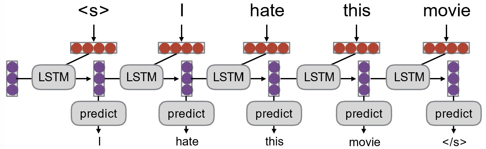

# Chapter 6. 自然语言生成和机器翻译 Natural Language Generation and Neural Machine Translation

## 6.1 自然语言生成 Natural Language Generation

`语言建模 Language Modeling`

:   给定一个序列，预测下一个词的概率分布，即 $P(y_t|y_1, ..., y_{t-1})$

`语言模型 Language Model`
:   语言建模的模型。例如下图模型：

    <figure markdown="span">
        {width="400"}
    </figure>

`RNN语言模型 RNN-LM`
:   使用RNN作为语言模型的模型

`条件语言模型 Conditional Language Model`
:   给定一个序列以及一个条件，预测下一个词的概率分布，即 $P(y_t|y_1, ..., y_{t-1}|x)$. 场景例如：

    - 机器翻译中 $x$ 为源语言句子，$y$ 为目标语言句子
    - 做摘要时 $x$ 为原文，$y$ 为摘要文本

    模型例如：

    <figure markdown="span">
        {width="400"}
    </figure>

---

### 条件RNN语言模型的训练

以机器翻译为例：

<figure markdown="span">
    {width="500"}
</figure>

- 其中 $J$ 表示损失函数（通过反向传播，最小化 $J$ 来训练模型）

???+ question "训练过程中，如果目标句子中某一个词预测错误，该把错误的词还是正确的词传下去？"
    **教师强制（Teacher Forcing）：**将正确的词传下去。但总是给予正确的词会导致模型过度依赖于训练数据，无法处理真实数据中的错误。

    **计划采样（Scheduled Sampling）：**在训练过程中，逐渐增加将模型预测的词传下去的比例，减少使用正确的词的比例。这样可以让模型在训练时逐渐适应真实数据中的错误。

### 隐空间传递 Hidden State Passing

解决编码器和解码器之间的信息传递问题：

1. 两者向量维度相同时，可直接传递；

    <figure markdown="span">
        {width="400"}
    </figure>

2. 变换

    <figure markdown="span">
        {width="400"}
    </figure>

3. 每次解码都输入编码器的结果

    <figure markdown="span">
        {width="500"}
    </figure>

### 从概率分布中选词

得到概率分布 $P(Y|X)$ 后，选词的方法总体分为两种：

1. **Argmax:** 直接取概率最大的词

2. **Sampling:** 从概率分布中采样（常用这个，这也是为什么现在的大语言模型能对相同的输入生成不同的输出）

#### 束搜索 Beam Search

核心思想：解码的每一步都保留 $k$ 个概率最大的词，以控制搜索空间。

<figure markdown="span">
    {width="400"}
</figure>

- 第一步保留概率最大的两个词"a""b"，第二步也保留概率最大的两个词"b""b"，保证每一步只有 $k=2$ 条“光束”

!!! note "k的选择"
    - $k$ 太小，会近似于贪心搜索（每一步都选择最优的），可能生成不符合语法的、不自然的句子
    - $k$ 太大，