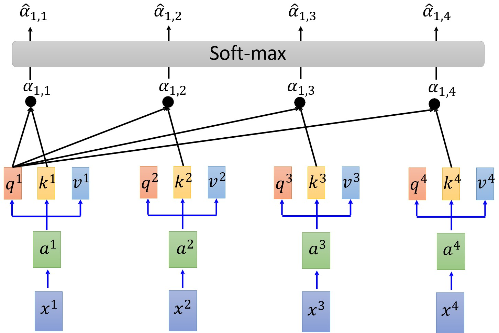
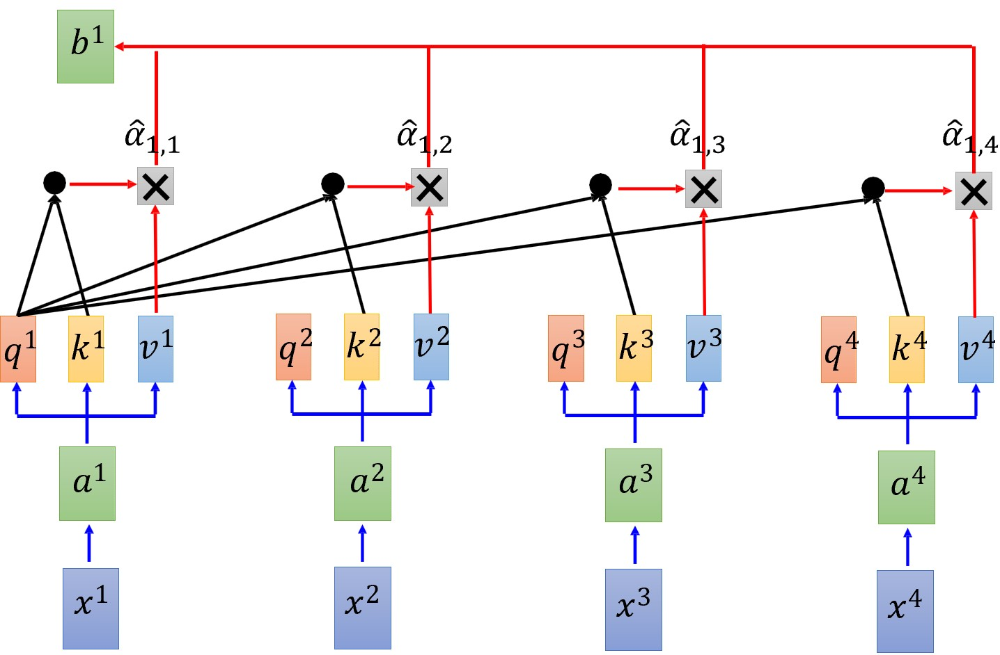

# Chapter 7. Transformers

传统RNN无法并行计算，传统CNN能够并行计算，但每次只能看到局部区域的信息。我们需要一种既能并行，又能很好地处理序列数据的方法。

## 7.1 Self-Attention

### 计算方法

给定一个序列 $X = [x^1, x^2, ..., x^n]$，我们需要计算每个元素对其他元素的注意力权重。具体步骤如下：

1. **词向量编码**：将每个元素 $x^i$ 转换为一个词向量表示。
    $$ a^i = Wx^i $$
2. **线性变换**：将每个词向量 $a^i$ 通过三个不同的线性变换，得到**查询（Query, to match others）、键（Key, to be matched）和值（Value, information to be extracted）**向量。

    $$ \begin{aligned}q^i &= W^qa^i \\ k^i &= W^ka^i \\ v^i &= W^va^i \end{aligned} $$

3. **计算注意力权重**：使用点积计算查询向量与键向量的相似度，然后通过 softmax 函数归一化得到注意力权重。（公式以计算第1个元素的注意力权重为例，其中 $d$ 为 $q$ 和 $k$ 的维度）
    $$ \hat{\alpha_{1, i}} = Softmax(\alpha_{1, i}) = Softmax(\frac{q^1 \cdot k^i}{\sqrt{d}}) $$
4. **加权求和**：将注意力权重与值向量相乘，得到最终的输出。（公式以计算第1个元素的输出为例）
    $$ b^1 = \sum_i \hat{\alpha_{1, i}} v^i $$

<figure markdown="span">
    {width="500"}
</figure>

<figure markdown="span">
    {width="500"}
</figure>