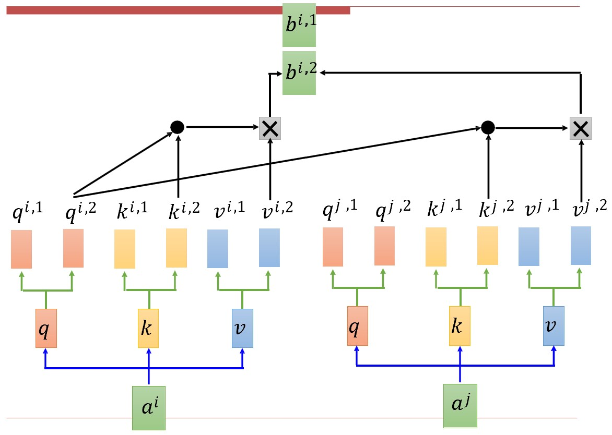
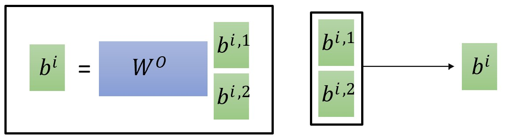
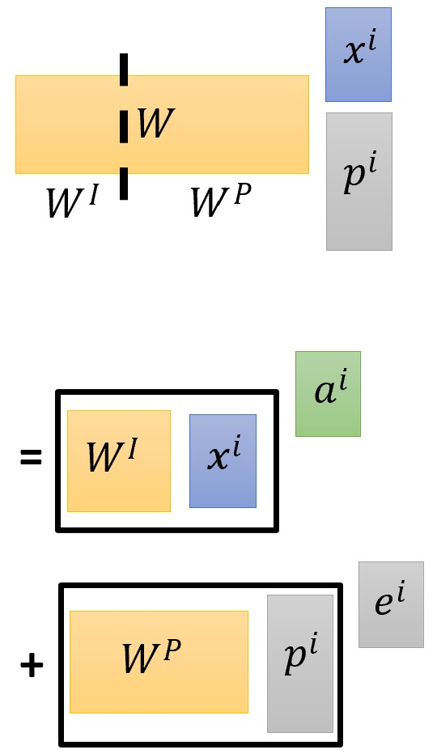
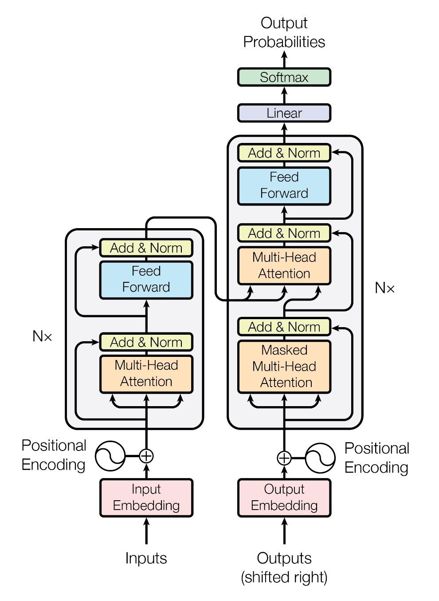

# Chapter 7. Transformers

传统RNN无法并行计算，传统CNN能够并行计算，但每次只能看到局部区域的信息。我们需要一种既能并行，又能很好地处理序列数据的方法。

## 7.1 Self-Attention

### 计算方法

给定一个序列 $X = [x^1, x^2, ..., x^n]$，我们需要计算每个元素对其他元素的注意力权重。具体步骤如下：

1. **词向量编码**：将每个元素 $x^i$ 转换为一个词向量表示。
    $$ a^i = Wx^i $$
2. **线性变换**：将每个词向量 $a^i$ 通过三个不同的线性变换，得到**查询（Query, to match others）、键（Key, to be matched）和值（Value, information to be extracted）**向量。

    $$ \begin{aligned}q^i &= W^qa^i \\ k^i &= W^ka^i \\ v^i &= W^va^i \end{aligned} $$

3. **计算注意力权重**：使用点积计算查询向量与键向量的相似度，然后通过 softmax 函数归一化得到注意力权重。（公式以计算第1个元素的注意力权重为例，其中 $d$ 为 $q$ 和 $k$ 的维度）
    $$ \hat{\alpha_{1, i}} = Softmax(\alpha_{1, i}) = Softmax(\frac{q^1 \cdot k^i}{\sqrt{d}}) $$
4. **加权求和**：将注意力权重与值向量相乘，得到最终的输出。（公式以计算第1个元素的输出为例）
    $$ b^1 = \sum_i \hat{\alpha_{1, i}} v^i $$

<figure markdown="span">
    {width="500"}
</figure>

<figure markdown="span">
    {width="500"}
</figure>

### 矩阵加速

自注意力计算的过程都可以写成矩阵乘法，并用**GPU并行加速**：

令 $I = [a^1, a^2, ..., a^n]$ 为输入矩阵，$O = [b^1, b^2, ..., b^n]$ 为输出矩阵，有：

$$\begin{cases}Q &= W^qI \\ K &= W^kI \\ V &= W^vI \end{cases},\ \hat{A} = Softmax(A) = Softmax(\frac{K^TQ}{\sqrt{d}}),\ O = V\hat{A}$$

### 多头自注意力 Multi-Head Self-Attention

每个元素对应多个 Q, K, V 向量，分别计算注意力权重，然后将所有头的输出拼接起来。

实际实现与普通自注意力相同，只是在计算出 Q, K, V 后多一步分块，计算出 B 后再多一步拼接。

<figure markdown="span">
    {width="500"}
</figure>

<figure markdown="span">
    {width="350"}
</figure>

### 位置编码 Positional Encoding

因为自注意力机制不考虑元素的顺序信息（并行时每个词是对等的），我们需要添加位置编码来保留序列中元素的位置信息。

最简单的做法是给每个 $x_i$ 拼接一个 one-hot 位置向量 $p_i$：

<figure markdown="span">
    {width="150"}
</figure>

## 7.2 Transformer

<figure markdown="span">
    {width="400"}
</figure>

???+ note 
    其实现在大部分大语言模型都只用了 Transformer 的编码器部分，因为编码器支持并行计算，而解码器需要逐步生成，不能并行。

??? question "Transformer 和 MLP、CNN、RNN 三者中谁更像？"
    更像 MLP 和 RNN.
    
    - 更像 MLP 的原因：把 k, q, v 看作输入，输出实质上是 v 的加权和，与 MLP 的做法一致。
        - 只是 MLP 的权重是学出来的，而 Transformer 的注意力分数是根据输入计算出来的（这也表明 Transformer 比 MLP 更灵活）
    - 更像 RNN 的原因：后面会讲

### Add & Norm

Add 指残差连接时的加法，Norm 为 Layer Normalization.

### Feed Forward

Transformer 中的前馈网络是一个中间宽、前后窄的 MLP**（真的是MLP吗？好像是 $1\times 1$ 卷积，也就是一一对应独立计算的？目前理解：对输出的每个向量独立做这个二层MLP，先升维再降维，而不同向量之间互不影响，后半句解释了什么是 $1 \times 1$ 卷积）**

- 实际上计算时因为硬件资源限制，将中间维度分块，割成多个小的 MLP 并行计算，最终相加。这样的做法称为 sharding.

大模型的参数量主要来自于前馈网络。