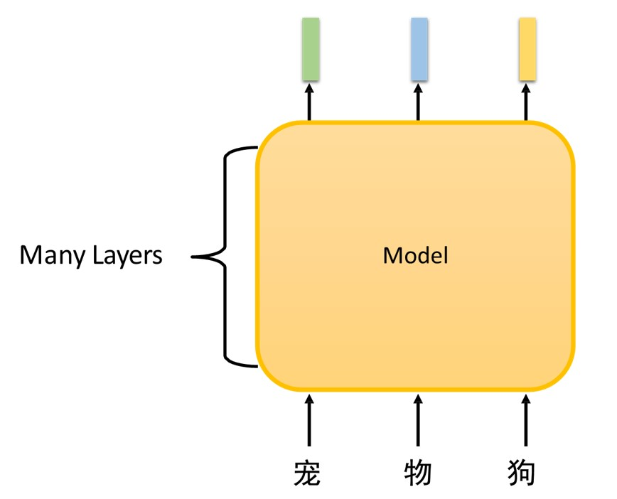
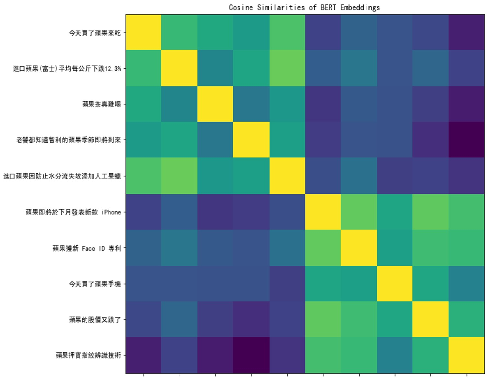
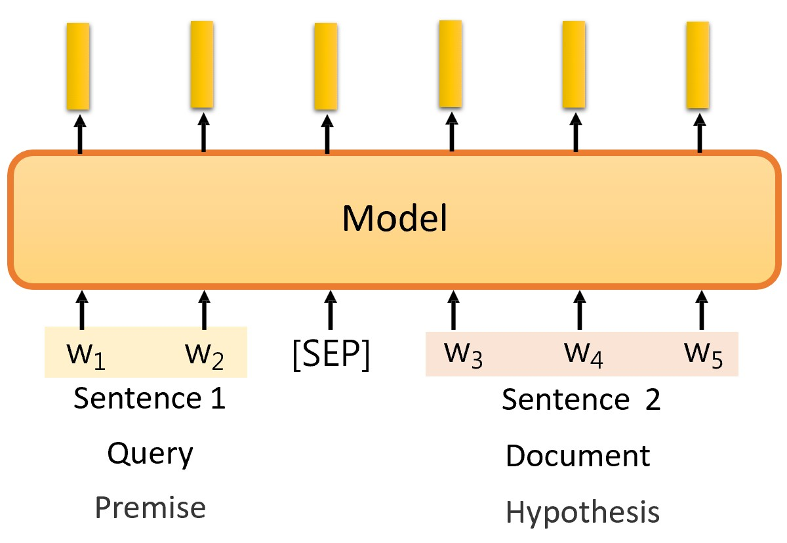
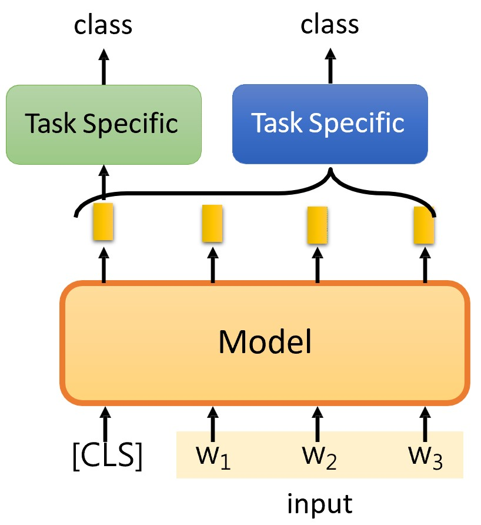
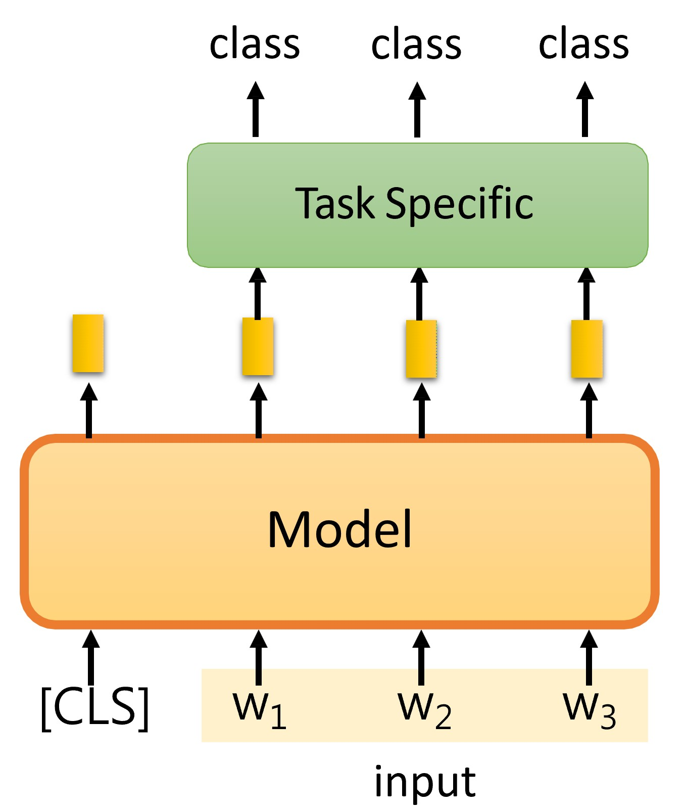
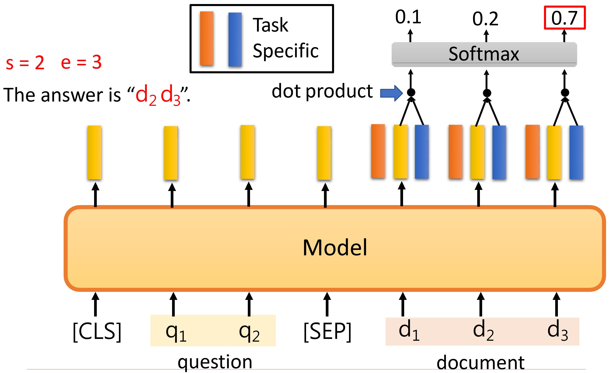
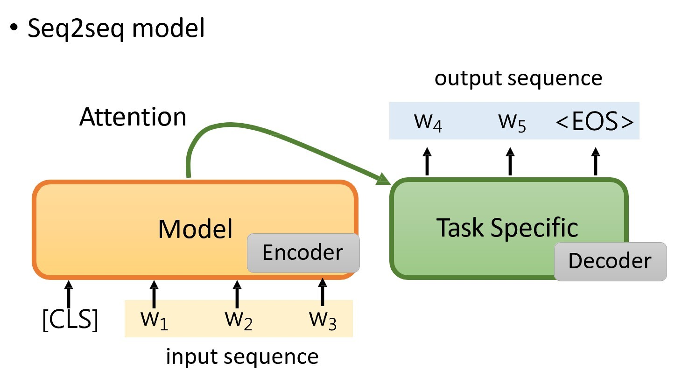
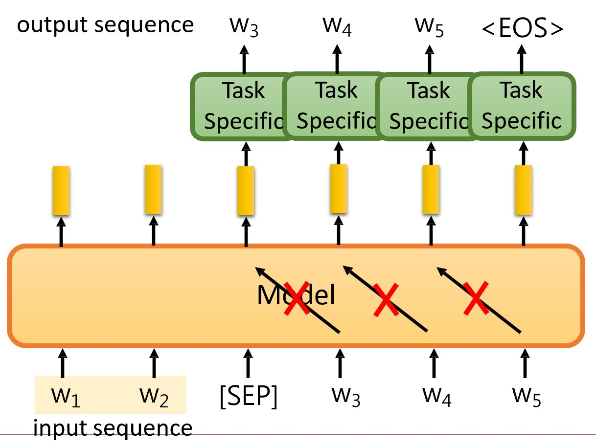
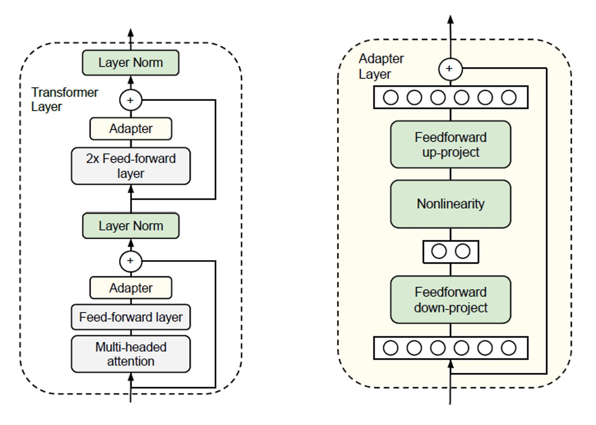

# Chapter 8. 预训练模型：BERT及其变体 Pre-trained Model: BERT and its Variants

**预训练**指的是先在大规模通用数据集（往往成本低、无标注）上训练模型，学习通用的知识或特征，为后续特定任务的微调打下基础。

## 8.1 预训练模型 Pre-trained Model

词向量是非常适合预训练模型的一个例子。

传统的一些生成词向量的方式有一个很大的问题：**无法处理多义词**（不带上下文语义，如“宠物狗”的“狗”和“单身狗”的“狗”会被编码为同一向量）。

于是使用 **语境词向量（Contextualized Word Embedding）**：

<figure markdown="span">
    {width="300"}
</figure>

- 其中的模型可以是 LSTM、Self-attention layers 等

训练出来效果不错，下图是对“苹果”这个词的语境词向量的相似度可视化（黄色相似度高，蓝色相似度低）：

<figure markdown="span">
    {width="500"}
</figure>

???+ note "缩小模型的方法"
    因为数据成本低，预训练模型参数量越做越大，也就相应地产生了许多缩小模型的方法：

    - 网络剪枝（Network Pruning）：去掉一些不重要的参数
    - 知识蒸馏（Knowledge Distillation）：用大模型为小模型的训练数据标注
    - 参数量化（Parameter Quantization）：降低浮点数精度，用更少的比特数表示参数
    - 架构设计（Architecture Design）：设计更小的模型架构

## 8.2 微调 Fine-tuning

### 任务分类 NLP Tasks

根据输入和输出的类型，总共可将 NLP 任务分为八类。

输入：

!!! quote ""
    === "one sentense"
        直接送入整个句子即可。句子过短则补0，过长则截断。

    === "multiple sentenses"
        句子之间用特殊符号分隔。

        <figure markdown="span">
            {width="400"}
        </figure>

输出：

!!! quote ""
    === "one class"
        送入一个特殊的 $[CLS]$ token，在句子里收集信息，用编码得到的向量做预测。

        <figure markdown="span">
            {width="300"}
        </figure>
    
    === "class for each token"
        如词性标注任务，每个token都有一个对应的输出。

        <figure markdown="span">
            {width="300"}
        </figure>

    === "copy from input"
        如阅读理解任务，答案在文章内，输出是输入的一个子集（起始位置和终止位置）。

        嵌入两个特殊token, 分别预测起始位置和终止位置。

        <figure markdown="span">
            {width="500"}
        </figure>

    === "general sequence"
        传统的 encoder-decoder 模型是这样的：

        <figure markdown="span">
            {width="500"}
        </figure>

        但因为此处的 decoder 是 task specific 的，没有经过训练，所以干脆让编码器“既当爹又当妈”：

        <figure markdown="span">
            {width="400"}
        </figure>

### 微调方法

#### Adapter

在预训练模型中嵌入 Adapter 模块，微调时只训练 Adapter 模块的参数。

一种常见的 Adapter 模块是瓶颈结构（降维再还原）：

<figure markdown="span">
    {width="500"}
</figure>

#### LoRA

LoRA（Low-Rank Adaptation）通过将预训练模型的权重矩阵分解为低秩矩阵的乘积（可还原回原矩阵）来减少参数量。

与 Adapter 不同，LoRA 是加在模型的旁路上的。

### 自监督学习 Self-supervised Learning

自监督学习是一种特殊的无监督学习，监督信号来自于数据本身，而不是外部标签。

<figure markdown="span">
    {width="500"}
</figure>

#### BERT

BERT（Bidirectional Encoder Representations from Transformers）的做法是将输入中的一些 token 随机遮蔽（mask token或random token），然后让模型预测这些被遮蔽的词。

#### GPT
GPT（Generative Pre-trained Transformer）的做法让模型预测下一个 token。

但需要解决模型偷看未来token的问题：可以用 LSTM 的方式，也可以在 transformer 计算出的 attention 矩阵中将偷看的部分置为0.

!!! note
    在编码器的 attention 上加 mask，就可以让编码器做解码器的工作。