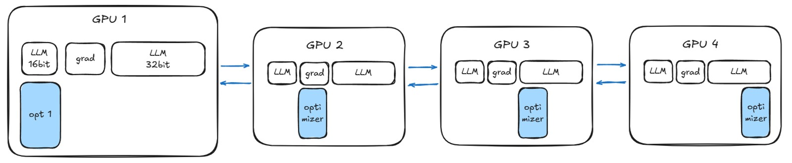
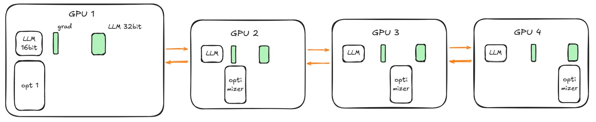
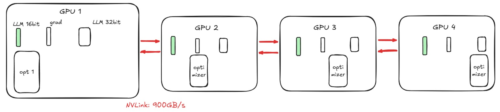
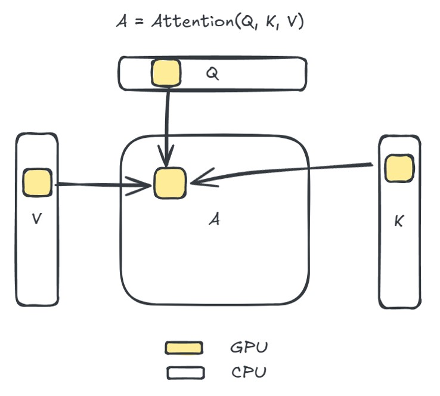

# Chapter 9. 如何训练大语言模型 How to Train Your LLM

传统的神经网络训练方法无法处理大规模数据和模型参数（根本无法一次性放入单个GPU）。

## 9.1 参数，梯度和优化器状态 Parameters, Gradients, and Optimizer States

### DeepSpeed

DeepSpeed 是微软开源的一个支持大模型分布式训练的库，采用的策略称为**ZeRO**（Zero Redundancy Optimizer），其核心思想是将模型参数、梯度和优化器状态分布到多个 GPU 上，减少每个 GPU 的内存占用。

!!! quote ""
    === "ZeRO-1"
        优化器是模型最占用内存的部分，且计算频率不那么高（因为使用了mini-batch），所以ZeRO-1 将优化器状态分布到多个 GPU 上。

        <figure markdown="span">
            {width="500"}
        </figure>

    === "ZeRO-2"
        ZeRO-2 在 ZeRO-1 的基础上，将梯度也分布到多个 GPU 上。

        <figure markdown="span">
            {width="500"}
        </figure>

    === "ZeRO-3"
        ZeRO-3 在 ZeRO-2 的基础上，将模型参数也分布到多个 GPU 上。

        <figure markdown="span">
            {width="500"}
        </figure>
    
    === "ZeRO-Offload"
        因为 CPU 内存很大，可以将参数从 GPU 拿到 CPU 上，进一步减少 GPU 内存占用。但这种方法时间效率较低。

## 9.2 激活 Activations

### Flash Attention Algorithm

把参数都放进 CPU ，每次只将一小部分参数加载入 GPU 进行计算。

<figure markdown="span">
    {width="300"}
</figure>

## 9.3 量化 Quantization

量化是指将模型参数从高精度转换为低精度，以减少模型大小和内存占用。