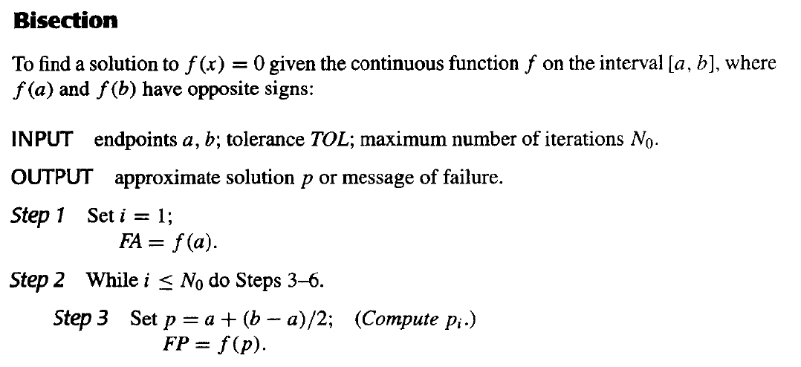
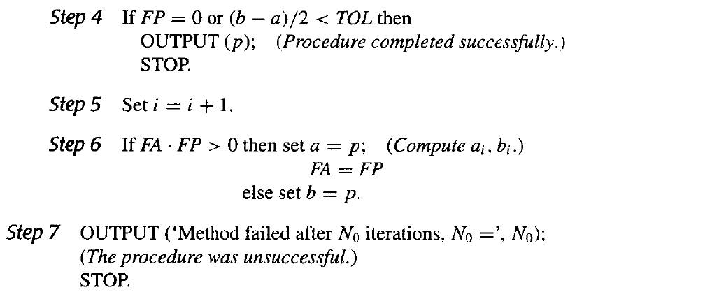
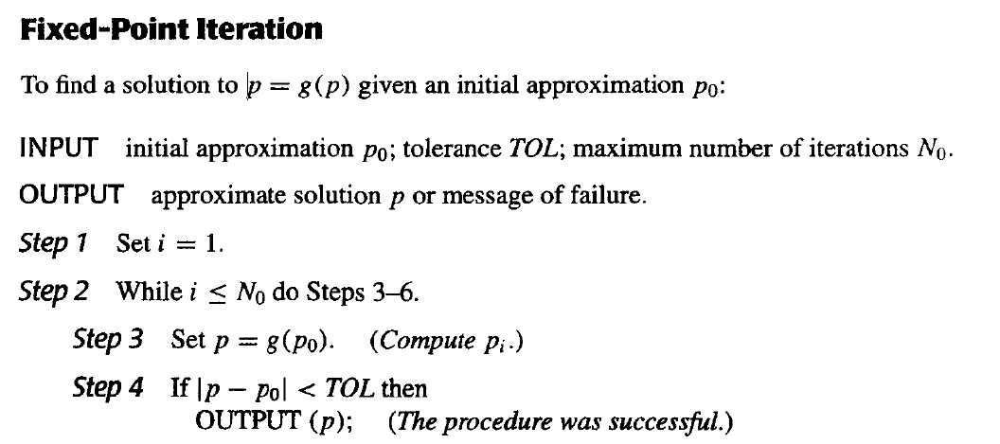
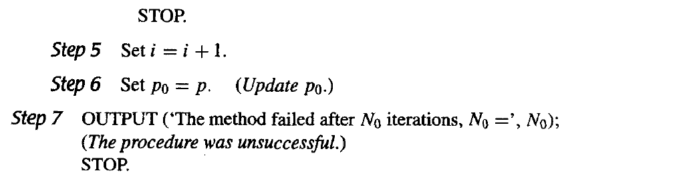
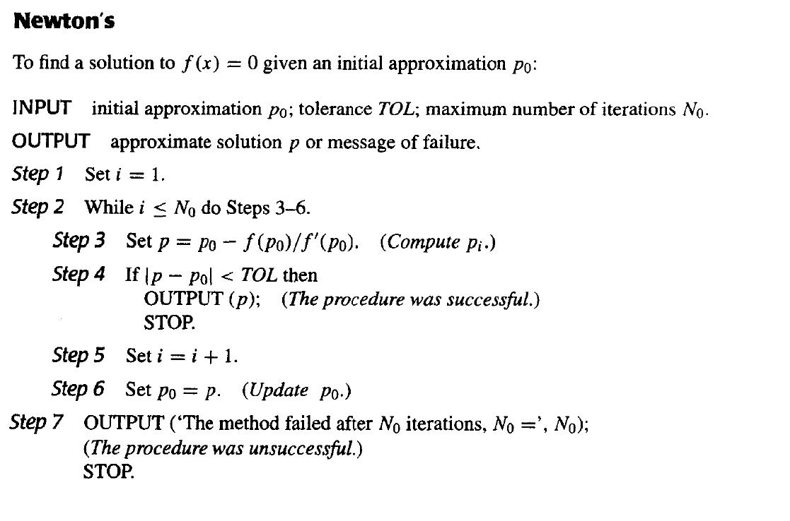
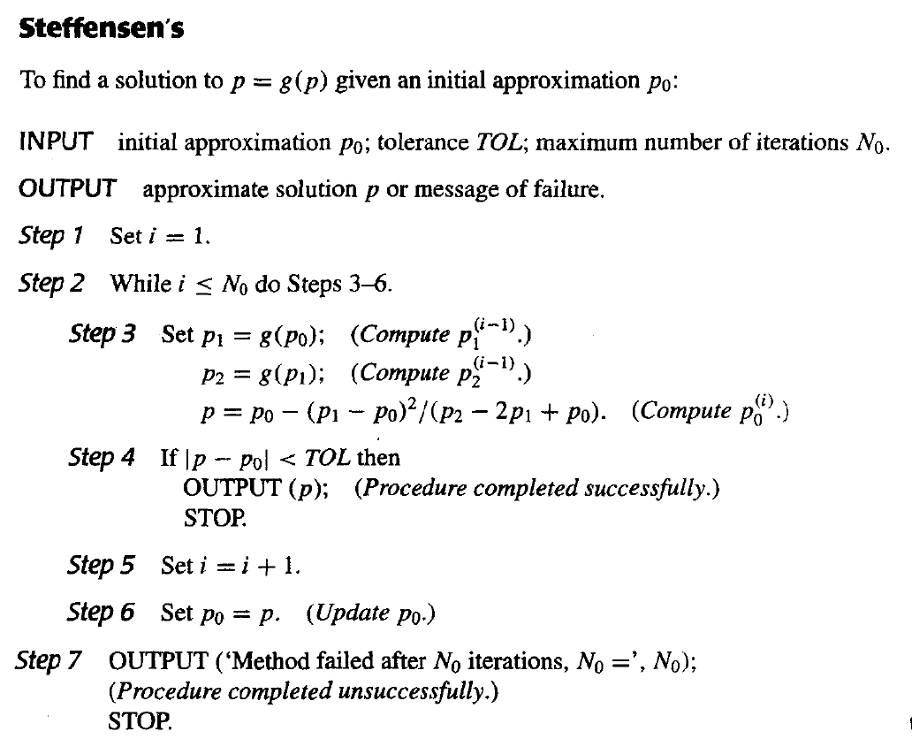

# Chapter 2 一元方程求解 Solutions of Equations in One Variable

目标：Find a root of $f(x)=0$.

## 2.1 终止条件
1. $|p_N-p_{N-1}|<\varepsilon$
2. $\frac{|p_N-p_{N-1}|}{|p_N|}<\varepsilon$
3. $|f(p_N)|<\varepsilon$
!!! note
    - 存在$|p_n-p_{n-1}|$收敛而$\{p_n\}$序列本身发散的情况（如$p_n=\sum_{k=1}^n\frac{1}{k}$），使得第一个终止条件失效；
    - 存在函数值$y$值相差不大，但$x$值相去甚远的情况，使得第三个终止条件不靠谱；
    - 一般来说第二个终止条件最有效。

## 2.2 求解方法
### 二分法 The Bisection Method
#### 伪代码

??? question "Step3为什么用 $p=a+\frac{b-a}{2}$ 而不用 $p=\frac{a+b}{2}$ ？"
    考虑有效位数时，由于舍入误差，后者的计算结果可能会落到$[a, b]$外面。

    如$a=0.98,\ b=0.99$，保留2位有效数字、使用`rounding`时算出来的中点为$1.0$.
#### 优缺点
优点：

1. 算法简单，非常容易理解；
2. 只需要满足函数连续的条件；
3. 总是能收敛到一个解。

缺点：

1. 收敛速度慢；
2. 无法找到重根和复根。

### 不动点迭代法 Fixed-Point Iteration
#### 不动点定理 Fixed-Point Theorem
- 如果 $g\in C[a, b]$，并且 $g(x)\in [a, b]$ 对所有 $x\in [a, b]$ 成立，则 $g$ 在 $[a, b]$ 上**存在**不动点。
- 在上一条基础之上，如果 $g$ 在 $[a, b]$ 上可导，并且存在常数 $0<k<1$ 使得 $|g'(x)|\leq k$ 对所有 $x\in (a, b)$ 成立，则对任何数 $p_0\in [a, b]$，迭代序列 $p_n=g(p_{n-1}),\ n\geq 1$ **收敛**于**唯一**不动点 $p\in [a, b]$.

??? tip "证明"
    需要证明不动点的1.存在性、2.唯一性和序列的3.收敛性。

    ---

    1. 令 $f(x)=g(x)-x$，有$a\leq g(x)\leq b\Rightarrow f(a)\geq 0,\ f(b)\leq 0$，根据介值定理，$f$ 的根存在，即 $g$ 的不动点存在；

    2. 反证法。假设 $p\leq q$ 都为 $g$ 的不动点，则由中值定理，存在 $\xi\in (p, q)$ 使得 $g(q)-g(p)=g'(\xi)(q-p)\Rightarrow (1-g'(\xi))(q-p)=0\xRightarrow{|g'(\xi)|\leq k<1\ } p=q$ 矛盾。

    3. $n\rightarrow\infty$ 时，$|p_n-p|=|g(p_{n-1})-g(p)|=|g'(\xi)||p_{n-1}-p|\leq k|p_{n-1}-p|\leq k^2|p_{n-2}-p|\leq ...\leq k^n|p_0-p|\rightarrow 0$.

---

满足以上定理后，可由 $|p_{n+1}-p_n|\geq ||p_n-p|-|p_{n+1}-p||\geq ||p_n-p|-k|p_n-p||=(1-k)|p_n-p|$，导出推论：

$$|p_n-p|\leq\frac{1}{1-k}|p_{n+1}-p_n|,\ |p_n-p|\leq\frac{k^n}{1-k}|p_1-p_0|$$

可知 $k$ 越小，收敛速度越快。当 $k>\frac{1}{2}$ 时，该方法慢于二分法。 

#### 伪代码

#### 优缺点

优点：

1. 算法较简单，较易理解。

缺点：

1. 不总是能收敛，需满足一定条件；
2. 收敛速度较慢。

### 牛顿迭代法 Newton's Method
主要思想是利用泰勒展开将非线性函数线性化。

假设 $f\in C^2[a, b]$，$p_0$ 是一个对 $f$ 的根 $p$ 的近似值，且 $f'(p_0)\neq 0$. 考虑 $f(x)$ 在 $p_0$ 处的一阶泰勒展开式：

$$f(x)=f(p_0)+f'(p_0)(x-p_0)+\frac{f''(\xi_x)}{2!}(x-p_0)^2$$

其中 $\xi_x$ 在 $p_0$ 与 $x$ 之间。

假设 $p_0$ 与 $p$ 很接近，即 $|p-p_0|$ 很小。那么我们可以忽略更小的二次项，得到

$$0=f(p)\approx f(p_0)+f'(p_0)(p-p_0)\ \Rightarrow\ p\approx p_0-\frac{f(p_0)}{f'(p_0)}$$

得出**牛顿迭代法**公式

$$p_n=p_{n-1}-\frac{f(p_{n-1})}{f'(p_{n-1})},\ n\geq 1$$

#### 伪代码

#### 优缺点
优点：

1. 收敛速度快。

缺点：

1. 对初始点的精度有很大要求，难以知道合适的区间；
2. 函数求导有时需要大量计算，会很困难。

### $^*$割线法 Secant Method
原始的牛顿法的变式，回避了函数求导的难题,但收敛速度可能较慢。

由导数定义，$f'(p_{n-1})=\mathop{lim}\limits_{x\rightarrow p_{n-1}}\frac{f(x)-f(p_{n-1})}{x-p_{n-1}}$. 

令 $x=p_{n-2}$，得到 $f'(p_{n-1})\approx\frac{f(p_{n-2})-f(p_{n-1})}{p_{n-2}-p_{n-1}}=\frac{f(p_{n-1})-f(p_{n-2})}{p_{n-1}-p_{n-2}}$.

将上式代入牛顿法公式，得到割线法公式

$$p_n=p_{n-1}-\frac{f(p_{n-1})(p_{n-1}-p_{n-2})}{f(p_{n-1})-f(p_{n-2})},\ n\geq 2$$

### $^*$试位法 Method of False Position
在割线法的基础上，保证 $p_{n-1}$ 和 $p_{n-2}$ （即相邻项）的函数值符号相反。做法是每次计算出新的 $p_n$ 后根据符号选择保留 $p_{n-1}$ 还是 $p_{n-2}$ 作为区间的另一个端点。

## 2.3 迭代法误差分析 Error Analysis for Iterative Methods
`收敛阶数 the order of convergence`
:   假设 $\{p_n\}_{n=0}^\infty$ 收敛于 $p$ 且 $p_n\neq p$ 对所有 $n$ 成立。如果存在正常数 $\lambda$ 和 $\alpha$ 使得

    $$\mathop{lim}\limits_{n\rightarrow\infty}\frac{|p_{n+1}-p|}{|p_n-p|^\alpha}=\lambda$$
    
    则称 $\{p_n\}_{n=0}^\infty$ $\alpha$ 阶收敛于 $p$，$\lambda$ 称为渐进误差常数。

    - 收敛阶数 $\alpha$ 越大，收敛越快。
    - $\alpha=1$，称为**线性收敛 (linearly convergent)**;
    - $\alpha=2$，称为**二次收敛 (quadratically convergent)**.

!!! warning
    个人补充：线性收敛时，应有 $0<\lambda<1$.

### 不动点法 与 牛顿法 的收敛阶数

- 当 $g'(p)\neq 0$ 时，不动点法**线性收敛**。

- 当 $f'(p)\neq 0$（即没有重根）时，牛顿法**至少二次收敛**。

??? tip "证明"
    不动点法：

    $$\mathop{lim}\limits_{n\rightarrow\infty}\frac{|p_{n+1}-p|}{|p_n-p|} = \mathop{lim}\limits_{n\rightarrow\infty}\frac{|g(p_n)-g(p)|}{|p_n-p|} = \mathop{lim}\limits_{n\rightarrow\infty}\frac{|g'(\xi_n)||p_n-p|}{|p_n-p|} = \mathop{lim}\limits_{n\rightarrow\infty}|g'(\xi_n)| = |g'(p)|$$

    牛顿法：

    $$\begin{aligned} &0=f(p)=f(p_n)+f'(p_n)(p-p_n)+\frac{f''(\xi_n)}{2!}(p-p_n)^2\\ \Rightarrow\ &p=\underbrace{p_n-\frac{f(p_n)}{f'(p_n)}}_{p_{n+1}}-\frac{f''(\xi_n)}{2!f'(p_n)}(p-p_n)^2\\ \Rightarrow\ &\mathop{lim}\limits_{n\rightarrow\infty}\frac{|p_{n+1}-p|}{|p_n-p|^2}=\mathop{lim}\limits_{n\rightarrow\infty}\frac{|f''(\xi_n)|}{2|f'(p_n)|}=\frac{|f''(p)|}{2|f'(p)|} \end{aligned}$$

- 当 $g'(p)=0$ 时，若存在 $\alpha\geq 2$ 使得 $g\in C^\alpha [p-\delta, p+\delta],\ g'(p)=...=g^{\alpha-1}(p)=0$ 且 $g^\alpha(p)\neq 0$ ，则不动点法 $\alpha$ 阶收敛。

??? tip "证明"

    由泰勒展开（其实前面用到的中值定理可算作一阶泰勒展开），

    $$p_{n+1}=g(p_n)=g(p)+g'(p)(p_n-p)+...+\frac{g^\alpha(\xi_n)}{\alpha!}(p_n-p)^\alpha=p+\lambda(p_n-p)^\alpha$$

- 若 $f$ 有 $m$ 重根，则牛顿法线性收敛。

??? tip "证明"
    有 $f(x)=(x-p)^mq(x),\ q(p)\neq 0$. 借用不动点法的分析方式，牛顿法其实就是 $p_n=g(p_{n-1})$，其中 $g(x)=x-\frac{f(x)}{f'(x)}$. 有

    $$g'(p)=\left| 1-\frac{f'(p)^2-f(p)f''(p)}{f'(p)^2}\right| =...=1-\frac{1}{m}=\lambda\in (0,1)$$

    !!! note
        对牛顿法来说，其实 $m=1$ 时 $g'(p)=0$（即 $k=0$），也可以证明单根情况下牛顿法至少二次收敛。

### 优化牛顿迭代法 处理重根情况
利用函数变换将重根转换为单根，加速传统牛顿法，达到二次收敛。

令

$$\mu(x)=\frac{f(x)}{f'(x)}$$

有 $\footnotesize{\mu(x)=\frac{(x-p)^mq(x)}{m(x-p)^{m-1}q(x)+(x-p)^mq'(x)}=(x-p)\frac{q(x)}{mq(x)+(x-p)q'(x)}}$，可知 $p$ 是 $\mu$ 的单根。直接将传统牛顿法应用于 $\mu$:

$g(x)=x-\frac{\mu(x)}{\mu'(x)}=x-\frac{f(x)f'(x)}{[f'(x)]^2-f(x)f''(x)}$$

得到**优化牛顿迭代法**公式

$$p_n=p_{n-1}-\frac{\mu(p_{n-1})}{\mu'(p_{n-1})}=p_{n-1}-\frac{f(p_{n-1})f'(p_{n-1})}{[f'(p_{n-1})]^2-f(p_{n-1})f''(p_{n-1})},\ n\geq 1$$

#### 优缺点
优点：

1. 二次收敛

缺点：

1. 需要额外计算 $f''(x)$；
2. 分母为两个都很接近 $0$ 的数之差，容易产生较大的误差。

## 2.4 加速收敛 Accelerating Convergence
### Aitken's $\Delta^2$ Method
假设 $\{p_n\}_{n=0}^\infty$ 线性收敛于 $p$. 方便起见，不妨假定 $p_n-p$、$p_{n+1}-p$、$p_{n+2}-p$ 符号相同，且 $n$ 足够大。

此时我们有

$$\begin{aligned}&\lambda=\mathop{lim}\limits_{n\rightarrow\infty}\frac{p_{n+2}-p}{p_{n+1}-p}=\mathop{lim}\limits_{n\rightarrow\infty}\frac{p_{n+1}-p}{p_n-p}&\\ \ \\ \Rightarrow\ &\frac{p_{n+2}-p}{p_{n+1}-p}\approx\frac{p_{n+1}-p}{p_n-p}&\end{aligned}$$

解得

$$p\approx p_n-\frac{(p_{n+1}-p_n)^2}{p_{n+2}-2p_{n+1}+p_n}$$

???+ warning
    此处必有分母 $p_{n+2}-2p_{n+1}+p_n\neq 0$，否则 $p_{n+2}-p_{n+1}=p_{n+1}-p_n\Rightarrow\lambda=1$，序列不收敛。

定义**前向差分 (forward difference)** $\Delta p_n=p_{n+1}-p_n,\ \Delta^kp_n=\Delta(\Delta^{k-1}p_n)$，则Aitken's $\Delta^2$ Method公式可以写作

$$\hat{p}_n=p_n-\frac{(\Delta p_n)^2}{\Delta^2p_n}$$

可以证明，$\{\hat{p}_n\}_{n=0}^\infty$ 比 $\{p_n\}_{n=0}^\infty$ 收敛得更快。（实际计算时，仍是算一步 $p_n$，算一步 $\hat{p}_{n-2}$）

??? tip "证明"
    即证 $\mathop{lim}\limits_{n\rightarrow\infty}\cfrac{\hat{p}_n-p}{p_n-p}=0$.

    ---

    令 $e_n=p_n-p$，则 $\mathop{lim}\limits_{n\rightarrow\infty}\frac{e_{n+2}}{e_{n+1}}=\mathop{lim}\limits_{n\rightarrow\infty}\frac{e_{n+1}}{e_n}=c$，有

    $$\begin{aligned}\hat{p}_n-p&=p_n-p-\frac{(p_{n+1}-p_n)^2}{(p_{n+2}-p_{n+1})-(p_{n+1}-p_n)}\\ &=e_n-\frac{(e_{n+1}-e_n)^2}{e_{n+2}-2e_{n+1}+e_n}\end{aligned}$$

    则

    $$\mathop{lim}\limits_{n\rightarrow\infty}\frac{\hat{p}_n-p}{p_n-p}=\mathop{lim}\limits_{n\rightarrow\infty}\frac{e_n-\frac{(e_{n+1}-e_n)^2}{e_{n+2}-2e_{n+1}+e_n}}{e_n}=\mathop{lim}\limits_{n\rightarrow\infty}[1-\frac{(\frac{e_{n+1}}{e_n}-1)^2}{\frac{e_{n+2}}{e_n}-\frac{2e_{n+1}}{e_n}+1}]=\mathop{lim}\limits_{n\rightarrow\infty}[1-\frac{(c-1)^2}{c^2-2c+1}]=0$$

### Steffensen's Method
将 Aitken's $\Delta^2$ Method 应用于不动点迭代法，并做一些适当的改变，可将其加速至二次收敛（证明似乎较复杂，略），即为 Steffensen's Method.

原始的 Aitken's $\Delta^2$ Method 计算过程如下：

$$\begin{aligned} &p_0,&\ &\\ &p_1=g(p_0),p_2=g(p_1),&\ &\hat{p}_0=\{\Delta^2\}(p_0),\\ &p_3=g(p_2), &\ &\hat{p}_1=\{\Delta^2\}(p_1),\\&...,&\  &...  \end{aligned}$$

而 Steffensens' Method 认为 $\hat{p_0}$ 是比 $p_2$ 更好的近似值，所以用 $\hat{p}_0$ 代替 $p_2$ 作为下一次迭代的自变量。计算过程如下：

$$\begin{aligned}
&p_0^{(0)},\ p_1^{(0)}=g(p_0^{(0)}),\ p_2^{(0)}=g(p_1^{(0)}),\\
&p_0^{(1)}=\{\Delta^2\}(p_0^{(0)}),\ p_1^{(1)}=g(p_0^{(1)}),\ p_2^{(1)}=g(p_1^{(1)}),\\
&...
\end{aligned}$$

#### 伪代码

