# Chapter 1: 引入 Introduction

本课程涉及的范围：

<figure markdown="span">
    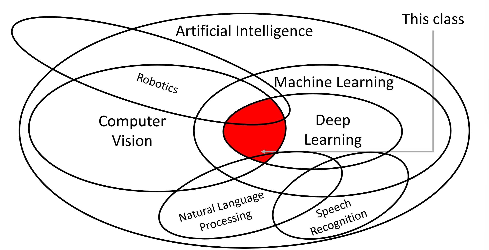{width="500"}
</figure>

`计算机视觉 Computer Vision`
:   教计算机如何看 | teaching meachine to see

`机器学习 Machine Learning`
:   教计算机如何学 | teaching meachine to learn

`深度学习 Deep Learning`
:   - “学习”的含义是“构建从数据和经验中学习的人工系统” | Building artificial systems that  learn from data and experience
    - “深度”的含义是“多层次的分层学习算法” | Hierarchical learning algorithms with many "layers", (very) loosely inspired by the brain

---

!!! question "为什么计算机视觉很重要？"
    仅仅依靠人力，我们无法处理所有的视觉数据（例如社交平台上一天发布的图片总数是海量的）。

---

## 1.1 计算机视觉历史 History of CV

概括来说，每个年代都有一个相对流行的研究主题。

| 年份 | 事件 |  |  
| :---: | :---: | :---: |
| 1959 | Hubel & Wiesel 在猫脑中（视觉神经部分）插入电极后，给它展示不同形状、位置、亮度等的物体，发现猫脑中出现神经元活动，并且：**1. 不同类型的细胞会对不同类型的视觉刺激做出反应； 2. 物体的边缘（edges）是视觉系统的基本特征** | <figure markdown="span">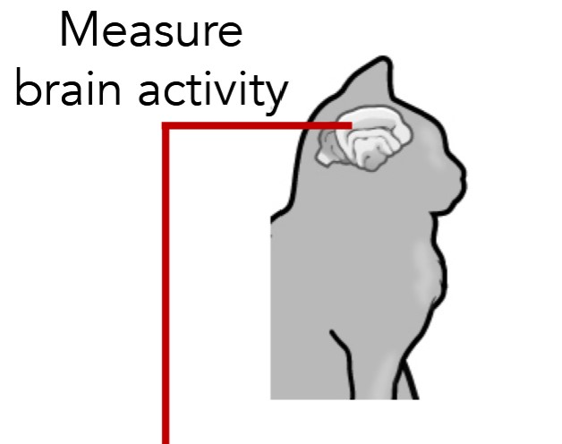{width="300"}</figure> |
| 1970s | 基于部分识别（Recognition via Parts） | <figure markdown="span">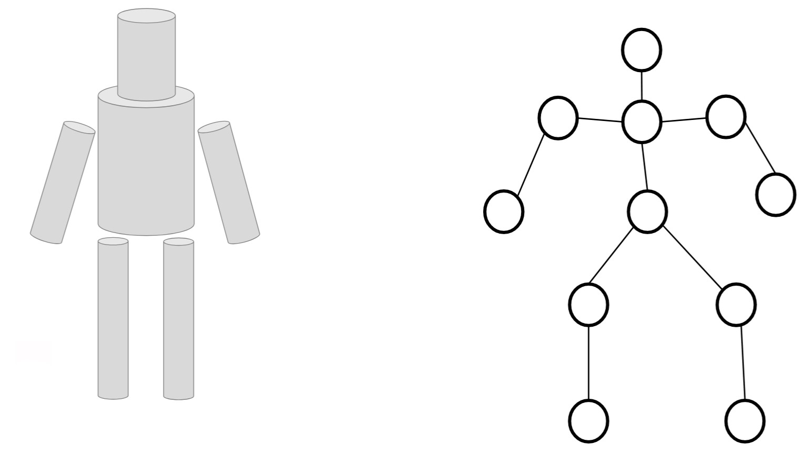{width="300"}</figure> |
| 1980s | 基于边缘检测识别（Recognition via Edge Detection） | <figure markdown="span">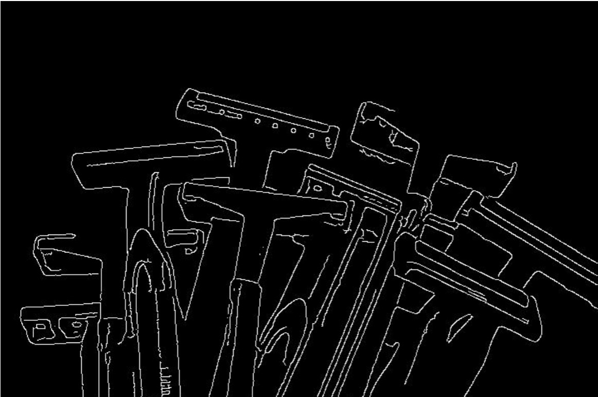{width="300"}</figure> |
| 1990s | 基于像素分组识别（Recognition via Grouping） | <figure markdown="span">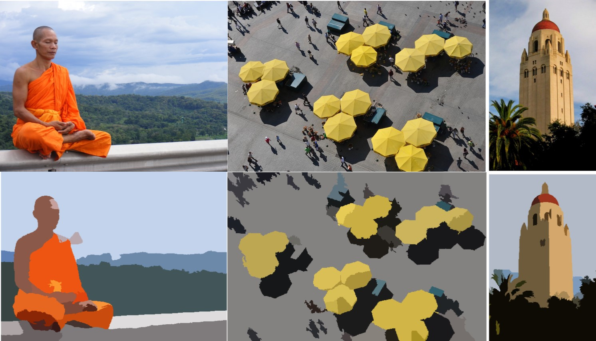{width="300"}</figure> |
| 2000s | 基于图像匹配识别（Recognition via Matching）（1999年SIFT算法） | <figure markdown="span">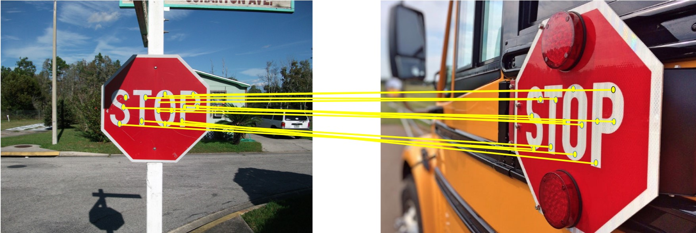{width="300"}</figure> |
| 2001 | 人脸检测（Face Detection）| <figure markdown="span">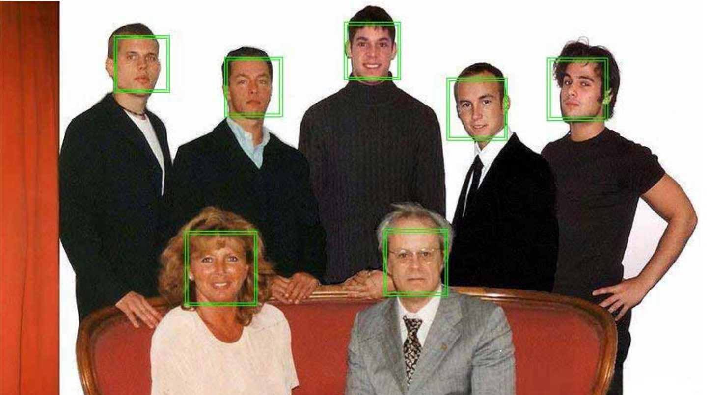{width="300"}</figure> |
| 2009 | ImageNet数据集（超过1400万张经过标注的图像，包含2万多个类别）与ImageNet大规模视觉识别挑战赛（ILSVRC） | <figure markdown="span">{width="300"}</figure> |
| 2012 | AlexNet出世，深度学习开始占据主流 | <figure markdown="span">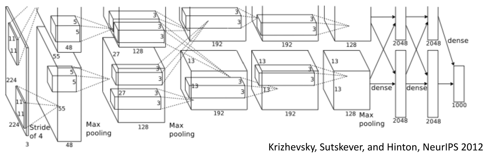{width="300"}</figure> |

## 1.2 深度学习历史 History of DL

| 年份 | 事件 |  |
| :---: | :---: | :---: |
| 1958 | 感知机模型（Perceptron），今天我们将其视为一种线性分类器（Linear Classifier）。1969年 Minsky & Papert 指出有一些函数是感知机无法学习的，如XOR. | <figure markdown="span">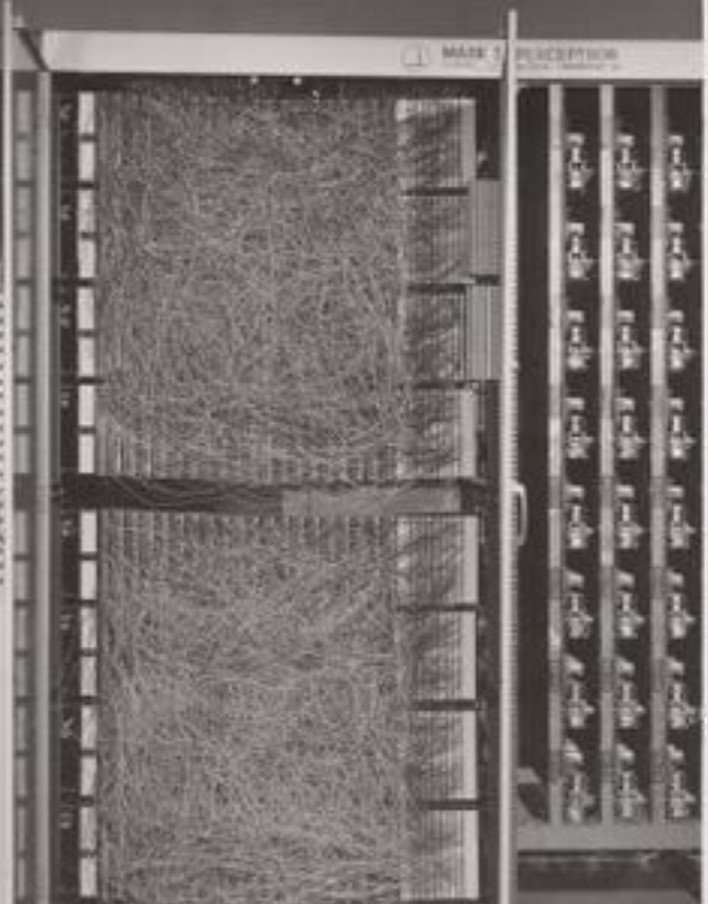{width="300"}</figure> |
| 1980 | Neocognitron模型，是卷积神经网络（CNN）的前身，受 Hubel & Wiesel 的研究启发，为分层结构，使用类似卷积和池化的操作，但没有用于学习权重的算法。32年后的AlexNet结构与其十分相似。 | <figure markdown="span">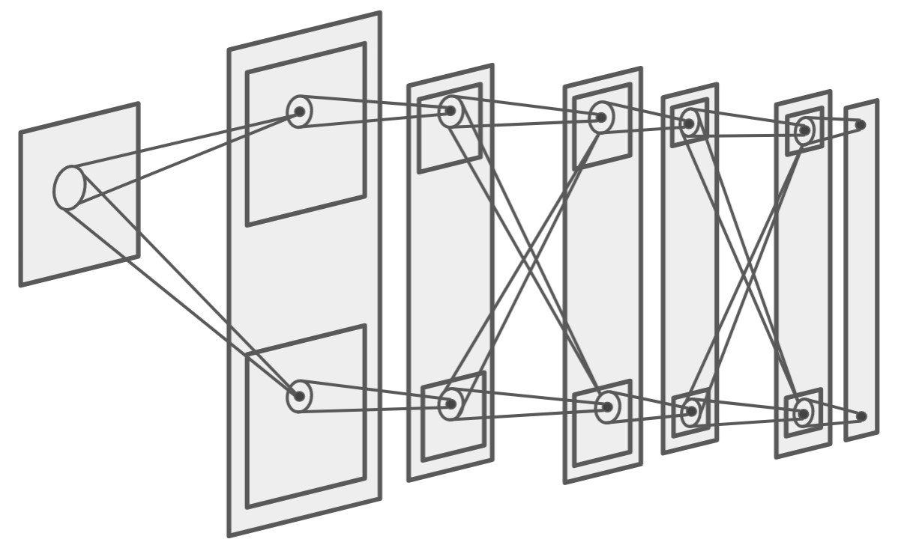{width="300"}</figure> |
| 1986 | 反向传播算法（Backprop），成功训练多层感知机 | <figure markdown="span">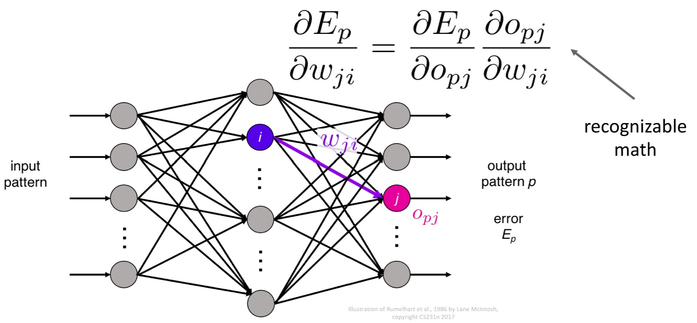{width="300"}</figure> |
| 1998 | 经典卷积神经网络（Convolutional Neural Networks）LeNet出世，将反向传播应用于类似Neocognitron的架构，实现手写数字识别 | <figure markdown="span">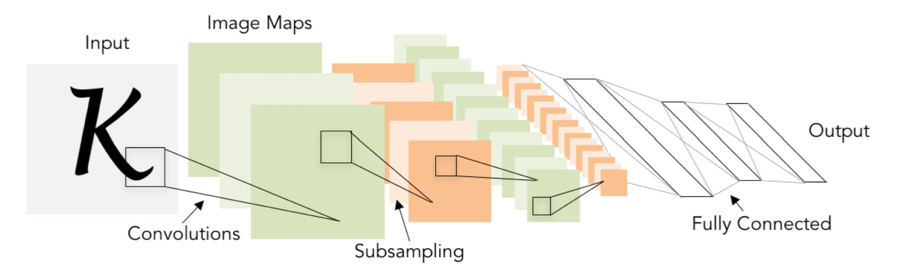{width="300"}</figure> |
| 2000s | 深度学习的理论基础开始发展，但由于数据量和计算能力的限制，深度学习并未成为主流 | <figure markdown="span">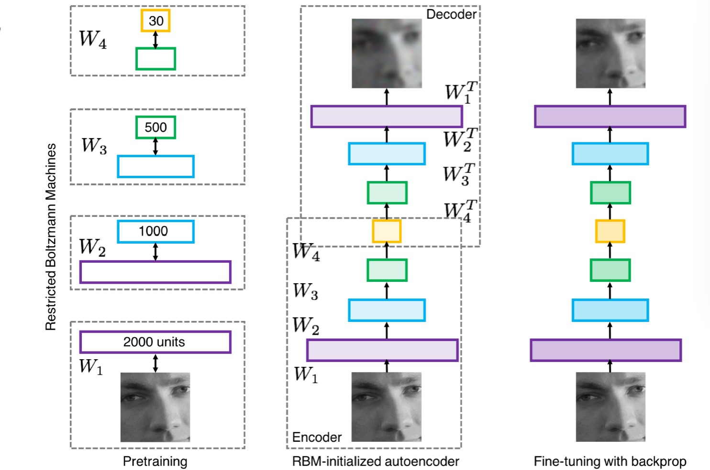{width="300"}</figure> |
| 2012至今 | 2012年AlexNet出世，之后深度学习爆炸式发展 | <figure markdown="span">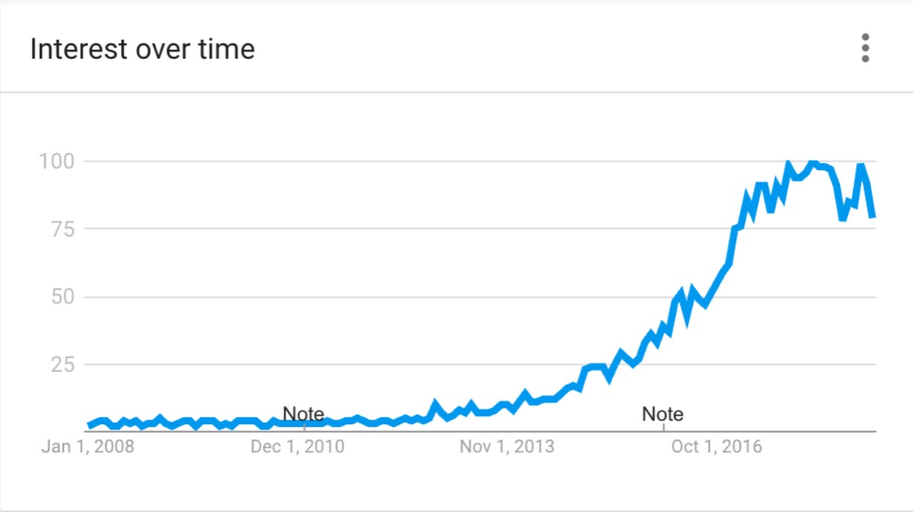{width="300"}</figure> |

---

!!! question "为什么2012年之后深度学习开始流行？"
    三者发展的汇总：算法、数据、计算资源。