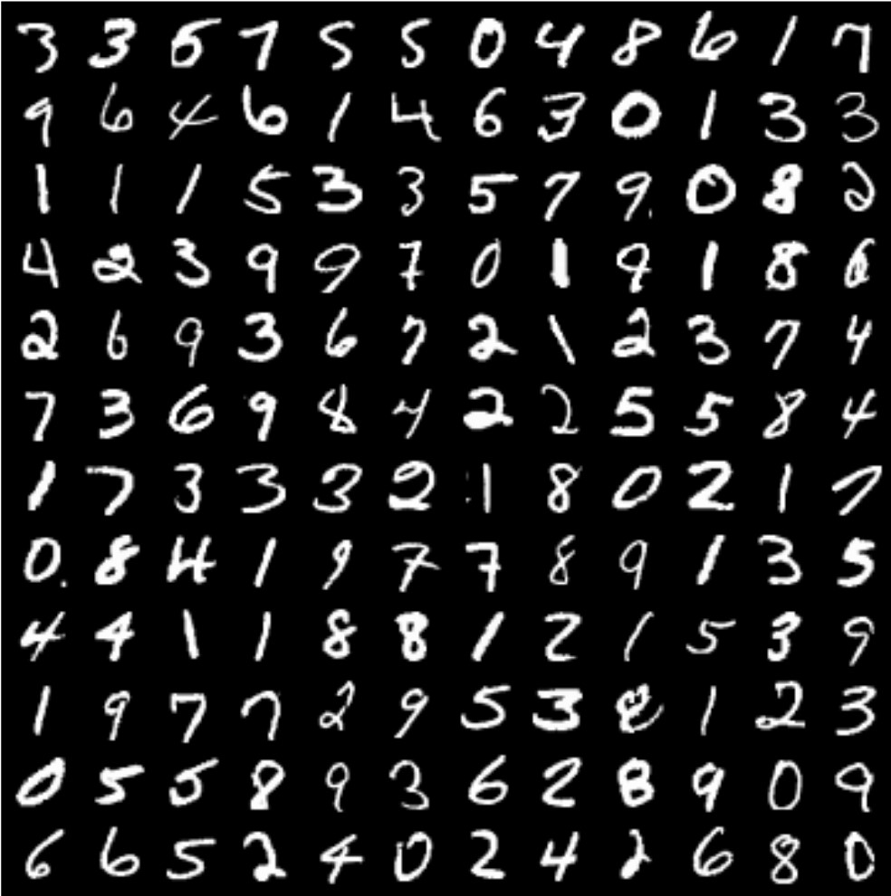
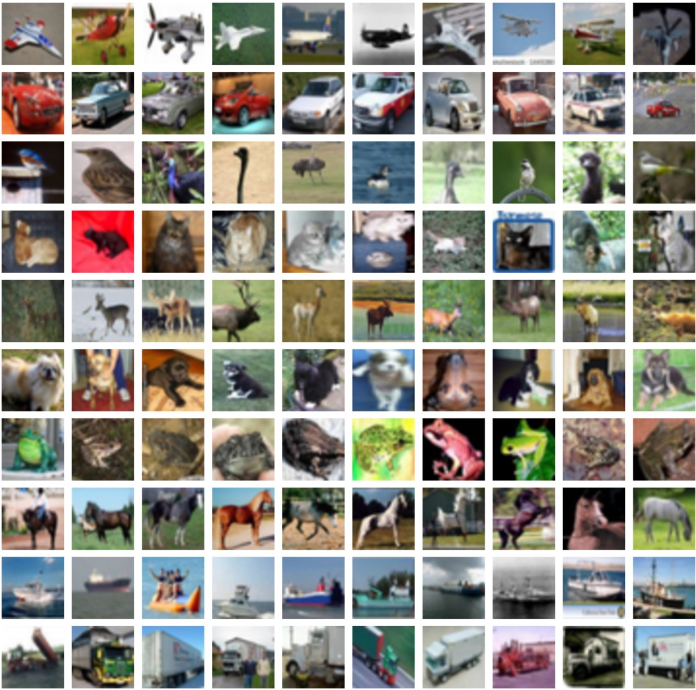
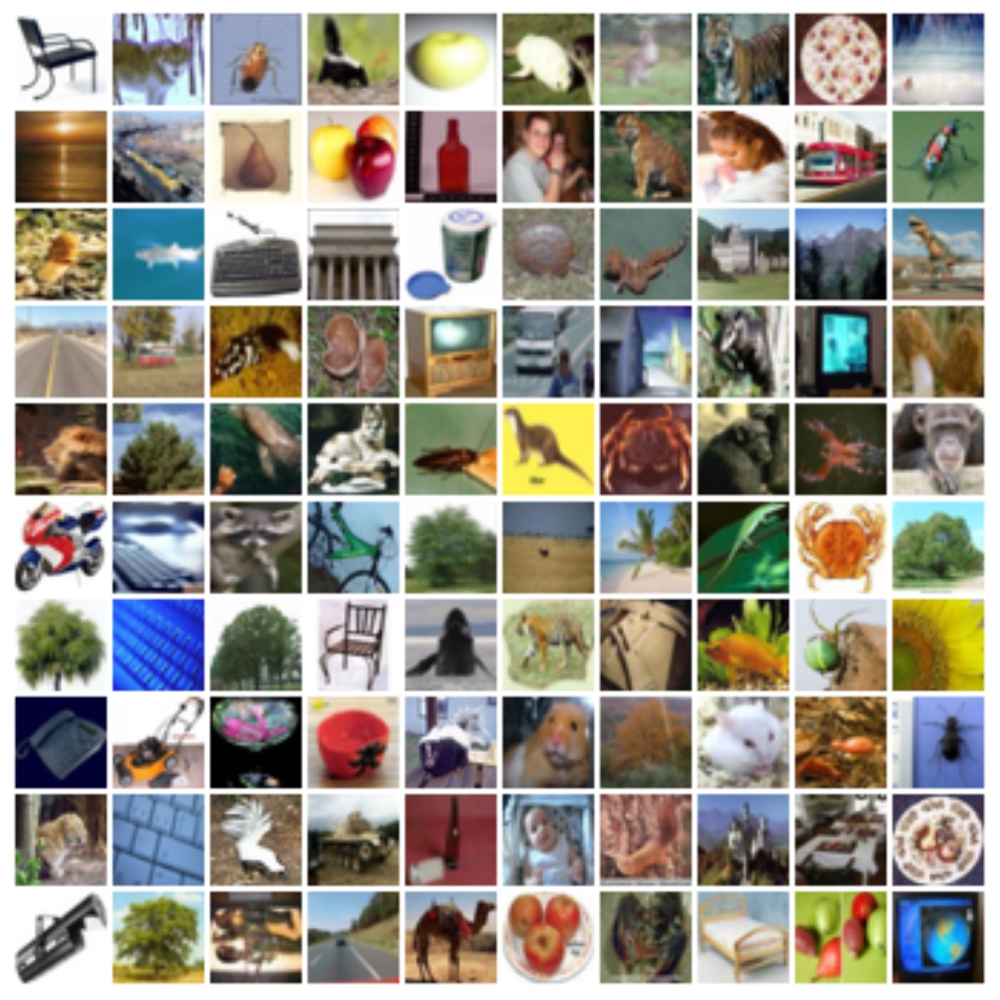
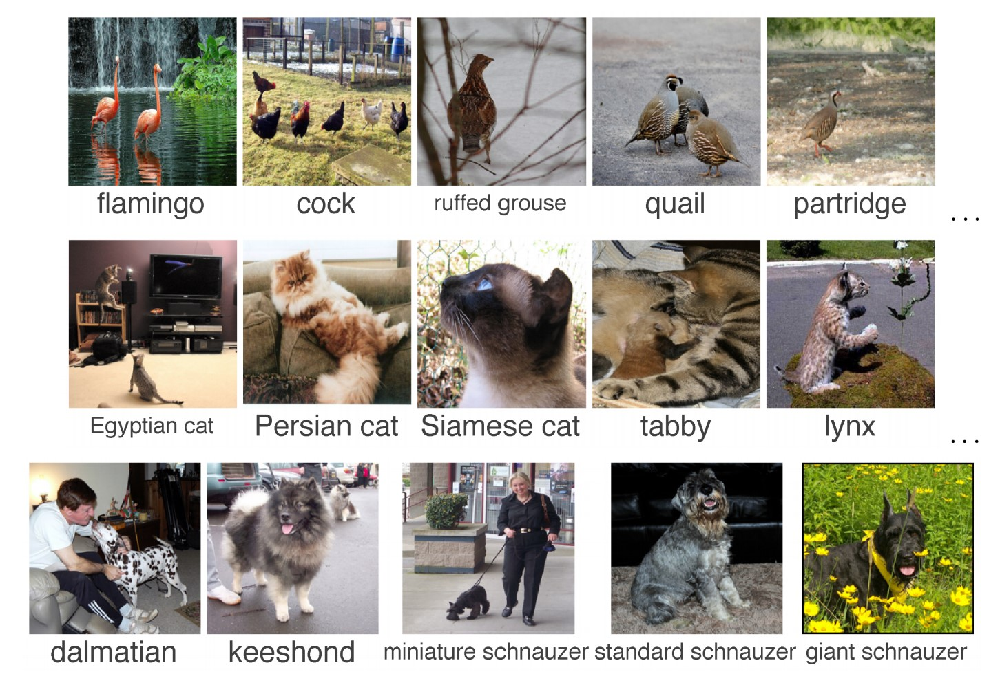
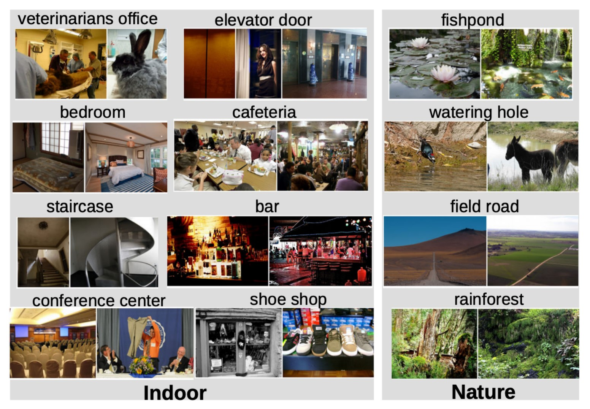
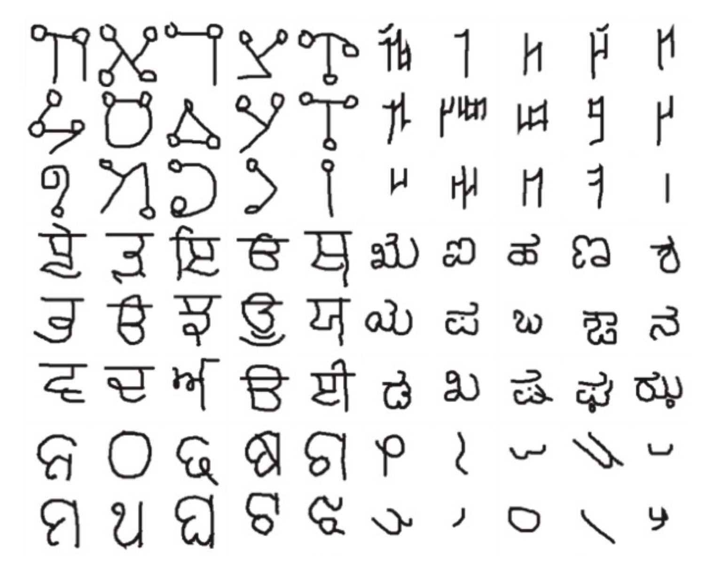
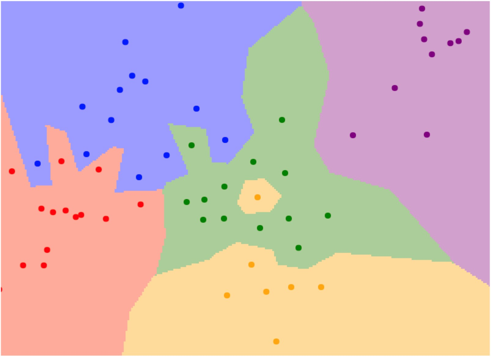
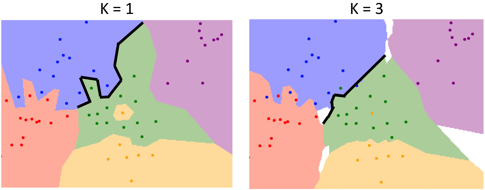
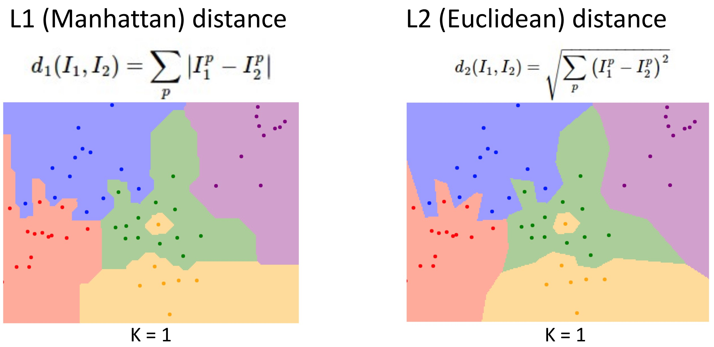

# Chapter 2 图像分类 Image Classification

## 2.1 图像分类任务 Image Classification Task

图像分类任务是计算机视觉领域的基础任务，可作为构建很多其它任务（如对象检测、图像字幕、围棋决策等）的模块。

### 任务描述 Description

- 输入：一张图片（image）
- 输出：图片中物体的类别（category）

### 任务难点 Challenges

图像分类任务最大的问题在于**语义鸿沟（semantic gap）**。在计算机“眼”中，图像只是由许多像素值组成的网格，而不是人类眼中有直观意义的物体。

具体的难点包括：

1. **视角变化（Viewpoint Variation）**：同一物体在不同角度下的图片可能完全不同。
2. **类内差异（Intraclass Variation）**：同一类别物体之间可能存在明显差异。（如两个属于“猫”的样本可能长得非常不同）
3. **细粒度类别（Fine-grained Categories）**：同一大类下的细分类别之间可能非常相似。（如缅因猫、布偶猫、美国短毛猫等）
4. **背景杂乱（Background Clutter）**：图片背景可能干扰物体识别。
5. **光照变化（Illumination Changes）**：光照变化可能导致图片像素值变化。
6. **形变（Deformation）**：物体可能发生形变。（如猫可以站、坐、躺等）
7. **遮挡（Occlusion）**：物体可能被遮挡。

## 2.2 图像分类数据集 Image Classification Datasets

!!! note
    机器学习是一种**数据驱动方法（Data-Driven Approach）**。分类器的构建步骤主要包括：

    1. 收集图像和标签数据集；
    2. 使用机器学习算法训练分类器；
    3. 在新的图像数据上评估评估分类器。

    因而一般需要实现**训练（train）**和**预测（predict）**两个函数：

    ```python
    def train(images, labels):
        # Machine learning!
        return model
    
    def predict(model, test_images):
        # Use model to predict labels
        return test_labels
    ```

    可见数据集的质量和规模对模型性能有很大影响。

以下是一些常见的图像分类数据集：

!!! quote ""
    === "MNIST"
        { align=left width=50% }

        - 手写数字数据集
        - 10个类别：数字 0 - 9
        - 60000张训练图片，10000张测试图片
        - 28 $\times$ 28的灰度图像
        ---
        - MNIST数据集小且简单，仅适合验证算法的正确性，不适合评估算法的性能。

    === "CIFAR-10"
        { align=left width=50% }

        - 10个类别：飞机、汽车、鸟、猫、鹿、狗、青蛙、马、船、卡车
        - 50000张训练图片，10000张测试图片
        - 32 $\times$ 32的RGB图像

    === "CIFAR-100"
        { align=left width=50% }

        - 100个类别：20个大类别，每个大类别包含5个小类别（如树木：枫树、橡树、棕榈树、松树、柳树）
        - 50000张训练图片，10000张测试图片
        - 32 $\times$ 32的RGB图像

    === "ImageNet"
        { align=left width=50% }

        - 1000个类别
        - 约1300000张训练图片，50000张验证图片，100000张测试图片
        - 图像尺寸不固定（训练时一般调整为 $256\times 256$ 或 $224\times 224$）
        - 2012年ILSVRC竞赛的数据集
        ---
        - 因为想要精确预测图片类别非常困难，一般采用**前5名准确率（Top 5 accuracy）**作为性能评价指标，即模型预测5个类别，其中包含正确类别的概率。
        - ImageNet是图像分类研究中最重要的数据集之一。

    === "MIT Places(Places365)"
        { align=left width=50% }

        - 场景数据集
        - 365个类别
        - 约8000000张训练图片，18250张验证图片（每个类别50张），328500张测试图片（每个类别900张）
        - 图像尺寸不固定（训练时一般调整为 $256\times 256$ 或 $224\times 224$）

    === "Omniglot"
        { align=left width=50% }

        - 1623个类别：50种语言
        - 每个类别仅包含20张图片
        --- 
        - 用于小样本学习（Few-shot Learning）研究


## 2.3 最近邻分类器 Nearest Neighbor Classifier

### 实现方法

#### 训练

只需存储所有训练图像和标签即可。

#### 预测

给出与预测图像最相似的训练图像的标签。

### 代码实现

这里使用L1距离（曼哈顿距离，在下一节介绍）作为距离度量：
```python
import numpy as np

class NearestNeighbor:
    def __init__(self):
        pass

    def train(self, X, y):
        """ X is N x D where each row is an example. Y is 1-dimension of size N """
        self.Xtr = X
        self.ytr = y

    def predict(self, X):
        """ X is N x D where each row is an example we wish to predict label for """
        num_test = X.shape[0]
        # lets make sure that the output type matches the input type
        Ypred = np.zeros(num_test, dtype = self.ytr.dtype)

        # loop over all test rows
        for i in range(num_test):
            # find the nearest training image to the i'th test image
            # using the L1 distance (sum of absolute value differences)
            distances = np.sum(np.abs(self.Xtr - X[i,:]), axis = 1)
            min_index = np.argmin(distances) # get the index with smallest distance
            Ypred[i] = self.ytr[min_index] # predict the label of the nearest example
        
        return Ypred
```

### 模型特点

- NN分类器的正确率较低。
- 假设训练集有 $N$ 个样本，每个样本的处理时间为常数，则NN分类器的训练时间复杂度为 $O(1)$，预测时间复杂度为 $O(N)$。**这是非常坏的：我们可以负担较慢的训练时间，但希望预测时间尽可能快。**

## 2.4 K-近邻分类器 K-Nearest Neighbor Classifier

在NN分类器的基础上，K-NN分类器引入一个超参数 $K$，表示预测时考虑的最近邻样本的数量。即在预测时，先找出与预测样本最相似的 $K$ 个训练样本，它们各自投票给自己的类别标签，再选择票数最多的类别作为预测结果。

KNN分类器的另一个超参数是**距离度量（Distance Metric）**，用于衡量两个样本之间的相似度。

!!! note "超参数（Hyperparameter）"
    **超参数（Hyperparameter）**是在模型训练之前即设定好的参数，不会被训练过程改变。超参数的选择可能影响模型的性能。超参数的优化是模型设计的重要一环。

### $K$ 值的影响

??? note "决策边界（Decision Boundary）"
    **决策边界（Decision Boundary）**是不同类别区域的分界线。以二维样本空间为例，NN分类器的决策边界可能如下图所示：

    <figure markdown="span">
        {width="500"}
    </figure>

    - 其中每个点代表一个训练样本，点的颜色代表其类别，区域颜色代表落在该区域的样本的预测类别。

下图为 $K=1$ 和 $K=3$ 时可能的决策边界的对比：

<figure markdown="span">
    {width="500"}
</figure>

- 直观上看，$K$ 值的选择会影响决策边界的复杂度：$K$ 越大，决策边界越平滑，离群值（outlier）对预测结果的影响越小。

!!! warning
    若 $K>1$，则可能出现**平票（tie）**的情况（上图中的白色区域）。设计模型时需额外处理。

### 距离度量的影响

??? note "距离度量（Distance Metric）"
    **距离度量（Distance Metric）**是用于衡量两个样本之间相似度的函数。常见的距离度量函数如下：

    - L1(Manhattan) Distance:
        $\ d_1(I_1, I_2) = \sum\limits_p|I_1^p - I_2^p|$
    - L2(Euclidean) Distance:
        $\ d_2(I_1, I_2) = \sqrt{\sum\limits_p(I_1^p - I_2^p)^2}$

    通过选择合适的距离度量函数，我们可以将KNN分类器应用于任何类型的数据。

下图为使用L1距离和L2距离时可能的决策边界对比（设 $K = 1$）：

<figure markdown="span">
    {width="500"}
</figure>

- 使用L1距离时，决策边界分割线均为水平/垂直/45°直线；使用L2距离时，决策边界仍然表现为分段线性，但直线斜率可以任意。

### 超参数选择与测试方法

事实上超参数的选择需要具体问题具体分析。一般来说我们需要依次尝试不同的超参数组合，测试得出最优的超参数组合。

给定超参数之后，我们可能会想到以下几种测试方法：