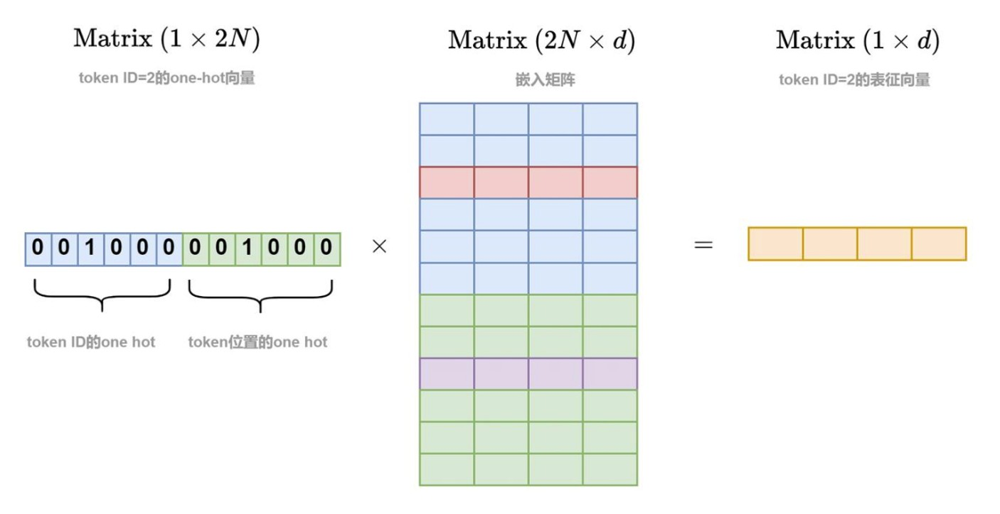

# Sinusoidal 位置编码 Sinusoidal Positional Encoding

!!! note
    **Sinusoidal 位置编码(Sinusoidal Positional Encoding)** 是一种经典的绝对位置编码方法，最早由 Vaswani 等人在论文 [Attention is All You Need](https://arxiv.org/abs/1706.03762) 中提出，用于 Transformer 模型中。

---

## 1. 绝对位置编码 Absolute Positional Encoding

为序列中的每个位置添加一个唯一的向量表示，使模型能够区分不同位置的信息（即破坏置换不变性）。每个位置的编码是固定的，与输入数据无关。

一般而言，假设有输入序列 $x_1, x_2, ..., x_n$，经过词嵌入得到词向量表示 $a_1, a_2, ..., a_n\in \mathbb{R}^d$, 则位置编码 $e_1, e_2, ..., e_n \in \mathbb{R}^d$ 也具有相同的维度 $d$。最终的输入表示为 $z_i = a_i + e_i$.

???+ question "为什么 $e_i$ 可以直接加到 $a_i$ 上？"
    在 [Transformer介绍](../../cs_notes/nlp/chap7.md/#positional-encoding) 中提到的最简单的位置编码方法是给每个 $x_i$ 拼接一个 one-hot 向量 $p_i$. 
    
    但这样会增加输入的维度，且 one-hot 向量之间是正交的，无法反映位置之间的相对关系，所以并不是一种好的编码方式。

    我们可以这样考虑：上述方法中，在 $x_i$ 上拼接 $p_i$ 后，仍然需要经过一个线性变换 $W$ 才能得到最终的词向量表示。那不妨我们直接令 $x_i$ 也成为 one-hot 的形式（实际情况下可能不是仅有一个1的独热编码，而是多个小数的编码，但含义类似），让它应用线性变换时的含义也变成一种“查表”的过程，这样就和 $p_i$ 的作用类似了。

    <figure markdown="span">
        {width="500"}
    </figure>

    注意图中不小心把 $x_i$ 和 $p_i$ 画成了相同维度，且都是严格的独热编码，实际情况不一定如此。

    这样一来，我们发现，当 $x_i$ 和 $p_i$ 拼接后，经过线性变换 $W$ 得到的结果,等价于 $x_i$ 经过线性变换 $W_x$, 再加上 $p_i$ 经过线性变换 $W_p$ 的结果，即 $a_i + e_i$ 的结果。

## 2. 二进制数字位置编码 

一种简单的绝对位置编码方法是使用二进制数字的向量形式表示位置索引。

例如，假设序列长度不超过16，则每个位置可以用4位二进制数表示：

| 位置 | 二进制 | 向量表示       |
| ---- | ------ | -------------- |
| 0    | 0000   | [0, 0, 0, 0]   |
| 1    | 0001   | [0, 0, 0, 1]   |
| 2    | 0010   | [0, 0, 1, 0]   |
| 3    | 0011   | [0, 0, 1, 1]   |
| 4    | 0100   | [0, 1, 0, 0]   |
| ...  | ...    | ...            |

二进制数字位置编码有一个特点：**低位变化频率高，高位变化频率低。**

虽然这种编码方式简单易懂，但它存在明显的缺点，例如：

- 位置之间的相对关系难以捕捉（如位置3和位置4的编码差异较大，但它们在序列中是相邻的）
- 高维度变化频率过低，如果模型聚焦于学习这些维度的信息，会难以区分（如位置0和位置7的高位部分完全相同）

## 3. Sinusoidal 位置编码 Sinusoidal Positional Encoding

我们希望设计出的位置编码能够打破置换不变性，且最好反映位置之间的相对关系。接下来我们考虑形式化地表达这两点。

### 3.1 打破置换不变性

假设我们的模型是一个函数 $f(a_1, a_2, ..., a_n)$，本来由于置换不变性，有 $$ f(..., a_m, ..., a_n, ...) = f(..., a_n, ..., a_m, ...) $$

为了打破置换不变性，我们引入位置编码 $e_1, e_2, ..., e_n$，希望使得 $$ f(..., a_m + e_m, ..., a_n + e_n, ...) \neq f(..., a_n + e_m, ..., a_m + e_n, ...) $$

因为位置编码传递的位置信息一般少于词向量传递的含义信息，所以我们可以尝试对上式进行泰勒展开，依旧仅考虑 $m, n$ 两个位置，得到

$$ \begin{aligned} &\ f(a_m + e_m, a_n + e_n) \\ =&\ f(a_m, a_n) + \frac{\partial f}{\partial a_m} e_m + \frac{\partial f}{\partial a_n} e_n + \frac{1}{2} \frac{\partial^2 f}{\partial a_m^2} e_m^2 + \frac{1}{2} \frac{\partial^2 f}{\partial a_n^2} e_n^2 + \frac{\partial^2 f}{\partial a_m \partial a_n} e_m \cdot e_n + ... \end{aligned} $$

展开式中第1项和位置无关，第2到5项仅和单一位置有关，只有第6项包含了两个位置之间的关系。

### 3.2 表达相对关系

由上，我们希望展开式中 $ \frac{\partial^2 f}{\partial a_m \partial a_n} e_m \cdot e_n $ 这项能够表达位置之间的相对关系，即存在某函数 $g$ 使得 $$ \frac{\partial^2 f}{\partial a_m \partial a_n} e_m \cdot e_n = g(m - n) $$