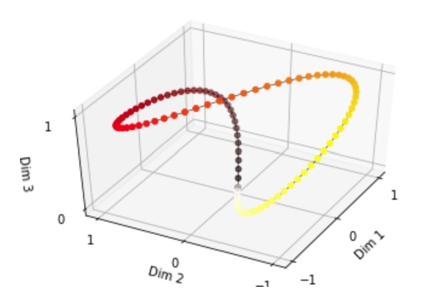
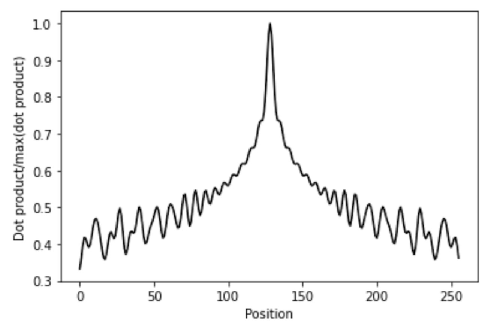
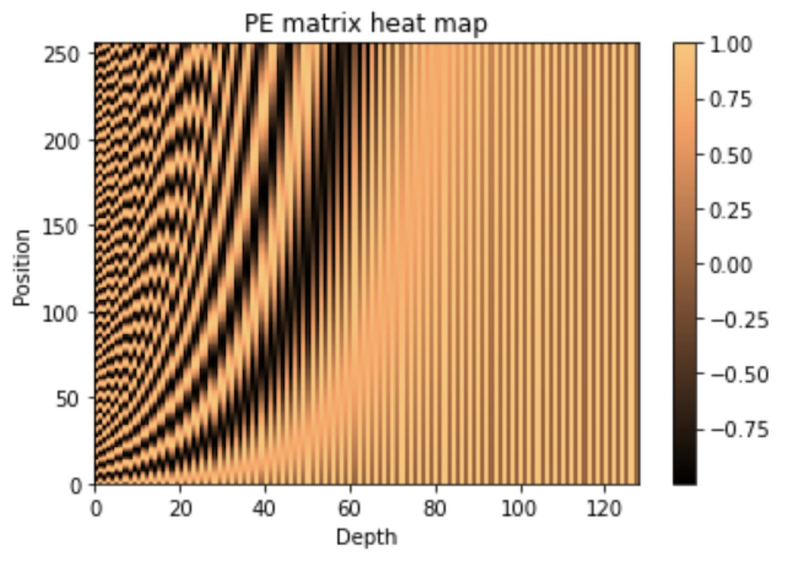

# Sinusoidal 位置编码 Sinusoidal Positional Encoding

!!! abstract
    **Sinusoidal 位置编码(Sinusoidal Positional Encoding)** 是一种经典的绝对位置编码方法，最早由 Vaswani 等人在论文 [Attention is All You Need](https://arxiv.org/abs/1706.03762) 中提出，用于 Transformer 模型中。

---

## 1. 绝对位置编码 Absolute Positional Encoding

为序列中的每个位置添加一个唯一的向量表示，使模型能够区分不同位置的信息（即破坏置换不变性）。每个位置的编码是固定的，与输入数据无关。

一般而言，假设有输入序列 $x_1, x_2, ..., x_n$，经过词嵌入得到词向量表示 $a_1, a_2, ..., a_n\in \mathbb{R}^d$, 则位置编码 $e_1, e_2, ..., e_n \in \mathbb{R}^d$ 也具有相同的维度 $d$。最终的输入表示为 $z_i = a_i + e_i$.

???+ question "为什么 $e_i$ 可以直接加到 $a_i$ 上？"
    在 [Transformer介绍](../../cs_notes/nlp/chap7.md/#positional-encoding) 中提到的最简单的位置编码方法是给每个 $x_i$ 拼接一个 one-hot 向量 $p_i$. 
    
    但这样会增加输入的维度，且 one-hot 向量之间是正交的，无法反映位置之间的相对关系，所以并不是一种好的编码方式。

    我们可以这样考虑：上述方法中，在 $x_i$ 上拼接 $p_i$ 后，仍然需要经过一个线性变换 $W$ 才能得到最终的词向量表示。那不妨我们直接令 $x_i$ 也成为 one-hot 的形式（实际情况下可能不是仅有一个1的独热编码，而是多个小数的编码，但含义类似），让它应用线性变换时的含义也变成一种“查表”的过程，这样就和 $p_i$ 的作用类似了。

    <figure markdown="span">
        {width="500"}
    </figure>

    注意图中不小心把 $x_i$ 和 $p_i$ 画成了相同维度，且都是严格的独热编码，实际情况不一定如此。

    这样一来，我们发现，当 $x_i$ 和 $p_i$ 拼接后，经过线性变换 $W$ 得到的结果,等价于 $x_i$ 经过线性变换 $W_x$, 再加上 $p_i$ 经过线性变换 $W_p$ 的结果，即 $a_i + e_i$ 的结果。

## 2. 整数位置编码

最简单的绝对位置编码方法是直接使用整数索引作为位置编码：

| 位置 | 向量表示 |
| ---- | -------- |
| 0    | [0]      |
| 1    | [1]      |
| 2    | [2]      |
| ...  | ...      |

这种编码方式的主要缺点在于：

- 位置编码的数值范围随序列长度增加而增加，可能导致训练不稳定（一般希望神经网络的权重在0附近，且正负均衡，否则容易导致梯度消失或梯度爆炸）
- 无法推广到训练时未见过的更长序列

## 3. $[0, 1]$ 位置编码

为解决整数位置编码的问题，一种绝对位置编码方法是将位置索引归一化到 $[0, 1]$ 范围内：

| 位置 | 向量表示       |
| ---- | -------------- |
| 0    | $[0.0]$          |
| 1    | $[\frac{1}{n-1}]$      |
| 2    | $[\frac{2}{n-1}]$      |
| ...  | ...            |
| n-1  | $[1.0]$         |

虽然这种编码方式将数值范围固定在了 $[0, 1]$ 内，有助于训练稳定，但它引入了新的缺点：

- 当序列长度变化时，同一位置的编码、位置间的相对距离也会变化，导致模型难以适应不同长度的序列

## 4. 二进制数字位置编码 

另一种绝对位置编码方法是使用二进制数字的向量形式表示位置索引。

例如，假设序列长度不超过16，则每个位置可以用4位二进制数表示：

| 位置 | 二进制 | 向量表示       |
| ---- | ------ | -------------- |
| 0    | 0000   | [0, 0, 0, 0]   |
| 1    | 0001   | [0, 0, 0, 1]   |
| 2    | 0010   | [0, 0, 1, 0]   |
| 3    | 0011   | [0, 0, 1, 1]   |
| 4    | 0100   | [0, 1, 0, 0]   |
| ...  | ...    | ...            |

二进制数字位置编码有一个特点：**低位变化频率高，高位变化频率低。**

虽然这种编码方式使得所有值都有界，且因为token的维度 $d$ 一般足够大，可以表示出序列中所有位置，但它依然存在明显的缺点，例如：

- 位置之间的相对关系难以捕捉（如位置1和位置2的编码差异较小，而位置3和位置4的编码差异较大，但它们在序列中都是相邻的）
- 高维度变化频率过低，如果模型聚焦于学习这些维度的信息，会难以区分（如位置0和位置7的高位部分完全相同）
- 编码出来的位置向量处在一个离散的空间中，难以反映位置之间的连续关系

## 5. 周期性位置编码

考虑到我们希望位置编码以连续的方式逐渐增加（其实这一点并不那么自然，原因有待理解），去插值一个 $0\rightarrow 1\rightarrow 0\rightarrow 1$ 的有界变化趋势，自然会想到使用周期函数，如正弦函数来表示。

为了模拟二进制数字位置编码中低位变化频率高、高位变化频率低的特点，我们可以使用不同频率的正弦函数来表示不同维度的位置编码。具体地，我们可以定义位置 $m$ 的位置编码（设维度为 $d$ ）

$$ \begin{aligned} {PE}_m &= [\sin{m\omega_0}, \sin{m\omega_1}, \sin{m\omega_2}, ..., \sin{m\omega_{d-1}}] \\ &= [\sin{m\frac{\frac{\pi}{2}}{2^0}}, \sin{m\frac{\frac{\pi}{2}}{2^1}}, \sin{m\frac{\frac{\pi}{2}}{2^2}}, ..., \sin{m\frac{\frac{\pi}{2}}{2^{d - 1}}}] \end{aligned} $$

这样就可以最大程度地模拟二进制数字位置编码（第 $i$ 维在第 $2^i$ 个位置第一次由 $0$ 变成 $1$）。

值得注意的是，这样的表示对频率的值提出了要求：如果频率太小，会导致位置编码的数值过小（接近0）；而如果频率太大，因为正弦函数位置编码理论上是一个如下图所示的周期性的环，所以会导致远距离的两个点反而在位置编码上很接近。

<figure markdown="span">
     {width="300"}
</figure>

为了解决这一问题，我们发现频率 $\omega_0, \omega_1, ..., \omega_{d - 1}$ 并不一定要满足模拟二进制增长，而只要满足**单调递减**即可，这样就可以设计一个适当的频率范围。

???+ note 
    Vaswani 等人选择的值大约为 $\omega_i = \frac{1}{10000^{\frac{i}{d}}}$，具体原因未知，应该是一个实验性的选择。

    实际使用时可以将其设置为一个可训练的参数。

## 6. Sinusoidal 位置编码 Sinusoidal Positional Encoding

### 捕捉相对位置关系

回顾以上提到的各种绝对位置编码的缺点，我们发现还有一个问题没有解决：**捕捉位置之间的相对关系**。

由上文的例子，我们倾向于希望位置1和位置2的关系，与位置3和位置4的关系是类似的甚至相同的。而如何定义“位置之间的关系”呢？普遍意义上，transformer使用了**线性变换**来生成查询、键和值，这就是一种广义上的“关系”。所以，如果我们也能够使用线性变换来“移动”位置编码，就非常理想了，即：

$$ {PE}_{m+k} = T_k \cdot {PE}_m $$

其中 $T_k$ 是一个与位置偏移 $k$ 相关的线性变换矩阵。

在三角函数中，平移等价于相位的变化，对应于**旋转变换**这一类线性变换，所以我们可以利用恒等式

$$ \begin{bmatrix} \sin(x + \phi) \\ \cos(x + \phi) \end{bmatrix} = \begin{bmatrix} \cos(\phi) & \sin(\phi) \\ -\sin(\phi) & \cos(\phi) \end{bmatrix} \begin{bmatrix} \sin(x) \\ \cos(x) \end{bmatrix} $$

来设计位置编码上的线性变换。因此，我们尝试将位置编码的每两个维度作为一组，使用相同频率的正余弦函数来表示：

$$ \begin{aligned} {PE}_m = [ \sin{(m\omega_0)}, \cos{(m\omega_0)}, \sin{(m\omega_1)}, \cos{(m\omega_1)}, ..., \sin{(m\omega_{\frac{d}{2}-1})}, \cos{(m\omega_{\frac{d}{2}-1})} ] \end{aligned} $$

这样一来，我们就可以定义线性变换

$$ T_k = \begin{bmatrix} R(k\omega_0) & 0 & ... & 0 \\ 0 & R(k\omega_1) & ... & 0 \\ ... & ... & ... & ... \\ 0 & 0 & ... & R(k\omega_{\frac{d}{2}-1}) \end{bmatrix} $$

其中 $R(\theta) = \begin{bmatrix} \cos(\theta) & \sin(\theta) \\ -\sin(\theta) & \cos(\theta) \end{bmatrix}$.

### 位置编码定义

Sinusoidal 位置编码的正式定义为：

$$ \begin{aligned} {PE}_{pos, 2i} &= \sin{\left(pos \cdot \frac{1}{10000^{\frac{2i}{d}}}\right)} \\ {PE}_{pos, 2i+1} &= \cos{\left(pos \cdot \frac{1}{10000^{\frac{2i}{d}}}\right)} \end{aligned} $$

其中 $pos$ 是位置索引，$i$ 是维度索引，$d$ 是位置编码的总维度。 

???+ note "Sinusoidal 位置编码的一点性质"

    容易证明，两不同位置的编码之间的点积只与它们的相对位置有关，且具有远程衰减的特点，且无方向性。

    暂时不知道这一性质是否有实际意义，因为位置编码的数值相对于词向量来说较小，所以点积的值也会较小。

    <figure markdown="span">
        {width="400"}
    </figure>

    但这个性质或许可以解释二进制数字编码中“高维度变化频率过低，如果模型聚焦于学习这些维度的信息，会难以区分”的问题：模型可以利用高频的维度来捕捉短距离信息，而利用低频的维度来捕捉长距离信息。

    <figure markdown="span">
        {width="400"}
    </figure>

<!-- ## 4. Sinusoidal 位置编码 Sinusoidal Positional Encoding

我们希望设计出的位置编码能够打破置换不变性，且最好反映位置之间的相对关系。接下来我们考虑形式化地表达这两点。

### 3.1 打破置换不变性

假设我们的模型是一个函数 $f(a_1, a_2, ..., a_n)$，本来由于置换不变性，有 $$ f(..., a_m, ..., a_n, ...) = f(..., a_n, ..., a_m, ...) $$

为了打破置换不变性，我们引入位置编码 $e_1, e_2, ..., e_n$，希望使得 $$ f(..., a_m + e_m, ..., a_n + e_n, ...) \neq f(..., a_n + e_m, ..., a_m + e_n, ...) $$

因为位置编码传递的位置信息一般少于词向量传递的含义信息，所以我们可以尝试对上式进行泰勒展开，依旧仅考虑 $m, n$ 两个位置，得到

$$ \begin{aligned} &\ f(a_m + e_m, a_n + e_n) \\ =&\ f(a_m, a_n) + \frac{\partial f}{\partial a_m} e_m + \frac{\partial f}{\partial a_n} e_n + \frac{1}{2} \frac{\partial^2 f}{\partial a_m^2} e_m^2 + \frac{1}{2} \frac{\partial^2 f}{\partial a_n^2} e_n^2 + \frac{\partial^2 f}{\partial a_m \partial a_n} e_m \cdot e_n + ... \end{aligned} $$

展开式中第1项和位置无关，第2到5项仅和单一位置有关，只有第6项包含了两个位置之间的关系。

### 3.2 表达相对关系

由上，我们希望展开式中 $ \frac{\partial^2 f}{\partial a_m \partial a_n} e_m \cdot e_n $ 这项能够表达位置之间的相对关系，即存在某函数 $g$ 使得 $$ \frac{\partial^2 f}{\partial a_m \partial a_n} e_m \cdot e_n = g(m - n) $$ -->